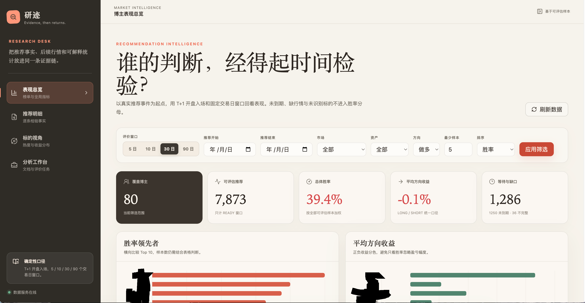
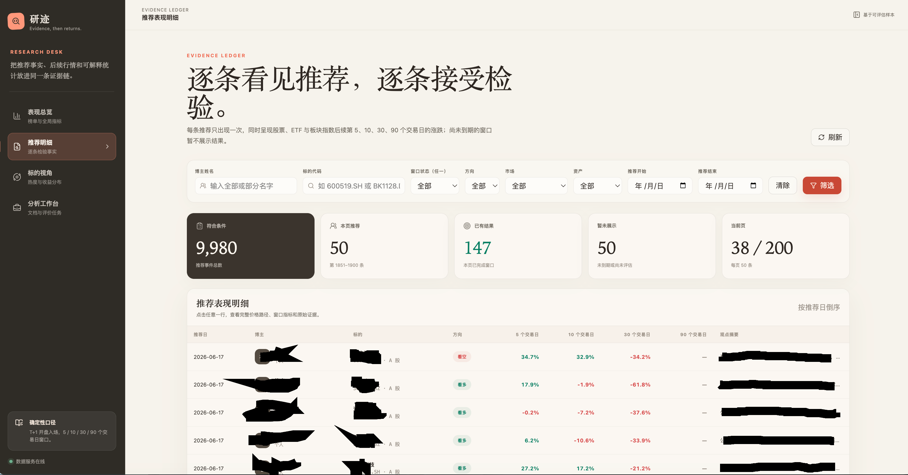

# FinanceSys

> 让每一个市场观点都有出处，让每一次判断都接受时间检验。

FinanceSys 是一套面向中国资本市场的研究情报与推荐表现评估系统。它持续收集研报、复盘文章和专家观点，从非结构化内容中识别真实的推荐事实，再用后续市场数据回答一个朴素但重要的问题：**谁在什么时候推荐了什么，后来表现究竟如何？**

它的目标不是再生成一份转瞬即逝的摘要，而是建立一套可以长期积累的市场观点数据库。随着时间推移，零散文章会沉淀为博主研究档案、标的关注轨迹、推荐表现记录和可复核的历史证据，让主观印象逐渐让位于数据，让内容消费逐渐变成研究资产。

## 为什么需要 FinanceSys

市场每天产生大量观点，但绝大多数内容很快被新的信息覆盖：

- 一位博主长期表现如何，通常依赖印象，而不是完整样本。
- 一次成功推荐被反复传播，失败推荐却容易被遗忘。
- 不同文章中的股票简称、代码、主题和板块口径并不统一。
- 推荐后的表现往往只看某一天的涨跌，缺少统一时间窗口。
- 原始观点、推荐事实和后续结果相互分离，难以回到证据核验。

FinanceSys 将这些问题转化为一套可持续运行的研究基础设施：保留原文、识别事实、统一标的、追踪行情、固定口径计算，并把每一个结果重新连接到它的来源。

## 你能看到什么

### 页面预览





### 博主表现总览

在统一的 5、10、30、90 个交易日窗口下，对比不同博主的可评估样本数、胜率、平均收益、中位收益、最佳与最差表现以及回撤情况。排行榜不会只突出一次高收益，也不会把尚未到期或数据不完整的样本混入统计结果。

### 博主研究档案

每位博主都有持续更新的历史档案。可以查看其推荐频率、主要关注标的、不同时间窗口的表现，以及每一条具体推荐。系统关心的不是内容风格或传播热度，而是观点能否在一致口径下经受时间检验。

### 推荐事实台账

每条推荐被记录为独立事实，包含博主、推荐日期、股票、ETF 或板块指数、方向、观点摘要和原文证据。台账支持按博主姓名、标的代码、资产类型、市场、方向、日期和评价状态筛选，并展示后续各窗口的实际表现。

### 单条推荐复盘

一条推荐不仅有最终收益，还可以看到推荐前后的价格路径、入场与退出位置、最大浮盈、最大不利波动和最大回撤。所有评价都能回到原始观点和来源文档，避免脱离上下文解读数字。

### 标的热度与表现

从股票、ETF 和板块维度观察市场关注度：哪些标的被更多博主同时提及，参与者是谁，后续平均表现和胜率如何。推荐热度与实际表现被并列展示，帮助区分市场共识、主题行情和真正有质量的判断。

## 从文章到研究资产

FinanceSys 支持人工上传，也能从已配置的 OpenList 文档源持续发现新文章。扫描型 PDF 会经过专用 OCR，普通文档则直接提取文本；相同文件按内容去重，避免重复分析和重复统计。

系统从文章中识别博主、推荐日期、标的、方向、观点和证据，并结合本地主数据统一股票、ETF 与东方财富板块指数的名称和代码。能够唯一映射的板块、行业与概念会进入持续追踪；模糊简称、泛称和无法确认的目标不会被强行映射，而是作为不可追踪或待复核信息单独保留。

推荐事实形成后，系统持续同步市场行情，并按统一规则更新评价结果。新文章、前一交易日行情和最近时间窗口内的历史推荐都可以由自动任务持续处理，每次任务的输入、输出和错误均有独立记录。

这意味着系统不是一次性的文档分析工具，而是一套会随着文章、行情和时间不断增长的研究数据库。

## 评价口径

为了让不同博主、不同日期和不同标的之间可以公平比较，FinanceSys 使用一致、确定的评价方式：

- 推荐事实使用归一后的推荐日期，不以后见之明修改历史时间点。
- 默认以推荐后的下一交易日开盘价作为评价入场基准。
- 使用 5、10、30、90 个交易日窗口持续追踪，不使用自然日替代交易日。
- 做多和做空推荐按方向统一计算收益。
- 同时记录窗口收益、最大浮盈、最大不利波动和最大回撤。
- 尚未到期的窗口保持等待状态，不提前展示结果。
- 停牌、行情缺失、标的未识别等情况单独记录，不伪造收益，也不进入有效样本分母。

这些口径由确定性程序执行。同样的事实和行情输入应得到同样的评价结果，LLM 不参与收益率、胜率或排行榜数值的计算。

## 数据可信原则

### 结论必须回到证据

推荐事件保留来源文档、观点摘要和证据片段。排行榜上的每一个数字都应能够逐层回到具体推荐和原始内容。

### 失败也是数据

没有识别出股票、行情不足、窗口未到期、内容没有形成明确推荐，都不会被悄悄丢弃。它们以明确状态保留，避免只留下成功样本。

### 不让模型替代规则

LLM 和 Agent 用于理解文章、抽取事实和辅助标的识别；交易参数、时间窗口、收益表现和聚合统计由确定性规则完成。

### 开发与生产隔离

系统维护同构的开发测试环境与生产环境。只有明确声明生产环境的进程才会连接生产数据，其余启动和测试默认进入测试环境，避免开发数据污染长期积累的线上样本。

## 当前能力

- 支持 PDF、Word、TXT、Markdown、CSV 等研究资料。
- 支持 macOS 与 Windows，并针对扫描型、带水印研报提供专用 OCR。
- 支持文件内容去重、原始文档留存和重复分析控制。
- 支持 OpenList 外部文章自动发现、下载、幂等摄取和失败重试。
- 支持股票、ETF 与东方财富板块指数识别、主数据核验和不可追踪目标记录。
- 支持证券与板块主数据每日刷新，以及股票、ETF、板块日行情持续同步。
- 支持推荐事实、候选计划、证据和解析过程的完整审计。
- 支持日行情自动同步和通用调度任务台账。
- 支持 5、10、30、90 个交易日推荐表现评价。
- 支持博主排行榜、博主档案、推荐明细、单条复盘和标的分析看板。
- 支持按日期、博主、标的、市场、方向和样本状态进行筛选分析。
- 支持 Nacos 统一配置，以及开发测试库和生产库的严格隔离。

## 适合谁

FinanceSys 适合希望长期积累研究优势，而不是只消费当日信息的人：

- 想系统复盘关注博主历史表现的个人研究者。
- 需要管理大量研报、文章和推荐事实的小型投研团队。
- 希望建立内容质量评价体系的财经内容运营者。
- 关注证据、样本边界和可复现计算的开发者与数据研究者。

## 长期愿景

FinanceSys 希望逐步形成一张中国市场观点网络：连接内容来源、研究者、推荐事件、证券标的、市场阶段和最终结果。

当历史足够长、来源足够丰富时，系统能够帮助回答更有价值的问题：一个博主真正擅长什么类型的机会；一种观点在哪些市场环境中更有效；多个独立来源形成共识时是否具有额外信息；热门标的是因为判断领先，还是仅仅跟随行情。

最终，我们希望把难以验证的“感觉他很准”，变成可以检查、比较和持续更新的研究事实。

## 快速开始

本地只需要准备 Go、Python 和文档处理依赖。MySQL、Nacos、LLM 和行情服务均使用现有远程配置，不需要在开发机安装中间件。

当前 macOS 生产环境可使用一键启动：

```bash
./fast_start_prod.sh
```

脚本会检查 Nacos SDK 所需端口、启动分析 Agent、构建并启动服务，并在退出前确认两端健康。未明确指定生产环境的开发和测试默认使用测试数据库。

提交代码前执行：

```bash
GOTOOLCHAIN=local go test ./...
GOTOOLCHAIN=local go build ./...
```

## 项目文档

完整业务方案、数据口径、部署说明、测试策略、阶段复盘和演进路线统一维护在飞书知识库：

<https://my.feishu.cn/wiki/DAUVw7Lr6i7L3XkulELcWmoCnLh>

本 README 只介绍项目价值、当前能力和必要入口，不承担完整技术文档职责。

## 免责声明

FinanceSys 用于整理和复盘历史研究观点，系统展示的推荐事实、统计结果和历史行情表现均不构成任何投资建议，也不代表未来收益。
