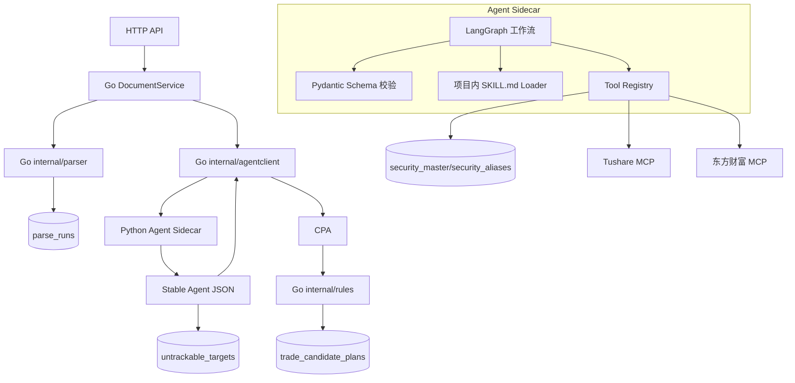
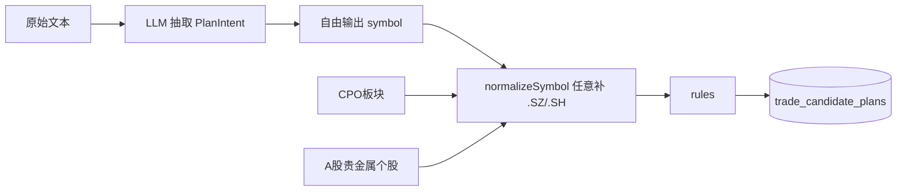
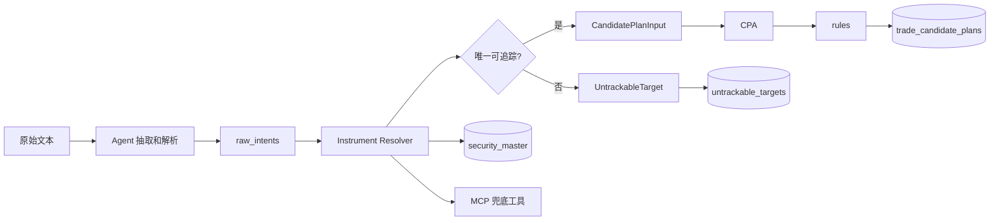
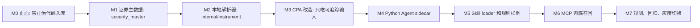

# Agent 标的解析层与 CPA 稳定输入技术方案

## 1. 结论

当前 `trade_candidate_plans` 出现 `A股贵金属个股.SZ`、`CPO板块.SZ`，说明现有 LLM 抽取层把板块/主题/泛称误当成股票代码，并且后续 `normalizeSymbol` 又把任意文本补成 `.SZ`。

推荐重构为：

```text
Go 主系统
-> Python Agent Sidecar
-> LangGraph 编排
-> Pydantic 校验
-> 本地 security_master 优先
-> Tushare MCP / 东方财富 MCP 兜底
-> CPA 只接收稳定 JSON
-> rules 只生成可追踪证券的 CandidatePlan
```

核心原则：

- AI 可以抽取和消歧，但不能决定交易参数。
- MCP 可以召回候选，但不能绕过本地证券主数据。
- CPA 只接收已验证的 `ts_code`。
- 板块、主题、泛称进入不可追踪事件，不进入 `trade_candidate_plans`。

## 2. 通俗版说明

这套方案可以理解成“先找人读文章，再找身份证，再决定能不能建交易计划”。

原来的流程像是让 AI 读完文章后直接说“推荐了什么”。AI 看到“CPO板块”“A股贵金属个股”这类词，也会当成推荐标的填到 `symbol` 里。后面的代码又看到不是 `6` 开头，就直接补成 `.SZ`，于是出现了 `CPO板块.SZ` 这种看起来像股票代码、实际完全不能追踪的脏数据。

新方案把这件事拆开：

1. Agent 先读文章，找出文中提到的股票、板块、主题、泛称。
2. Resolver 去本地证券主数据表里查“这个名字到底是不是一只真实股票或 ETF”。
3. 如果本地查不到，再让 MCP 工具去 Tushare 或东方财富查候选。
4. 查到候选后还要回到本地证券主数据表确认，确认不了就不能进入候选计划。
5. CPA 只吃确认过的稳定 JSON，rules 再根据确定性规则生成价格、止损、止盈和仓位。

换句话说：

- Agent 像研究助理，负责读文章和找线索。
- `security_master` 像证券身份证库，负责判断“这个东西到底是不是可追踪证券”。
- MCP 像外部查询工具，只能帮忙找候选，不能直接拍板。
- CPA 像门禁，只放行已经验明身份的证券。
- rules 像计算器，只负责按固定规则算交易参数。

这样做的结果是：文章里出现“CPO板块”时，系统不会再把它伪造成 `CPO板块.SZ`。如果文章同时提到“新易盛”“旭创”，系统会尝试把这两个名字解析成真实股票代码；如果解析成功，才生成候选计划。

## 3. 英文术语中文解释

本文保留了一些英文名，因为它们会成为代码目录、接口字段、数据库表名或第三方技术名称。下面是统一解释。

| 英文/代码名 | 中文解释 | 在本方案里的意思 |
| --- | --- | --- |
| Agent | 智能代理 | 一个独立的 Python 服务，负责读文章、调用工具、解析标的、输出稳定 JSON。 |
| Sidecar | 旁路服务 / 辅助服务 | 不放进 Go 主进程，而是作为旁边单独运行的服务。 |
| Python Agent Sidecar | Python 智能代理旁路服务 | 用 Python 写的 Agent 服务，Go 后端通过 HTTP 调它。 |
| LangGraph | LangGraph 工作流框架 | 用来编排 Agent 的多步骤流程，例如抽取、查本地库、调工具、消歧、校验。 |
| Pydantic | Pydantic 数据校验库 | 用来定义 Agent 输出格式，并强制校验字段是否合法。 |
| MCP | 模型上下文协议 | 一种让 Agent 连接外部工具和数据源的协议。 |
| Tushare MCP | Tushare 工具服务 | 通过 MCP 方式查询 Tushare 数据，用于补充证券候选。 |
| 东方财富 MCP | 东方财富工具服务 | 通过 MCP 方式查询东方财富相关数据，用于板块/概念候选召回。 |
| CPA | 候选计划装配器 | Candidate Plan Assembler 的缩写，只接收已校验标的，再交给 rules 生成候选计划。 |
| rules | 确定性规则引擎 | 当前 `internal/rules`，只负责生成入场价、止损价、止盈价、仓位。 |
| stable JSON | 稳定 JSON 输出 | Agent 最终返回给 Go 的固定格式 JSON，字段和含义不能随意变化。 |
| schema | 数据结构约束 | 规定 JSON 里必须有哪些字段、字段类型是什么、允许哪些枚举值。 |
| JSON Schema | JSON 结构说明 | 可机器读取的数据格式说明，方便跨语言校验。 |
| security_master | 证券主数据表 | 本地股票/ETF/指数基础信息表，是判断能不能追踪的第一依据。 |
| security_aliases | 证券别名表 | 存股票简称、常用别名、拼音缩写等，用于把“旭创”映射到“中际旭创”。 |
| Instrument Resolver | 标的解析器 | 把原文里的股票名、板块名、主题名解析成真实证券或不可追踪目标。 |
| CandidatePlan | 候选交易计划 | 当前系统落到 `trade_candidate_plans` 的结构化计划。 |
| CandidatePlanInput | 候选计划输入 | Agent 校验后给 CPA 的输入，只能包含真实可追踪证券。 |
| PlanIntent | 交易意图 | AI 从文本里抽出的推荐意图，不能直接进 rules。 |
| TrackablePlanIntent | 可追踪交易意图 | 已经确认有真实证券代码的交易意图，可以进入 rules。 |
| RecommendationEvent | 推荐事件 | “谁在什么时间推荐了什么”的事实记录，不等于交易计划。 |
| UntrackableTarget | 不可追踪目标 | 板块、主题、泛称、歧义名称等不能直接跟踪的目标。 |
| raw_intents | 原始意图 | Agent 初步从文章中抽出来的推荐表达，还没经过证券校验。 |
| raw_name | 原始名称 | 文章里直接出现的名称，例如 `CPO板块`、`旭创`。 |
| target_type | 目标类型 | 标记是股票、ETF、指数、板块、主题、商品还是未知。 |
| ts_code | Tushare 证券代码 | Tushare 使用的证券代码，例如 `300502.SZ`。 |
| symbol | 证券代码主体 | 不带交易所后缀的 6 位代码，例如 `300502`。 |
| resolve | 解析 / 归一 | 把自然语言名称转换成确定证券代码的过程。 |
| disambiguate | 消歧 | 多个候选都可能匹配时，判断到底是哪一个。 |
| validate | 校验 | 检查字段、格式、枚举值和业务规则是否正确。 |
| fallback | 兜底 | 本地查不到时，再调用外部工具补充候选。 |
| uvicorn | Python ASGI 服务启动器 | 用来启动 Agent 的 HTTP 服务。 |
| FastAPI | Python HTTP API 框架 | 用来暴露 `/v1/resolve-document` 等接口。 |

代码块里的字段名、表名和目录名会继续保留英文，因为这些是后续实现时要直接使用的契约名称；中文解释以本表为准。

## 4. 选型通俗解释

### 4.1 为什么要用 Agent，而不是继续只调一个 LLM 接口

单次 LLM 调用只适合“读一段文本并返回结构化结果”。但现在的问题不是单纯读文本，而是要完成一串动作：

```text
读文章 -> 找出提到的名字 -> 判断是股票还是板块 -> 查本地证券库 -> 查不到再查工具 -> 多候选时消歧 -> 输出稳定 JSON
```

这已经是一个小工作流，不是一个 prompt 能稳定解决的问题。Agent 的价值就是把这个工作流串起来，并且能在每一步调用工具。

### 4.2 为什么用 LangGraph

LangGraph 不是为了“更高级”，而是为了让 Agent 流程可控。标的解析不是一次问答，它有明确步骤和分支：

- 本地查到了，就不用调外部工具。
- 本地没查到，才调 MCP。
- 调 MCP 后有多个候选，需要消歧。
- 消歧失败，要落成不可追踪目标。
- 输出不合法，要重试或失败。

这些步骤用普通函数也能写，但后面会越来越乱。LangGraph 让这些节点和分支显式化，方便测试、重试和审计。

### 4.3 为什么用 Pydantic

Pydantic 的作用是“把 AI 输出关进格式笼子里”。Agent 最终返回的 JSON 必须满足 schema，比如：

- `ts_code` 必须像 `300502.SZ`。
- `direction` 只能是 `LONG` 或 `SHORT`。
- `confidence` 必须在 `(0,1]`。
- `candidate_plan_inputs` 里不能放板块。

没有 Pydantic，就容易出现 AI 输出字段少了、类型错了、枚举乱写了，Go 侧再处理会很痛苦。

### 4.4 为什么本地 security_master 优先

因为最终要交给 Tushare 追踪，必须有确定证券代码。外部工具可以帮忙找候选，但最终判断必须依赖本地可控的数据表。

可以把 `security_master` 理解成“本系统自己的证券身份证库”。它不是行情表，不存今天涨跌幅；也不是推荐表，不存谁推荐了什么；它只回答一个问题：某个名字、代码或别名，能不能对应到一只真实、唯一、当前允许追踪的证券。

例如：

- `新易盛` 可以在 `security_master` 里找到 `300502.SZ`，所以可以进入后续候选计划。
- `中际旭创` 可以在 `security_master` 里找到 `300308.SZ`，所以可以进入后续候选计划。
- `旭创` 不是官方简称，但可以先命中 `security_aliases`，再关联到 `security_master` 的 `300308.SZ`。
- `CPO板块` 不是一只证券，不能直接进入 `trade_candidate_plans`。
- `A股贵金属个股` 是泛称，不是证券，不能伪造成 `.SZ`。

本地表的好处：

- 可重复：同一输入每次解析结果一致。
- 可审计：知道某个别名为什么映射到某只股票。
- 可修正：发现“旭创”应该指向“中际旭创”，可以加 alias。
- 可控：外部工具挂了也不影响已有主数据判断。
- 可隔离：Tushare MCP 或东方财富 MCP 返回的候选必须回到本地表核验，不会把外部噪声直接写进交易计划。

### 4.5 为什么 MCP 只能兜底

MCP 是工具接入方式，不是权威数据本身。Tushare MCP、东方财富 MCP 都可能有超时、字段变化、候选不准等问题。所以它们只能帮忙“找可能是谁”，不能直接决定“就是谁”。

正确顺序是：

```text
MCP 返回候选 -> 回本地 security_master 校验 -> 通过才进 CPA
```

### 4.6 为什么要自己实现 SKILL.md loader

IDE 的 skill 机制不应该成为后端生产能力的一部分。我们可以借鉴 skill 的形式，但要把它变成项目内可版本化、可测试、可审计的文件。

项目内 `SKILL.md` 的作用是写清楚业务规则，例如：

- 板块不是股票。
- 泛称不是可追踪标的。
- 不能编造 `ts_code`。
- 只有本地证券表或工具确认过的证券才能进入候选计划输入。

这样 skill 会随着代码一起提交、评审和发布。

### 4.7 为什么 CPA 只接收稳定 JSON

CPA 是进入交易计划生成前的最后一道门。它不应该再猜测、查工具或修复 AI 输出。它只做一件事：把已经验明身份的标的交给 rules。

这样可以保证：

- 脏标的不会进入 `trade_candidate_plans`。
- rules 继续保持确定性。
- 后续 Tushare 跟踪只面对真实证券代码。

## 5. 调研评估

### 5.1 LangGraph

LangGraph 适合多步骤 Agent 工作流，尤其是需要工具调用、条件分支、重试、持久化和可恢复执行的流程。标的解析正好符合这个形态：先抽取原始目标，再查本地证券表，再必要时调用 MCP，再消歧和校验。

采用方式：

- 作为 Python sidecar 内部编排框架。
- 不进入 Go 主进程。
- 不直接写业务表。

### 5.2 Pydantic

Pydantic 适合定义 Agent 的输入、输出和工具返回 schema。Agent 输出必须先通过 Pydantic，再返回给 Go。Go 侧仍然做二次校验。

采用方式：

- Python Agent 内部 stable schema。
- 输出 JSON Schema 可作为跨语言契约。
- Go 不直接依赖 Python 运行时。

### 5.3 MCP

MCP 是工具/资源接入协议，适合作为 Agent 的工具层。Tushare MCP 和东方财富 MCP 可以作为兜底召回，但不能作为最终可信判断。

采用方式：

- 本地 `security_master` 第一优先。
- MCP 只在本地查不到或有歧义时使用。
- MCP 返回候选后仍需本地校验。
- 东方财富 MCP 如果不是官方稳定服务，按非权威三方工具处理。

### 5.4 security_master

本地证券主数据是最终可追踪性判断来源。一个标的如果无法映射成唯一有效 `ts_code`，就不能进入候选计划。

更通俗地说，`security_master` 是系统判断“这是不是一只真股票/ETF”的本地字典。它的典型数据来自 Tushare 的 `stock_basic`、ETF 基础信息、人工补充的必要字段，以及后续经过审核的外部候选。

它和其他表的关系如下：

- `security_master`：存官方身份，例如 `300502.SZ / 新易盛 / 股票 / 深交所 / 上市中`。
- `security_aliases`：存非官方但常见的叫法，例如 `旭创 -> 中际旭创`。
- `instrument_resolution_runs`：存一次文档解析过程中查了什么、怎么判断、为什么失败或成功。
- `untrackable_targets`：存不能直接追踪的目标，例如板块、主题、泛称、歧义名称。
- `trade_candidate_plans`：只存已经通过 `security_master` 验证的候选交易计划。

阶段一不要求 `security_master` 覆盖所有市场，只要求覆盖 A 股股票和后续要跟踪的 ETF。指数、板块、行业、主题先不进入候选交易计划；如果文中提到它们，只记录为不可追踪目标或推荐事件。

## 6. 总体架构



边界：

- Go：事务、数据库、rules、HTTP API。
- Agent：工具调用、标的解析、消歧、稳定 JSON。
- CPA：只做稳定 JSON 到 rules 输入的转换。
- rules：只生成入场价、止损价、止盈价、仓位。

## 7. 当前链路问题



错误根因：

- `symbol` 既承载股票，也承载板块/主题。
- 没有 `target_type`。
- 没有本地证券主数据校验。
- 规则层收到的输入已经被污染。

## 8. 目标链路



## 9. 示例

### 9.1 CPO 板块

原文：

```text
周五科技股领涨的CPO板块，在周末两个大佬新易盛和旭创公布了出色的业绩预告，
也让板块吃下定心丸，尤其是新易盛四季度业绩大幅增长完全超预期，
周一可以看看这两个股票如何演绎行情。
```

正确输出：

```json
{
  "candidate_plan_inputs": [
    {
      "ts_code": "300502.SZ",
      "name": "新易盛",
      "direction": "LONG",
      "reference_price": 0
    },
    {
      "ts_code": "300308.SZ",
      "name": "中际旭创",
      "direction": "LONG",
      "reference_price": 0
    }
  ],
  "untrackable_targets": [
    {
      "raw_name": "CPO板块",
      "target_type": "SECTOR",
      "reason": "sector_or_theme_not_directly_tradeable"
    }
  ]
}
```

### 9.2 A 股贵金属个股

原文：

```text
A股的贵金属个股将在周一继续大面积跌停。
```

正确输出：

```json
{
  "candidate_plan_inputs": [],
  "untrackable_targets": [
    {
      "raw_name": "A股贵金属个股",
      "target_type": "THEME",
      "reason": "broad_theme_without_specific_security"
    }
  ]
}
```

## 10. Agent Sidecar 设计

目录：

```text
agent/
  pyproject.toml
  app/
    main.py
    config.py
    graph.py
    schemas.py
    skills.py
    tools/
      local_security.py
      tushare_mcp.py
      eastmoney_mcp.py
      llm_client.py
    nodes/
      extract_raw_intents.py
      resolve_local.py
      resolve_mcp.py
      disambiguate.py
      validate_output.py
  skills/
    instrument_resolution/
      SKILL.md
      examples.jsonl
```

目录中文解释：

- `agent/`：Python Agent 服务根目录。
- `pyproject.toml`：Python 项目依赖和构建配置。
- `app/main.py`：HTTP 服务入口。
- `app/config.py`：Agent 配置读取。
- `app/graph.py`：LangGraph 工作流定义。
- `app/schemas.py`：Pydantic schema 定义。
- `app/skills.py`：项目内 SKILL.md loader。
- `app/tools/`：本地证券表、Tushare MCP、东方财富 MCP、LLM 客户端等工具封装。
- `app/nodes/`：LangGraph 每个节点的具体实现。
- `skills/instrument_resolution/SKILL.md`：标的解析规则说明。
- `examples.jsonl`：标的解析正反例样本。

LangGraph 节点：


## 11. Pydantic Stable Schema

核心输出：

```python
class ResolvedSecurity(BaseModel):
    ts_code: str = Field(pattern=r"^\d{6}\.(SH|SZ|BJ)$")
    symbol: str = Field(pattern=r"^\d{6}$")
    name: str = Field(min_length=1)
    exchange: str
    market: str
    asset_type: Literal["STOCK", "ETF"]
    list_status: Literal["L", "P", "D", "G"]
    source: DataSource
    confidence: float = Field(gt=0, le=1)

class CandidatePlanInput(BaseModel):
    source_intent_id: str
    security: ResolvedSecurity
    direction: Literal["LONG", "SHORT"]
    reference_price: float = Field(ge=0)
    reference_price_note: str
    thesis: str = Field(min_length=1, max_length=500)
    risks: list[str] = Field(default_factory=list, max_length=5)
    evidence: list[EvidenceSpan] = Field(default_factory=list, min_length=1, max_length=8)
    confidence: float = Field(gt=0, le=1)

class AgentResolutionOutput(BaseModel):
    schema_version: Literal["agent_resolution.v1"]
    agent_version: str
    status: Literal["RESOLVED", "PARTIAL", "FAILED"]
    candidate_plan_inputs: list[CandidatePlanInput]
    recommendation_events: list[RecommendationEventInput]
    untrackable_targets: list[UntrackableTarget]
    warnings: list[str] = Field(default_factory=list)
    debug: AgentDebug
```

CPA 只读取 `candidate_plan_inputs`。

关键字段中文解释：

| 字段 | 中文解释 |
| --- | --- |
| `ResolvedSecurity` | 已解析证券，表示已经确认能追踪的股票或 ETF。 |
| `ts_code` | Tushare 证券代码，例如 `300502.SZ`。 |
| `symbol` | 6 位股票代码主体，例如 `300502`。 |
| `asset_type` | 资产类型，阶段内只允许股票或 ETF。 |
| `list_status` | 上市状态，用于过滤退市或异常标的。 |
| `CandidatePlanInput` | 候选计划输入，CPA 只读取这个结构。 |
| `source_intent_id` | 原始意图 ID，用于追溯这条输入来自哪段文本。 |
| `reference_price` | 原文提到的参考价，没有则为 0。 |
| `reference_price_note` | 参考价说明，例如原文缺失价格。 |
| `evidence` | 支撑证据，来自原文片段。 |
| `AgentResolutionOutput` | Agent 最终稳定输出。 |
| `schema_version` | 输出结构版本。 |
| `agent_version` | Agent 版本。 |
| `untrackable_targets` | 不可追踪目标列表。 |
| `warnings` | 非致命问题提示。 |
| `debug` | 调试信息，例如使用了哪些工具。 |

## 12. 数据库设计

新增四组表：

```text
security_master
security_aliases
instrument_resolution_runs
untrackable_targets
```

### 12.0 security_master 通俗解释和实施细则

`security_master` 是这套方案里最关键的“证券身份证库”。它不负责判断一篇文章是不是看多，也不负责生成价格，更不负责存行情。它只负责维护证券的稳定身份，让系统知道：

- 这是不是一个真实可交易/可追踪的标的。
- 它的标准 Tushare 代码是什么。
- 它属于股票、ETF、指数还是其他类型。
- 它现在是否还处于可用状态。
- 它有哪些常见别名可以被原文命中。

#### 12.0.1 它到底存什么

一行 `security_master` 代表一个标准证券身份。阶段一只把“可以直接交给 Tushare 追踪的股票或 ETF”当作可进入候选计划的标的。

| ts_code | symbol | name | asset_type | exchange | list_status | 说明 |
| --- | --- | --- | --- | --- | --- | --- |
| `300502.SZ` | `300502` | `新易盛` | `STOCK` | `SZSE` | `L` | 可追踪股票，可以进入候选计划。 |
| `300308.SZ` | `300308` | `中际旭创` | `STOCK` | `SZSE` | `L` | 可追踪股票，可以进入候选计划。 |
| `510300.SH` | `510300` | `沪深300ETF` | `ETF` | `SSE` | `L` | 可追踪 ETF，配置允许后可以进入候选计划。 |

不会放进 `security_master` 的内容：

- `CPO板块`：这是板块，不是一只证券。
- `A股贵金属个股`：这是泛称，不是一只证券。
- `科技股`：这是主题/风格，不是一只证券。
- `黄金`、`白银`：这是商品或宏观资产，阶段一不直接进入 A 股候选计划。

如果未来要支持指数、行业、商品或港美股，可以继续扩展 `asset_type` 和追踪链路，但阶段一不要把这些东西混进股票/ETF 候选计划。

#### 12.0.2 它和 security_aliases 的区别

`security_master` 存“官方身份”，`security_aliases` 存“大家平时怎么叫它”。

例如 `中际旭创` 的官方身份在 `security_master`：

```text
security_master:
id=2
ts_code=300308.SZ
symbol=300308
name=中际旭创
asset_type=STOCK
exchange=SZSE
list_status=L
```

但文章里可能不会写全称，而是写“旭创”。这时用 `security_aliases` 处理：

```text
security_aliases:
security_id=2
alias=旭创
normalized_alias=旭创
alias_type=COMMON
source=MANUAL
confidence=1.0
```

解析时先把原文名称归一化，再查别名表，别名表命中后才能回到 `security_master` 取标准身份。也就是说，别名本身不能直接进入候选计划，必须最终落到唯一一行 `security_master`。

#### 12.0.3 它和 trade_candidate_plans 的区别

`security_master` 是基础资料表，变化频率低，类似“证券户籍册”。`trade_candidate_plans` 是业务结果表，记录某篇文档触发的一条候选交易计划。

两者不要混用：

- `security_master` 不存推荐方向、推荐理由、止损止盈、仓位。
- `trade_candidate_plans` 不负责判断 `CPO板块` 到底是不是证券。
- `trade_candidate_plans.symbol` 后续应该只保存已经验证过的标准代码，推荐直接存 `ts_code` 或新增 `ts_code` 字段，避免再出现任意文本补后缀。

#### 12.0.4 数据从哪里来

阶段一建议三类来源：

1. Tushare 基础数据初始化：用 `stock_basic` 初始化 A 股股票，后续补 ETF 基础表。
2. 人工维护别名：把高频简称、研报常用叫法、历史简称写入 `security_aliases`。
3. MCP 候选回填：MCP 只能召回候选，不能直接写正式主数据；候选必须通过校验或人工确认后再进入 `security_master` / `security_aliases`。

不要在每次文档解析时全量刷新 `security_master`。建议把同步任务和文档分析链路分开：

```text
定时/手动同步证券主数据 -> security_master
人工或审核任务维护别名 -> security_aliases
文档分析链路只读 security_master/security_aliases
```

这样可以保证一次文档分析是可重复、可审计的，不会因为外部工具临时返回不同结果导致候选计划漂移。

#### 12.0.5 解析链路里怎么用

标准流程：

```text
原文 raw_name
-> 名称归一化 normalized_name
-> 查 security_master.ts_code / symbol / name
-> 查不到再查 security_aliases.normalized_alias
-> 别名命中后回到 security_master
-> 判断 asset_type、list_status、唯一性
-> 通过后输出 CandidatePlanInput
-> 不通过则输出 UntrackableTarget 或 ambiguous target
```

对应判定规则：

- 命中唯一 `security_master` 且 `asset_type in (STOCK, ETF)`：允许进入 `candidate_plan_inputs`。
- 命中唯一但 `list_status` 不是可追踪状态：不进入候选计划，记录 `INACTIVE_SECURITY`。
- 命中多个证券：不猜，记录 `AMBIGUOUS`，必要时让 Agent 结合上下文消歧。
- 查不到证券，但像板块/行业/主题：记录 `SECTOR` / `THEME`，不进入候选计划。
- 查不到且无法分类：记录 `UNKNOWN`，不进入候选计划。
- MCP 返回候选：必须再次命中或写入本地审核流程，不能直接进入 CPA。

#### 12.0.6 Agent 里的最小查询接口

Agent 不应该直接拼复杂 SQL。Go 或 Python 工具层需要封装几个稳定查询能力：

```text
QueryByTSCode(ts_code)
QueryBySymbol(symbol)
QueryActiveByName(name)
QueryByNormalizedAlias(normalized_alias)
SearchCandidates(keyword, limit)
```

返回结果要包含：

```text
ts_code
symbol
name
asset_type
exchange
market
industry
list_status
match_type
confidence
```

`match_type` 用来解释是怎么命中的，例如：

- `TS_CODE_EXACT`：精确命中 `300502.SZ`。
- `SYMBOL_EXACT`：精确命中 `300502`。
- `NAME_EXACT`：精确命中 `新易盛`。
- `ALIAS_EXACT`：通过别名命中 `旭创 -> 中际旭创`。
- `FUZZY_CANDIDATE`：模糊候选，只能用于消歧，不能直接放行。

#### 12.0.7 最小落地数据

为了覆盖当前暴露出来的问题，M1 阶段至少需要导入：

```sql
INSERT INTO security_master
(ts_code, symbol, name, fullname, cnspell, asset_type, exchange, market, industry, list_status, data_source)
VALUES
('300502.SZ', '300502', '新易盛', '成都新易盛通信技术股份有限公司', 'XYS', 'STOCK', 'SZSE', '创业板', '通信设备', 'L', 'TUSHARE'),
('300308.SZ', '300308', '中际旭创', '中际旭创股份有限公司', 'ZJXC', 'STOCK', 'SZSE', '创业板', '通信设备', 'L', 'TUSHARE');

INSERT INTO security_aliases
(security_id, alias, normalized_alias, alias_type, source, confidence)
VALUES
((SELECT id FROM security_master WHERE ts_code='300308.SZ'), '旭创', '旭创', 'COMMON', 'MANUAL', 1.0);
```

这组数据可以验证：

- `新易盛` -> `300502.SZ`。
- `中际旭创` -> `300308.SZ`。
- `旭创` -> `300308.SZ`。
- `CPO板块` -> `untrackable_targets`。
- `A股贵金属个股` -> `untrackable_targets`。

#### 12.0.8 实施时的注意事项

- `security_master.ts_code` 必须唯一。
- `security_master.symbol` 不是唯一键，因为不同市场未来可能存在相同主体代码，唯一身份以 `ts_code` 为准。
- `security_aliases.normalized_alias` 可能对应多个证券，查询结果必须允许返回多条并进入消歧。
- `list_status` 阶段一只允许 `L` 进入候选计划，其他状态先拦截。
- Agent 可以使用 MCP 查候选，但 CPA 只相信本地 `security_master` 校验后的结果。
- 任何无法唯一确认的标的都不能靠字符串规则补 `.SZ/.SH`。

### 12.1 security_master

```sql
CREATE TABLE `security_master` (
  `id` bigint NOT NULL AUTO_INCREMENT,
  `ts_code` varchar(16) NOT NULL,
  `symbol` varchar(16) NOT NULL,
  `name` varchar(128) NOT NULL,
  `fullname` varchar(255) NOT NULL DEFAULT '',
  `cnspell` varchar(64) NOT NULL DEFAULT '',
  `asset_type` varchar(32) NOT NULL,
  `exchange` varchar(16) NOT NULL,
  `market` varchar(64) NOT NULL DEFAULT '',
  `industry` varchar(128) NOT NULL DEFAULT '',
  `list_status` varchar(8) NOT NULL,
  `list_date` date DEFAULT NULL,
  `delist_date` date DEFAULT NULL,
  `data_source` varchar(32) NOT NULL,
  `source_updated_at` timestamp NULL DEFAULT NULL,
  `created_at` timestamp NOT NULL DEFAULT CURRENT_TIMESTAMP,
  `updated_at` timestamp NOT NULL DEFAULT CURRENT_TIMESTAMP ON UPDATE CURRENT_TIMESTAMP,
  PRIMARY KEY (`id`),
  UNIQUE KEY `uk_security_master_ts_code` (`ts_code`),
  KEY `idx_security_master_symbol` (`symbol`),
  KEY `idx_security_master_name` (`name`)
);
```

字段中文解释：

- `ts_code`：Tushare 证券代码。
- `symbol`：6 位证券代码主体。
- `name`：证券简称。
- `fullname`：证券全称。
- `cnspell`：拼音缩写。
- `asset_type`：资产类型。
- `exchange`：交易所。
- `market`：市场板块。
- `industry`：行业。
- `list_status`：上市状态。
- `data_source`：数据来源。
- `source_updated_at`：来源数据更新时间。

### 12.2 security_aliases

```sql
CREATE TABLE `security_aliases` (
  `id` bigint NOT NULL AUTO_INCREMENT,
  `security_id` bigint NOT NULL,
  `alias` varchar(128) NOT NULL,
  `normalized_alias` varchar(128) NOT NULL,
  `alias_type` varchar(32) NOT NULL,
  `source` varchar(32) NOT NULL,
  `confidence` double NOT NULL DEFAULT '1',
  `created_at` timestamp NOT NULL DEFAULT CURRENT_TIMESTAMP,
  `updated_at` timestamp NOT NULL DEFAULT CURRENT_TIMESTAMP ON UPDATE CURRENT_TIMESTAMP,
  PRIMARY KEY (`id`),
  UNIQUE KEY `uk_security_aliases_security_alias` (`security_id`, `normalized_alias`),
  KEY `idx_security_aliases_normalized` (`normalized_alias`)
);
```

字段中文解释：

- `security_id`：关联到 `security_master`。
- `alias`：别名原文，例如“旭创”。
- `normalized_alias`：归一化后的别名。
- `alias_type`：别名类型，例如简称、全称、拼音、人工维护。
- `source`：别名来源。
- `confidence`：别名可信度。

## 13. Go 主系统改造

新增：

```text
internal/agentclient
internal/instrument
```

`DocumentService` 从：

```text
parser -> llm.Analyze -> rules.Generate -> trade_candidate_plans
```

改成：

```text
parser -> agentclient.ResolveDocument -> CPA -> rules.Generate -> trade_candidate_plans
```

`rules.Generate` 入参从 `PlanIntent` 改成 `TrackablePlanIntent`：

```go
type TrackablePlanIntent struct {
    SourceIntentID     string
    TSCode             string
    Symbol             string
    SecurityName       string
    AssetType          AssetType
    Market             Market
    Direction          TradeDirection
    ReferencePrice     float64
    ReferencePriceNote ReferencePriceNote
    Thesis             string
    Evidence           []EvidenceSpan
    Risks              []string
    Confidence         float64
}
```

结构字段中文解释：

- `TrackablePlanIntent`：可追踪交易意图。
- `SourceIntentID`：原始意图 ID。
- `TSCode`：Tushare 证券代码。
- `SecurityName`：证券名称。
- `AssetType`：资产类型。
- `Market`：市场。
- `Direction`：方向，多头或空头。
- `ReferencePrice`：参考价。
- `ReferencePriceNote`：参考价说明。
- `Thesis`：推荐逻辑。
- `Evidence`：原文证据。
- `Risks`：风险提示。
- `Confidence`：抽取置信度。

## 14. 配置

新增配置：

```json
{
  "agent": {
    "enabled": true,
    "endpoint": "http://127.0.0.1:18080",
    "timeout_ms": 60000,
    "max_retries": 1,
    "schema_version": "agent_resolution.v1",
    "allow_legacy_llm_fallback": false
  },
  "instrument": {
    "trackable_asset_types": ["STOCK", "ETF"],
    "allow_sector_as_plan": false,
    "require_security_master_hit": true,
    "max_resolution_candidates": 5
  },
  "mcp_tools": {
    "tushare_enabled": true,
    "eastmoney_enabled": false,
    "tool_timeout_ms": 10000
  }
}
```

配置字段中文解释：

- `agent.enabled`：是否启用 Agent。
- `agent.endpoint`：Agent HTTP 地址。
- `agent.timeout_ms`：调用 Agent 的超时时间。
- `agent.max_retries`：Agent 调用失败后的重试次数。
- `agent.schema_version`：期望的稳定 JSON schema 版本。
- `agent.allow_legacy_llm_fallback`：是否允许回退到旧 LLM 链路。
- `instrument.trackable_asset_types`：允许进入候选计划的资产类型。
- `instrument.allow_sector_as_plan`：是否允许板块直接生成计划，阶段内应为 false。
- `instrument.require_security_master_hit`：是否要求命中本地证券主数据。
- `instrument.max_resolution_candidates`：单个目标最大候选数量。
- `mcp_tools.tushare_enabled`：是否启用 Tushare MCP。
- `mcp_tools.eastmoney_enabled`：是否启用东方财富 MCP。
- `mcp_tools.tool_timeout_ms`：单次工具调用超时时间。

## 15. 最小执行步骤

### 15.1 M0：止血

1. 删除任意字符串补 `.SZ/.SH`。
2. 新增 `ValidateTSCode`。
3. `CPO板块`、`A股贵金属个股` 不允许进入 `trade_candidate_plans`。
4. 增加测试。

### 15.2 M1：本地 security_master

1. 建表。
2. 生成 db_model。
3. 新增 DAL。
4. 导入最小样例：
   - `300502.SZ 新易盛`
   - `300308.SZ 中际旭创`
5. 本地 resolver 能解析名称和 alias。

### 15.3 M2：Agent sidecar

1. 新增 `agent/` 工程。
2. FastAPI 暴露 `/v1/resolve-document`。
3. LangGraph 实现节点。
4. Pydantic 校验输出。
5. Go `internal/agentclient` 调用 sidecar。

### 15.4 M3：Skill loader

1. 新增项目内 `SKILL.md`。
2. 启动加载并计算 hash。
3. 响应中返回 skill hash。
4. 落库审计。

### 15.5 M4：MCP 工具

1. 接 Tushare MCP。
2. 接东方财富 MCP。
3. 只做候选召回。
4. MCP 候选必须过本地 security master。

### 15.6 M5：CPA 切换

1. `rules.Generate` 改入参。
2. CPA 只遍历 `candidate_plan_inputs`。
3. 不可追踪目标写库。
4. `trade_candidate_plans.symbol` 明确存 `ts_code`。

### 15.7 M6：观测和回归

1. 保存 `instrument_resolution_runs`。
2. 保存 `untrackable_targets`。
3. 增加 API 查询解析结果。
4. 增加回归样例。

## 16. 验收标准

1. 不再出现 `CPO板块.SZ`、`A股贵金属个股.SZ`。
2. `新易盛` 解析为 `300502.SZ`。
3. `旭创` 解析为 `300308.SZ` 或通过 alias 指向 `中际旭创`。
4. 板块、主题、泛称进入 `untrackable_targets`。
5. CPA 只接收 Agent 稳定 JSON。
6. Agent 输出先过 Pydantic，再过 Go 校验。
7. `go test ./...` 和 `go build ./...` 通过。

## 17. 调研来源

- LangGraph Durable Execution：<https://docs.langchain.com/oss/python/langgraph/durable-execution>
- Pydantic Models：<https://docs.pydantic.dev/latest/concepts/models/>
- Pydantic JSON Schema：<https://docs.pydantic.dev/latest/concepts/json_schema/>
- MCP Architecture：<https://modelcontextprotocol.io/docs/learn/architecture>
- Tushare stock_basic：<https://tushare.pro/document/2?doc_id=25>
- Tushare trade_cal：<https://tushare.pro/document/2?doc_id=26>
- Tushare daily：<https://tushare.pro/document/2?doc_id=27>

## 18. 逐步实现路径和阶段目标

本章把前面的技术方案拆成可以逐步落地的工程路径。核心思路不是一次性把 Python Agent、MCP、skills、主数据、CPA 全部做完，而是先把脏数据入口关住，再让系统具备“识别真实证券”的能力，最后再接入 Agent 和外部工具。

实施顺序遵循四个原则：

1. 先止血，再增强。先保证 `trade_candidate_plans` 不再写入伪代码。
2. 先本地确定性，再外部工具。先建设 `security_master`，再接 Tushare MCP / 东方财富 MCP。
3. 先稳定契约，再智能编排。先定义 Go 与 Agent 之间的 JSON schema，再让 LangGraph 承担复杂流程。
4. 先可观测，再扩大范围。每一步都要能知道解析过程为什么成功或失败。

### 18.1 总体里程碑



阶段目标：

| 阶段 | 目标 | 完成后的效果 |
| --- | --- | --- |
| M0 | 止血 | `CPO板块.SZ`、`A股贵金属个股.SZ` 这类伪代码不再进入候选计划。 |
| M1 | 建证券主数据 | 系统有本地“证券身份证库”，能存股票、ETF、别名和上市状态。 |
| M2 | 本地解析器 | 不依赖 Agent，也能把 `新易盛`、`旭创` 解析成真实 `ts_code`。 |
| M3 | CPA 改造 | `rules` 只接收可追踪证券，板块/主题/泛称进入不可追踪记录。 |
| M4 | Agent sidecar | Python Agent 能读文本、查本地库、输出稳定 JSON。 |
| M5 | Skill loader | 标的解析规则进入项目内文件，能版本化、审计和测试。 |
| M6 | MCP 兜底 | 本地查不到时能调用外部工具召回候选，但仍需本地校验。 |
| M7 | 观测和灰度 | 每次解析有过程记录、失败原因、回归样例和开关。 |

### 18.2 M0：止血阶段

目标：先阻断“任意文本补 `.SZ/.SH`”造成的脏数据。

实施内容：

1. 删除或废弃当前 `normalizeSymbol` 里“非 6 开头就补 `.SZ`”的逻辑。
2. 新增 `ValidateTSCode` / `ValidateSymbol` 这类纯校验函数。
3. `PlanIntent.symbol` 如果不是标准格式，不再进入 `rules.Generate`。
4. LLM 输出非法标的时，当前分析可以失败，也可以落为不可追踪目标；但不能写入 `trade_candidate_plans`。
5. 增加针对以下输入的单元测试：
   - `300502.SZ`：合法。
   - `600519.SH`：合法。
   - `CPO板块`：非法。
   - `A股贵金属个股`：非法。
   - `CPO板块.SZ`：非法，因为主体不是 6 位数字。

代码落点：

```text
internal/llm/extractor.go
internal/domain/enums.go
internal/rules/engine.go
internal/service/document.go
internal/llm/extractor_test.go
internal/rules/engine_test.go
```

验收标准：

```text
go test ./...
go build ./...
```

并且用现有样例跑分析时，`trade_candidate_plans` 中不再出现非标准 `ts_code`。

### 18.3 M1：证券主数据阶段

目标：把“这是不是一个真实可追踪证券”的判断从 AI 输出转移到本地数据库。

新增表：

```text
security_master
security_aliases
```

实施内容：

1. 在 `migrations/` 新增建表 SQL。
2. 执行 `go run generate.go` 同步 `internal/domain/db_model`。
3. 在 `internal/dal/security_master.go` 增加主数据查询 DML。
4. 在 `internal/dal/security_alias.go` 增加别名查询 DML。
5. 新增最小初始化脚本或管理命令，至少写入：
   - `300502.SZ / 新易盛`
   - `300308.SZ / 中际旭创`
   - `旭创 -> 300308.SZ`
6. 暂时不把全量 Tushare 同步做进文档分析链路；主数据同步和文档分析要解耦。

DAL 方法建议：

```go
SecurityMasters.QueryByTSCode(ctx, db, param)
SecurityMasters.QueryBySymbol(ctx, db, param)
SecurityMasters.QueryActiveByName(ctx, db, param)
SecurityAliases.QueryByNormalizedAlias(ctx, db, param)
```

阶段性验收：

- 能通过名称查到 `新易盛 -> 300502.SZ`。
- 能通过别名查到 `旭创 -> 中际旭创 -> 300308.SZ`。
- `CPO板块` 查不到证券主数据。
- `A股贵金属个股` 查不到证券主数据。

### 18.4 M2：本地 Instrument Resolver 阶段

目标：在 Go 侧先建一个确定性标的解析器，即使 Python Agent 还没接入，也能完成最小可用解析。

新增目录：

```text
internal/instrument/
  resolver.go
  normalize.go
  types.go
  resolver_test.go
```

职责划分：

- `normalize.go`：处理名称归一化，例如去空格、全角半角、常见标点。
- `types.go`：定义 `ResolvedInstrument`、`UntrackableTarget`、`ResolutionCandidate`。
- `resolver.go`：按 `ts_code -> symbol -> name -> alias -> fuzzy candidates` 的顺序解析。
- `resolver_test.go`：覆盖当前已知问题样例。

解析策略：

```text
输入 raw_name
-> 如果是标准 ts_code，查 security_master
-> 如果是 6 位 symbol，查 security_master
-> 如果是证券简称，查 security_master.name
-> 如果是别名，查 security_aliases
-> 多候选则返回 AMBIGUOUS
-> 板块/主题/泛称则返回 UNTRACKABLE
```

这一步先不要调用外部工具，不要引入 LangGraph，不要把问题做大。目标是先把本地确定性规则跑通。

### 18.5 M3：CPA 和 rules 输入改造阶段

目标：让交易计划生成链路只接收“已经验明身份”的证券。

新增或调整结构：

```go
type TrackablePlanIntent struct {
    SourceIntentID string
    TSCode string
    Symbol string
    SecurityName string
    AssetType AssetType
    Market Market
    Direction TradeDirection
    ReferencePrice float64
    ReferencePriceNote ReferencePriceNote
    Thesis string
    Evidence []EvidenceSpan
    Risks []string
    Confidence float64
}
```

实施内容：

1. 在 `internal/service` 增加 CPA 装配逻辑。
2. CPA 输入可以先来自旧 LLM `PlanIntent + internal/instrument`，后续再切 Agent 输出。
3. `rules.Generate` 入参改为 `TrackablePlanIntent`。
4. `trade_candidate_plans.symbol` 写入标准 `ts_code` 或新增 `ts_code` 字段后写入 `ts_code`。
5. 不可追踪目标写入 `untrackable_targets`，不要丢弃。

关键约束：

- CPA 不调用 LLM。
- CPA 不调用 MCP。
- CPA 不猜测证券代码。
- CPA 不修复非法 symbol。
- CPA 只接收 resolver 或 Agent 已经确认的证券。

阶段性验收：

- `CPO板块` 会生成不可追踪记录，不生成候选交易计划。
- `新易盛` 能生成候选交易计划。
- `旭创` 通过 alias 能生成 `300308.SZ` 对应候选交易计划。

### 18.6 M4：Python Agent sidecar 阶段

目标：在 Go 主系统旁边启动一个 Python 服务，负责更复杂的抽取、工具调用、消歧和稳定 JSON 输出。

新增目录：

```text
agent/
  pyproject.toml
  README.md
  app/
    main.py
    config.py
    graph.py
    schemas.py
    skills.py
    tools/
    nodes/
  tests/
```

接口：

```text
POST /v1/resolve-document
```

请求包含：

```json
{
  "schema_version": "agent_resolution_request.v1",
  "document_id": 19,
  "parse_run_id": 14,
  "trade_date": "2026-05-17",
  "chunks": [
    {
      "chunk_index": 0,
      "text": "..."
    }
  ]
}
```

响应包含：

```json
{
  "schema_version": "agent_resolution.v1",
  "status": "RESOLVED",
  "candidate_plan_inputs": [],
  "recommendation_events": [],
  "untrackable_targets": [],
  "warnings": [],
  "debug": {
    "graph_run_id": "...",
    "skill_hash": "...",
    "tools_used": []
  }
}
```

LangGraph 节点最小集：

```text
load_skill
extract_raw_intents
resolve_with_local_security
classify_untrackable
validate_output
```

先不接 MCP 时，Agent 仍然有价值：它可以比单次 LLM 更清晰地拆分“原始目标、可追踪证券、不可追踪目标、证据”。

Go 侧新增：

```text
internal/agentclient/
  client.go
  types.go
  client_test.go
```

调用策略：

- 超时来自 Nacos 配置。
- 失败按 `agent.max_retries` 重试。
- 返回 schema version 不匹配则失败。
- Agent 返回 `FAILED` 时，当前分析失败或只落解析失败记录，不进入 rules。

### 18.7 M5：项目内 Skill loader 阶段

目标：把标的解析规则从“写在 prompt 里的散文”变成项目内可版本化文件。

新增：

```text
agent/skills/instrument_resolution/SKILL.md
agent/skills/instrument_resolution/examples.jsonl
```

`SKILL.md` 应明确写入：

- 不允许编造 `ts_code`。
- 板块、主题、泛称不能进入候选计划。
- MCP 返回候选必须回本地 `security_master` 校验。
- 多候选不确定时返回 `AMBIGUOUS`。
- 只有 `asset_type in (STOCK, ETF)` 且 `list_status = L` 才能进入 `candidate_plan_inputs`。

loader 行为：

1. Agent 启动时读取 `SKILL.md`。
2. 计算 `skill_hash`。
3. 每次 Agent 响应带上 `skill_hash`。
4. `instrument_resolution_runs` 记录本次使用的 `skill_hash`。

这样后续如果规则变了，可以追溯某一次解析使用的是哪版规则。

### 18.8 M6：MCP 兜底阶段

目标：本地解析失败或歧义时，允许 Agent 使用外部工具召回候选。

接入顺序：

1. Tushare MCP：优先用于股票、ETF 基础信息候选。
2. 东方财富 MCP：用于概念、板块、常用简称辅助判断。

使用约束：

```text
本地查不到
-> MCP 召回候选
-> 候选写入 resolution candidates
-> 回本地 security_master 校验
-> 本地仍没有则不进 CPA
```

禁止行为：

- 禁止 MCP 返回一个名字后直接写 `trade_candidate_plans`。
- 禁止 Agent 根据常识生成 `ts_code`。
- 禁止把板块代码当作股票代码。
- 禁止把东方财富概念/板块直接当成 Tushare 可追踪证券。

阶段性验收：

- MCP 工具超时不会拖垮 Go 主链路。
- MCP 返回多候选时不会强行选择。
- MCP 找到候选但本地未校验时，不进入候选计划。

### 18.9 M7：观测、回归和灰度切换阶段

目标：让这条新链路可排查、可回归、可切换。

新增表：

```text
instrument_resolution_runs
untrackable_targets
```

记录内容：

- 输入文档 ID、parse run ID、chunk 范围。
- Agent schema version、agent version、skill hash。
- 使用了哪些工具。
- 每个 raw target 的解析结果。
- 失败原因。
- 进入 CPA 的候选数量。
- 进入不可追踪目标的数量。

新增 API 建议：

```text
GET /api/v1/documents/{id}/resolution-runs
GET /api/v1/resolution-runs/{id}
GET /api/v1/documents/{id}/untrackable-targets
```

灰度开关：

```json
{
  "agent": {
    "enabled": true,
    "shadow_mode": false,
    "allow_legacy_llm_fallback": false
  }
}
```

切换策略：

1. `shadow_mode=true`：旧链路仍生成计划，新链路只记录解析结果，用于对比。
2. `agent.enabled=true` 且 `shadow_mode=false`：正式由 Agent + CPA 链路生成计划。
3. `allow_legacy_llm_fallback=false`：Agent 失败时不回退旧链路，避免脏数据重新进入。

### 18.10 推荐开发顺序

第一批 PR：止血和主数据基础。

```text
M0 + M1
```

产出：

- migrations。
- db_model 更新。
- DAL。
- TSCode 校验。
- 禁止伪 symbol 入库。
- 最小主数据样例。

第二批 PR：本地 resolver 和 CPA。

```text
M2 + M3
```

产出：

- `internal/instrument`。
- `TrackablePlanIntent`。
- `rules.Generate` 入参切换。
- `untrackable_targets`。
- 当前样例回归测试。

第三批 PR：Agent sidecar 最小闭环。

```text
M4 + M5
```

产出：

- `agent/` Python 工程。
- FastAPI 接口。
- LangGraph 最小节点。
- Pydantic schema。
- SKILL.md loader。
- Go `agentclient`。

第四批 PR：MCP 和观测增强。

```text
M6 + M7
```

产出：

- Tushare MCP 工具。
- 东方财富 MCP 工具。
- resolution run 查询 API。
- shadow mode 对比。
- 回归样例集。

### 18.11 每阶段测试清单

M0 测试：

- 非 6 位主体 symbol 被拒绝。
- `CPO板块.SZ` 被拒绝。
- 合法 `300502.SZ` 通过。

M1 测试：

- `security_master` 唯一键生效。
- `security_aliases` 能通过 `旭创` 找到 `中际旭创`。
- 退市或非 `L` 状态不能进入候选计划。

M2 测试：

- `新易盛` 解析为 `300502.SZ`。
- `旭创` 解析为 `300308.SZ`。
- `CPO板块` 输出 `UntrackableTarget`。
- 多候选返回 `AMBIGUOUS`。

M3 测试：

- CPA 不接收非法 symbol。
- `rules.Generate` 不再接收原始 `PlanIntent`。
- 不可追踪目标不会写入 `trade_candidate_plans`。

M4 测试：

- Agent schema 校验失败会返回 `FAILED`。
- Go 收到 schema version 不匹配会失败。
- Agent 超时按配置重试。

M5 测试：

- 修改 `SKILL.md` 后 `skill_hash` 变化。
- Agent 响应包含 `skill_hash`。
- resolution run 记录 `skill_hash`。

M6 测试：

- MCP 超时返回 warning，不直接污染计划。
- MCP 返回候选后必须本地校验。
- 外部工具不可用时，本地 resolver 仍可工作。

M7 测试：

- shadow mode 不影响旧链路写计划。
- 正式模式只用 Agent + CPA 写计划。
- 查询 API 能看到解析过程和失败原因。

### 18.12 最终目标状态

最终希望达到的状态是：

```text
文章中出现真实股票名
-> 解析成唯一 ts_code
-> CPA 放行
-> rules 生成候选计划
-> Tushare 可追踪
```

```text
文章中出现板块、主题、泛称
-> 记录推荐事件或不可追踪目标
-> 不生成候选交易计划
-> 不污染 trade_candidate_plans
```

这条路径完成后，系统就从“AI 说什么就落什么”升级为“AI 找线索，本地证券主数据验身份，CPA 放行，rules 算交易参数”。这既保留了 Agent 的灵活性，也保留了 Go 主系统的确定性和可审计性。
