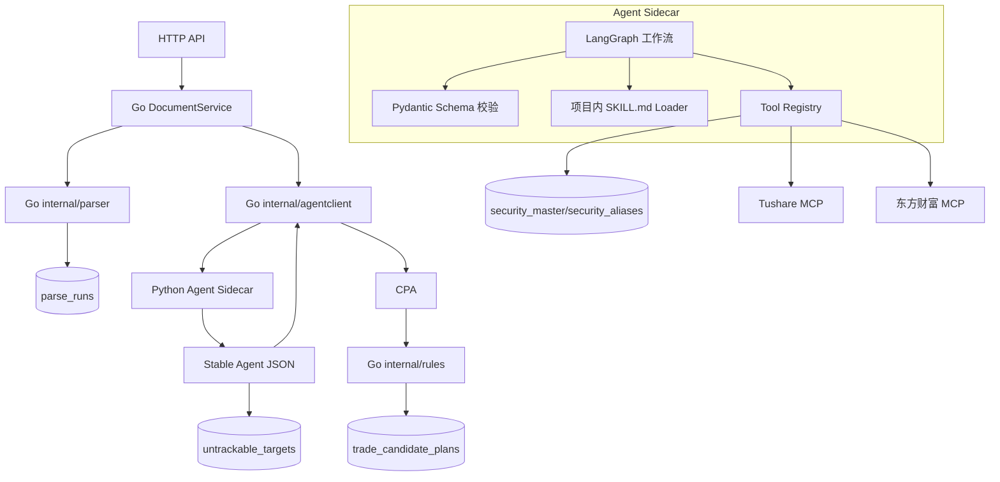
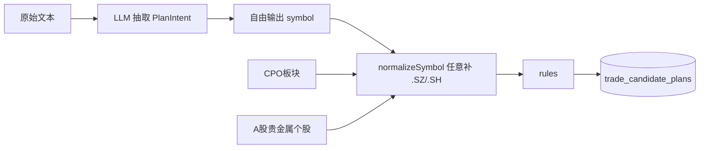
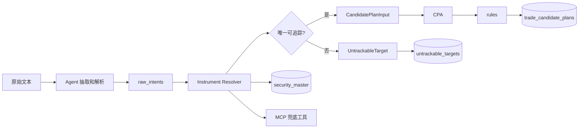
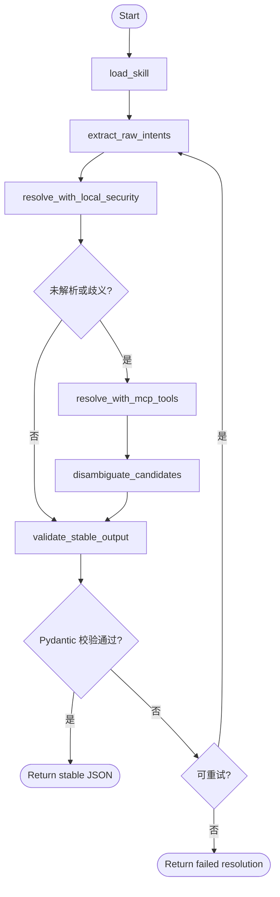

# Agent 标的解析层与 CPA 稳定输入技术方案

## 1. 结论

当前 `trade_candidate_plans` 出现 `A股贵金属个股.SZ`、`CPO板块.SZ`，说明现有 LLM 抽取层把板块/主题/泛称误当成股票代码，并且后续 `normalizeSymbol` 又把任意文本补成 `.SZ`。

推荐重构为：

```text
Go 主系统
-> Python Agent Sidecar
-> LangGraph 编排
-> Pydantic 校验
-> 本地 security_master 优先
-> Tushare MCP / 东方财富 MCP 兜底
-> CPA 只接收稳定 JSON
-> rules 只生成可追踪证券的 CandidatePlan
```

核心原则：

- AI 可以抽取和消歧，但不能决定交易参数。
- MCP 可以召回候选，但不能绕过本地证券主数据。
- CPA 只接收已验证的 `ts_code`。
- 板块、主题、泛称进入不可追踪事件，不进入 `trade_candidate_plans`。

## 2. 通俗版说明

这套方案可以理解成“先找人读文章，再找身份证，再决定能不能建交易计划”。

原来的流程像是让 AI 读完文章后直接说“推荐了什么”。AI 看到“CPO板块”“A股贵金属个股”这类词，也会当成推荐标的填到 `symbol` 里。后面的代码又看到不是 `6` 开头，就直接补成 `.SZ`，于是出现了 `CPO板块.SZ` 这种看起来像股票代码、实际完全不能追踪的脏数据。

新方案把这件事拆开：

1. Agent 先读文章，找出文中提到的股票、板块、主题、泛称。
2. Resolver 去本地证券主数据表里查“这个名字到底是不是一只真实股票或 ETF”。
3. 如果本地查不到，再让 MCP 工具去 Tushare 或东方财富查候选。
4. 查到候选后还要回到本地证券主数据表确认，确认不了就不能进入候选计划。
5. CPA 只吃确认过的稳定 JSON，rules 再根据确定性规则生成价格、止损、止盈和仓位。

换句话说：

- Agent 像研究助理，负责读文章和找线索。
- `security_master` 像证券身份证库，负责判断“这个东西到底是不是可追踪证券”。
- MCP 像外部查询工具，只能帮忙找候选，不能直接拍板。
- CPA 像门禁，只放行已经验明身份的证券。
- rules 像计算器，只负责按固定规则算交易参数。

这样做的结果是：文章里出现“CPO板块”时，系统不会再把它伪造成 `CPO板块.SZ`。如果文章同时提到“新易盛”“旭创”，系统会尝试把这两个名字解析成真实股票代码；如果解析成功，才生成候选计划。

## 3. 英文术语中文解释

本文保留了一些英文名，因为它们会成为代码目录、接口字段、数据库表名或第三方技术名称。下面是统一解释。

| 英文/代码名 | 中文解释 | 在本方案里的意思 |
| --- | --- | --- |
| Agent | 智能代理 | 一个独立的 Python 服务，负责读文章、调用工具、解析标的、输出稳定 JSON。 |
| Sidecar | 旁路服务 / 辅助服务 | 不放进 Go 主进程，而是作为旁边单独运行的服务。 |
| Python Agent Sidecar | Python 智能代理旁路服务 | 用 Python 写的 Agent 服务，Go 后端通过 HTTP 调它。 |
| LangGraph | LangGraph 工作流框架 | 用来编排 Agent 的多步骤流程，例如抽取、查本地库、调工具、消歧、校验。 |
| Pydantic | Pydantic 数据校验库 | 用来定义 Agent 输出格式，并强制校验字段是否合法。 |
| MCP | 模型上下文协议 | 一种让 Agent 连接外部工具和数据源的协议。 |
| Tushare MCP | Tushare 工具服务 | 通过 MCP 方式查询 Tushare 数据，用于补充证券候选。 |
| 东方财富 MCP | 东方财富工具服务 | 通过 MCP 方式查询东方财富相关数据，用于板块/概念候选召回。 |
| CPA | 候选计划装配器 | Candidate Plan Assembler 的缩写，只接收已校验标的，再交给 rules 生成候选计划。 |
| rules | 确定性规则引擎 | 当前 `internal/rules`，只负责生成入场价、止损价、止盈价、仓位。 |
| stable JSON | 稳定 JSON 输出 | Agent 最终返回给 Go 的固定格式 JSON，字段和含义不能随意变化。 |
| schema | 数据结构约束 | 规定 JSON 里必须有哪些字段、字段类型是什么、允许哪些枚举值。 |
| JSON Schema | JSON 结构说明 | 可机器读取的数据格式说明，方便跨语言校验。 |
| security_master | 证券主数据表 | 本地股票/ETF/指数基础信息表，是判断能不能追踪的第一依据。 |
| security_aliases | 证券别名表 | 存股票简称、常用别名、拼音缩写等，用于把“旭创”映射到“中际旭创”。 |
| Instrument Resolver | 标的解析器 | 把原文里的股票名、板块名、主题名解析成真实证券或不可追踪目标。 |
| CandidatePlan | 候选交易计划 | 当前系统落到 `trade_candidate_plans` 的结构化计划。 |
| CandidatePlanInput | 候选计划输入 | Agent 校验后给 CPA 的输入，只能包含真实可追踪证券。 |
| PlanIntent | 交易意图 | AI 从文本里抽出的推荐意图，不能直接进 rules。 |
| TrackablePlanIntent | 可追踪交易意图 | 已经确认有真实证券代码的交易意图，可以进入 rules。 |
| RecommendationEvent | 推荐事件 | “谁在什么时间推荐了什么”的事实记录，不等于交易计划。 |
| UntrackableTarget | 不可追踪目标 | 板块、主题、泛称、歧义名称等不能直接跟踪的目标。 |
| raw_intents | 原始意图 | Agent 初步从文章中抽出来的推荐表达，还没经过证券校验。 |
| raw_name | 原始名称 | 文章里直接出现的名称，例如 `CPO板块`、`旭创`。 |
| target_type | 目标类型 | 标记是股票、ETF、指数、板块、主题、商品还是未知。 |
| ts_code | Tushare 证券代码 | Tushare 使用的证券代码，例如 `300502.SZ`。 |
| symbol | 证券代码主体 | 不带交易所后缀的 6 位代码，例如 `300502`。 |
| resolve | 解析 / 归一 | 把自然语言名称转换成确定证券代码的过程。 |
| disambiguate | 消歧 | 多个候选都可能匹配时，判断到底是哪一个。 |
| validate | 校验 | 检查字段、格式、枚举值和业务规则是否正确。 |
| fallback | 兜底 | 本地查不到时，再调用外部工具补充候选。 |
| uvicorn | Python ASGI 服务启动器 | 用来启动 Agent 的 HTTP 服务。 |
| FastAPI | Python HTTP API 框架 | 用来暴露 `/v1/resolve-document` 等接口。 |

代码块里的字段名、表名和目录名会继续保留英文，因为这些是后续实现时要直接使用的契约名称；中文解释以本表为准。

## 4. 选型通俗解释

### 4.1 为什么要用 Agent，而不是继续只调一个 LLM 接口

单次 LLM 调用只适合“读一段文本并返回结构化结果”。但现在的问题不是单纯读文本，而是要完成一串动作：

```text
读文章 -> 找出提到的名字 -> 判断是股票还是板块 -> 查本地证券库 -> 查不到再查工具 -> 多候选时消歧 -> 输出稳定 JSON
```

这已经是一个小工作流，不是一个 prompt 能稳定解决的问题。Agent 的价值就是把这个工作流串起来，并且能在每一步调用工具。

### 4.2 为什么用 LangGraph

LangGraph 不是为了“更高级”，而是为了让 Agent 流程可控。标的解析不是一次问答，它有明确步骤和分支：

- 本地查到了，就不用调外部工具。
- 本地没查到，才调 MCP。
- 调 MCP 后有多个候选，需要消歧。
- 消歧失败，要落成不可追踪目标。
- 输出不合法，要重试或失败。

这些步骤用普通函数也能写，但后面会越来越乱。LangGraph 让这些节点和分支显式化，方便测试、重试和审计。

### 4.3 为什么用 Pydantic

Pydantic 的作用是“把 AI 输出关进格式笼子里”。Agent 最终返回的 JSON 必须满足 schema，比如：

- `ts_code` 必须像 `300502.SZ`。
- `direction` 只能是 `LONG` 或 `SHORT`。
- `confidence` 必须在 `(0,1]`。
- `candidate_plan_inputs` 里不能放板块。

没有 Pydantic，就容易出现 AI 输出字段少了、类型错了、枚举乱写了，Go 侧再处理会很痛苦。

### 4.4 为什么本地 security_master 优先

因为最终要交给 Tushare 追踪，必须有确定证券代码。外部工具可以帮忙找候选，但最终判断必须依赖本地可控的数据表。

可以把 `security_master` 理解成“本系统自己的证券身份证库”。它不是行情表，不存今天涨跌幅；也不是推荐表，不存谁推荐了什么；它只回答一个问题：某个名字、代码或别名，能不能对应到一只真实、唯一、当前允许追踪的证券。

例如：

- `新易盛` 可以在 `security_master` 里找到 `300502.SZ`，所以可以进入后续候选计划。
- `中际旭创` 可以在 `security_master` 里找到 `300308.SZ`，所以可以进入后续候选计划。
- `旭创` 不是官方简称，但可以先命中 `security_aliases`，再关联到 `security_master` 的 `300308.SZ`。
- `CPO板块` 不是一只证券，不能直接进入 `trade_candidate_plans`。
- `A股贵金属个股` 是泛称，不是证券，不能伪造成 `.SZ`。

本地表的好处：

- 可重复：同一输入每次解析结果一致。
- 可审计：知道某个别名为什么映射到某只股票。
- 可修正：发现“旭创”应该指向“中际旭创”，可以加 alias。
- 可控：外部工具挂了也不影响已有主数据判断。
- 可隔离：Tushare MCP 或东方财富 MCP 返回的候选必须回到本地表核验，不会把外部噪声直接写进交易计划。

### 4.5 为什么 MCP 只能兜底

MCP 是工具接入方式，不是权威数据本身。Tushare MCP、东方财富 MCP 都可能有超时、字段变化、候选不准等问题。所以它们只能帮忙“找可能是谁”，不能直接决定“就是谁”。

正确顺序是：

```text
MCP 返回候选 -> 回本地 security_master 校验 -> 通过才进 CPA
```

### 4.6 为什么要自己实现 SKILL.md loader

IDE 的 skill 机制不应该成为后端生产能力的一部分。我们可以借鉴 skill 的形式，但要把它变成项目内可版本化、可测试、可审计的文件。

项目内 `SKILL.md` 的作用是写清楚业务规则，例如：

- 板块不是股票。
- 泛称不是可追踪标的。
- 不能编造 `ts_code`。
- 只有本地证券表或工具确认过的证券才能进入候选计划输入。

这样 skill 会随着代码一起提交、评审和发布。

### 4.7 为什么 CPA 只接收稳定 JSON

CPA 是进入交易计划生成前的最后一道门。它不应该再猜测、查工具或修复 AI 输出。它只做一件事：把已经验明身份的标的交给 rules。

这样可以保证：

- 脏标的不会进入 `trade_candidate_plans`。
- rules 继续保持确定性。
- 后续 Tushare 跟踪只面对真实证券代码。

## 5. 调研评估

### 5.1 LangGraph

LangGraph 适合多步骤 Agent 工作流，尤其是需要工具调用、条件分支、重试、持久化和可恢复执行的流程。标的解析正好符合这个形态：先抽取原始目标，再查本地证券表，再必要时调用 MCP，再消歧和校验。

采用方式：

- 作为 Python sidecar 内部编排框架。
- 不进入 Go 主进程。
- 不直接写业务表。

### 5.2 Pydantic

Pydantic 适合定义 Agent 的输入、输出和工具返回 schema。Agent 输出必须先通过 Pydantic，再返回给 Go。Go 侧仍然做二次校验。

采用方式：

- Python Agent 内部 stable schema。
- 输出 JSON Schema 可作为跨语言契约。
- Go 不直接依赖 Python 运行时。

### 5.3 MCP

MCP 是工具/资源接入协议，适合作为 Agent 的工具层。Tushare MCP 和东方财富 MCP 可以作为兜底召回，但不能作为最终可信判断。

采用方式：

- 本地 `security_master` 第一优先。
- MCP 只在本地查不到或有歧义时使用。
- MCP 返回候选后仍需本地校验。
- 东方财富 MCP 如果不是官方稳定服务，按非权威三方工具处理。

### 5.4 security_master

本地证券主数据是最终可追踪性判断来源。一个标的如果无法映射成唯一有效 `ts_code`，就不能进入候选计划。

更通俗地说，`security_master` 是系统判断“这是不是一只真股票/ETF”的本地字典。它的典型数据来自 Tushare 的 `stock_basic`、ETF 基础信息、人工补充的必要字段，以及后续经过审核的外部候选。

它和其他表的关系如下：

- `security_master`：存官方身份，例如 `300502.SZ / 新易盛 / 股票 / 深交所 / 上市中`。
- `security_aliases`：存非官方但常见的叫法，例如 `旭创 -> 中际旭创`。
- `instrument_resolution_runs`：存一次文档解析过程中查了什么、怎么判断、为什么失败或成功。
- `untrackable_targets`：存不能直接追踪的目标，例如板块、主题、泛称、歧义名称。
- `trade_candidate_plans`：只存已经通过 `security_master` 验证的候选交易计划。

阶段一不要求 `security_master` 覆盖所有市场，只要求覆盖 A 股股票和后续要跟踪的 ETF。指数、板块、行业、主题先不进入候选交易计划；如果文中提到它们，只记录为不可追踪目标或推荐事件。

## 6. 总体架构



边界：

- Go：事务、数据库、rules、HTTP API。
- Agent：工具调用、标的解析、消歧、稳定 JSON。
- CPA：只做稳定 JSON 到 rules 输入的转换。
- rules：只生成入场价、止损价、止盈价、仓位。

## 7. 当前链路问题



错误根因：

- `symbol` 既承载股票，也承载板块/主题。
- 没有 `target_type`。
- 没有本地证券主数据校验。
- 规则层收到的输入已经被污染。

## 8. 目标链路



## 9. 示例

### 9.1 CPO 板块

原文：

```text
周五科技股领涨的CPO板块，在周末两个大佬新易盛和旭创公布了出色的业绩预告，
也让板块吃下定心丸，尤其是新易盛四季度业绩大幅增长完全超预期，
周一可以看看这两个股票如何演绎行情。
```

正确输出：

```json
{
  "candidate_plan_inputs": [
    {
      "ts_code": "300502.SZ",
      "name": "新易盛",
      "direction": "LONG",
      "reference_price": 0
    },
    {
      "ts_code": "300308.SZ",
      "name": "中际旭创",
      "direction": "LONG",
      "reference_price": 0
    }
  ],
  "untrackable_targets": [
    {
      "raw_name": "CPO板块",
      "target_type": "SECTOR",
      "reason": "sector_or_theme_not_directly_tradeable"
    }
  ]
}
```

### 9.2 A 股贵金属个股

原文：

```text
A股的贵金属个股将在周一继续大面积跌停。
```

正确输出：

```json
{
  "candidate_plan_inputs": [],
  "untrackable_targets": [
    {
      "raw_name": "A股贵金属个股",
      "target_type": "THEME",
      "reason": "broad_theme_without_specific_security"
    }
  ]
}
```

## 10. Agent Sidecar 设计

目录：

```text
agent/
  pyproject.toml
  app/
    main.py
    config.py
    graph.py
    schemas.py
    skills.py
    tools/
      local_security.py
      tushare_mcp.py
      eastmoney_mcp.py
      llm_client.py
    nodes/
      extract_raw_intents.py
      resolve_local.py
      resolve_mcp.py
      disambiguate.py
      validate_output.py
  skills/
    instrument_resolution/
      SKILL.md
      examples.jsonl
```

目录中文解释：

- `agent/`：Python Agent 服务根目录。
- `pyproject.toml`：Python 项目依赖和构建配置。
- `app/main.py`：HTTP 服务入口。
- `app/config.py`：Agent 配置读取。
- `app/graph.py`：LangGraph 工作流定义。
- `app/schemas.py`：Pydantic schema 定义。
- `app/skills.py`：项目内 SKILL.md loader。
- `app/tools/`：本地证券表、Tushare MCP、东方财富 MCP、LLM 客户端等工具封装。
- `app/nodes/`：LangGraph 每个节点的具体实现。
- `skills/instrument_resolution/SKILL.md`：标的解析规则说明。
- `examples.jsonl`：标的解析正反例样本。

LangGraph 节点：



## 11. Pydantic Stable Schema

核心输出：

```python
class ResolvedSecurity(BaseModel):
    ts_code: str = Field(pattern=r"^\d{6}\.(SH|SZ|BJ)$")
    symbol: str = Field(pattern=r"^\d{6}$")
    name: str = Field(min_length=1)
    exchange: str
    market: str
    asset_type: Literal["STOCK", "ETF"]
    list_status: Literal["L", "P", "D", "G"]
    source: DataSource
    confidence: float = Field(gt=0, le=1)

class CandidatePlanInput(BaseModel):
    source_intent_id: str
    security: ResolvedSecurity
    direction: Literal["LONG", "SHORT"]
    reference_price: float = Field(ge=0)
    reference_price_note: str
    thesis: str = Field(min_length=1, max_length=500)
    risks: list[str] = Field(default_factory=list, max_length=5)
    evidence: list[EvidenceSpan] = Field(default_factory=list, min_length=1, max_length=8)
    confidence: float = Field(gt=0, le=1)

class AgentResolutionOutput(BaseModel):
    schema_version: Literal["agent.resolve_document.response.v1"]
    agent_version: str
    status: Literal["RESOLVED", "PARTIAL", "FAILED"]
    candidate_plan_inputs: list[CandidatePlanInput]
    recommendation_events: list[RecommendationEventInput]
    untrackable_targets: list[UntrackableTarget]
    warnings: list[str] = Field(default_factory=list)
    debug: AgentDebug
```

CPA 只读取 `candidate_plan_inputs`。

说明：上面是早期稳定结构示意，M4 落地时以 18.6.4 的 `agent.resolve_document.request.v1` 和 `agent.resolve_document.response.v1` 为准。

关键字段中文解释：

| 字段 | 中文解释 |
| --- | --- |
| `ResolvedSecurity` | 已解析证券，表示已经确认能追踪的股票或 ETF。 |
| `ts_code` | Tushare 证券代码，例如 `300502.SZ`。 |
| `symbol` | 6 位股票代码主体，例如 `300502`。 |
| `asset_type` | 资产类型，阶段内只允许股票或 ETF。 |
| `list_status` | 上市状态，用于过滤退市或异常标的。 |
| `CandidatePlanInput` | 候选计划输入，CPA 只读取这个结构。 |
| `source_intent_id` | 原始意图 ID，用于追溯这条输入来自哪段文本。 |
| `reference_price` | 原文提到的参考价，没有则为 0。 |
| `reference_price_note` | 参考价说明，例如原文缺失价格。 |
| `evidence` | 支撑证据，来自原文片段。 |
| `AgentResolutionOutput` | Agent 最终稳定输出。 |
| `schema_version` | 输出结构版本。 |
| `agent_version` | Agent 版本。 |
| `untrackable_targets` | 不可追踪目标列表。 |
| `warnings` | 非致命问题提示。 |
| `debug` | 调试信息，例如使用了哪些工具。 |

## 12. 数据库设计

新增四组表：

```text
security_master
security_aliases
instrument_resolution_runs
untrackable_targets
```

### 12.0 security_master 通俗解释和实施细则

`security_master` 是这套方案里最关键的“证券身份证库”。它不负责判断一篇文章是不是看多，也不负责生成价格，更不负责存行情。它只负责维护证券的稳定身份，让系统知道：

- 这是不是一个真实可交易/可追踪的标的。
- 它的标准 Tushare 代码是什么。
- 它属于股票、ETF、指数还是其他类型。
- 它现在是否还处于可用状态。
- 它有哪些常见别名可以被原文命中。

#### 12.0.1 它到底存什么

一行 `security_master` 代表一个标准证券身份。阶段一只把“可以直接交给 Tushare 追踪的股票或 ETF”当作可进入候选计划的标的。

| ts_code | symbol | name | asset_type | exchange | list_status | 说明 |
| --- | --- | --- | --- | --- | --- | --- |
| `300502.SZ` | `300502` | `新易盛` | `STOCK` | `SZSE` | `L` | 可追踪股票，可以进入候选计划。 |
| `300308.SZ` | `300308` | `中际旭创` | `STOCK` | `SZSE` | `L` | 可追踪股票，可以进入候选计划。 |
| `510300.SH` | `510300` | `沪深300ETF` | `ETF` | `SSE` | `L` | 可追踪 ETF，配置允许后可以进入候选计划。 |

不会放进 `security_master` 的内容：

- `CPO板块`：这是板块，不是一只证券。
- `A股贵金属个股`：这是泛称，不是一只证券。
- `科技股`：这是主题/风格，不是一只证券。
- `黄金`、`白银`：这是商品或宏观资产，阶段一不直接进入 A 股候选计划。

如果未来要支持指数、行业、商品或港美股，可以继续扩展 `asset_type` 和追踪链路，但阶段一不要把这些东西混进股票/ETF 候选计划。

#### 12.0.2 它和 security_aliases 的区别

`security_master` 存“官方身份”，`security_aliases` 存“大家平时怎么叫它”。

例如 `中际旭创` 的官方身份在 `security_master`：

```text
security_master:
id=2
ts_code=300308.SZ
symbol=300308
name=中际旭创
asset_type=STOCK
exchange=SZSE
list_status=L
```

但文章里可能不会写全称，而是写“旭创”。这时用 `security_aliases` 处理：

```text
security_aliases:
security_id=2
alias=旭创
normalized_alias=旭创
alias_type=COMMON
source=MANUAL
confidence=1.0
```

解析时先把原文名称归一化，再查别名表，别名表命中后才能回到 `security_master` 取标准身份。也就是说，别名本身不能直接进入候选计划，必须最终落到唯一一行 `security_master`。

#### 12.0.3 它和 trade_candidate_plans 的区别

`security_master` 是基础资料表，变化频率低，类似“证券户籍册”。`trade_candidate_plans` 是业务结果表，记录某篇文档触发的一条候选交易计划。

两者不要混用：

- `security_master` 不存推荐方向、推荐理由、止损止盈、仓位。
- `trade_candidate_plans` 不负责判断 `CPO板块` 到底是不是证券。
- `trade_candidate_plans.symbol` 后续应该只保存已经验证过的标准代码，推荐直接存 `ts_code` 或新增 `ts_code` 字段，避免再出现任意文本补后缀。

#### 12.0.4 数据从哪里来

阶段一建议三类来源：

1. Tushare 基础数据初始化：用 `stock_basic` 初始化 A 股股票，后续补 ETF 基础表。
2. 人工维护别名：把高频简称、研报常用叫法、历史简称写入 `security_aliases`。
3. MCP 候选回填：MCP 只能召回候选，不能直接写正式主数据；候选必须通过校验或人工确认后再进入 `security_master` / `security_aliases`。

不要在每次文档解析时全量刷新 `security_master`。建议把同步任务和文档分析链路分开：

```text
定时/手动同步证券主数据 -> security_master
人工或审核任务维护别名 -> security_aliases
文档分析链路只读 security_master/security_aliases
```

这样可以保证一次文档分析是可重复、可审计的，不会因为外部工具临时返回不同结果导致候选计划漂移。

#### 12.0.5 解析链路里怎么用

标准流程：

```text
原文 raw_name
-> 名称归一化 normalized_name
-> 查 security_master.ts_code / symbol / name
-> 查不到再查 security_aliases.normalized_alias
-> 别名命中后回到 security_master
-> 判断 asset_type、list_status、唯一性
-> 通过后输出 CandidatePlanInput
-> 不通过则输出 UntrackableTarget 或 ambiguous target
```

对应判定规则：

- 命中唯一 `security_master` 且 `asset_type in (STOCK, ETF)`：允许进入 `candidate_plan_inputs`。
- 命中唯一但 `list_status` 不是可追踪状态：不进入候选计划，记录 `INACTIVE_SECURITY`。
- 命中多个证券：不猜，记录 `AMBIGUOUS`，必要时让 Agent 结合上下文消歧。
- 查不到证券，但像板块/行业/主题：记录 `SECTOR` / `THEME`，不进入候选计划。
- 查不到且无法分类：记录 `UNKNOWN`，不进入候选计划。
- MCP 返回候选：必须再次命中或写入本地审核流程，不能直接进入 CPA。

#### 12.0.6 Agent 里的最小查询接口

Agent 不应该直接拼复杂 SQL。Go 或 Python 工具层需要封装几个稳定查询能力：

```text
QueryByTSCode(ts_code)
QueryBySymbol(symbol)
QueryActiveByName(name)
QueryByNormalizedAlias(normalized_alias)
SearchCandidates(keyword, limit)
```

返回结果要包含：

```text
ts_code
symbol
name
asset_type
exchange
market
industry
list_status
match_type
confidence
```

`match_type` 用来解释是怎么命中的，例如：

- `TS_CODE_EXACT`：精确命中 `300502.SZ`。
- `SYMBOL_EXACT`：精确命中 `300502`。
- `NAME_EXACT`：精确命中 `新易盛`。
- `ALIAS_EXACT`：通过别名命中 `旭创 -> 中际旭创`。
- `FUZZY_CANDIDATE`：模糊候选，只能用于消歧，不能直接放行。

#### 12.0.7 最小落地数据

为了覆盖当前暴露出来的问题，M1 阶段至少需要导入：

```sql
INSERT INTO security_master
(ts_code, symbol, name, fullname, cnspell, asset_type, exchange, market, industry, list_status, data_source)
VALUES
('300502.SZ', '300502', '新易盛', '成都新易盛通信技术股份有限公司', 'XYS', 'STOCK', 'SZSE', '创业板', '通信设备', 'L', 'TUSHARE'),
('300308.SZ', '300308', '中际旭创', '中际旭创股份有限公司', 'ZJXC', 'STOCK', 'SZSE', '创业板', '通信设备', 'L', 'TUSHARE');

INSERT INTO security_aliases
(security_id, alias, normalized_alias, alias_type, source, confidence)
VALUES
((SELECT id FROM security_master WHERE ts_code='300308.SZ'), '旭创', '旭创', 'COMMON', 'MANUAL', 1.0);
```

这组数据可以验证：

- `新易盛` -> `300502.SZ`。
- `中际旭创` -> `300308.SZ`。
- `旭创` -> `300308.SZ`。
- `CPO板块` -> `untrackable_targets`。
- `A股贵金属个股` -> `untrackable_targets`。

#### 12.0.8 实施时的注意事项

- `security_master.ts_code` 必须唯一。
- `security_master.symbol` 不是唯一键，因为不同市场未来可能存在相同主体代码，唯一身份以 `ts_code` 为准。
- `security_aliases.normalized_alias` 可能对应多个证券，查询结果必须允许返回多条并进入消歧。
- `list_status` 阶段一只允许 `L` 进入候选计划，其他状态先拦截。
- Agent 可以使用 MCP 查候选，但 CPA 只相信本地 `security_master` 校验后的结果。
- 任何无法唯一确认的标的都不能靠字符串规则补 `.SZ/.SH`。

### 12.1 security_master

```sql
CREATE TABLE `security_master` (
  `id` bigint NOT NULL AUTO_INCREMENT,
  `ts_code` varchar(16) NOT NULL,
  `symbol` varchar(16) NOT NULL,
  `name` varchar(128) NOT NULL,
  `fullname` varchar(255) NOT NULL DEFAULT '',
  `cnspell` varchar(64) NOT NULL DEFAULT '',
  `asset_type` varchar(32) NOT NULL,
  `exchange` varchar(16) NOT NULL,
  `market` varchar(64) NOT NULL DEFAULT '',
  `industry` varchar(128) NOT NULL DEFAULT '',
  `list_status` varchar(8) NOT NULL,
  `list_date` date DEFAULT NULL,
  `delist_date` date DEFAULT NULL,
  `data_source` varchar(32) NOT NULL,
  `source_updated_at` timestamp NULL DEFAULT NULL,
  `created_at` timestamp NOT NULL DEFAULT CURRENT_TIMESTAMP,
  `updated_at` timestamp NOT NULL DEFAULT CURRENT_TIMESTAMP ON UPDATE CURRENT_TIMESTAMP,
  PRIMARY KEY (`id`),
  UNIQUE KEY `uk_security_master_ts_code` (`ts_code`),
  KEY `idx_security_master_symbol` (`symbol`),
  KEY `idx_security_master_name` (`name`)
);
```

字段中文解释：

- `ts_code`：Tushare 证券代码。
- `symbol`：6 位证券代码主体。
- `name`：证券简称。
- `fullname`：证券全称。
- `cnspell`：拼音缩写。
- `asset_type`：资产类型。
- `exchange`：交易所。
- `market`：市场板块。
- `industry`：行业。
- `list_status`：上市状态。
- `data_source`：数据来源。
- `source_updated_at`：来源数据更新时间。

### 12.2 security_aliases

```sql
CREATE TABLE `security_aliases` (
  `id` bigint NOT NULL AUTO_INCREMENT,
  `security_id` bigint NOT NULL,
  `alias` varchar(128) NOT NULL,
  `normalized_alias` varchar(128) NOT NULL,
  `alias_type` varchar(32) NOT NULL,
  `source` varchar(32) NOT NULL,
  `confidence` double NOT NULL DEFAULT '1',
  `created_at` timestamp NOT NULL DEFAULT CURRENT_TIMESTAMP,
  `updated_at` timestamp NOT NULL DEFAULT CURRENT_TIMESTAMP ON UPDATE CURRENT_TIMESTAMP,
  PRIMARY KEY (`id`),
  UNIQUE KEY `uk_security_aliases_security_alias` (`security_id`, `normalized_alias`),
  KEY `idx_security_aliases_normalized` (`normalized_alias`)
);
```

字段中文解释：

- `security_id`：关联到 `security_master`。
- `alias`：别名原文，例如“旭创”。
- `normalized_alias`：归一化后的别名。
- `alias_type`：别名类型，例如简称、全称、拼音、人工维护。
- `source`：别名来源。
- `confidence`：别名可信度。

## 13. Go 主系统改造

新增：

```text
M3:
internal/service/candidate_assembler.go
internal/domain/trackable_intent.go

M4:
internal/agentclient
```

`DocumentService` 从：

```text
parser -> llm.Analyze -> rules.Generate -> trade_candidate_plans
```

改成：

```text
M3:
parser -> llm.Analyze -> CPA -> rules.Generate -> trade_candidate_plans

M4 及以后:
parser -> agentclient.ResolveDocument -> CPA -> rules.Generate -> trade_candidate_plans
```

`rules.Generate` 入参从 `PlanIntent` 改成 `TrackablePlanIntent`：

```go
type TrackablePlanIntent struct {
    Analyst            string
    Institution        string
    RawSymbol          string
    TSCode             string
    Symbol             string
    SecurityName       string
    AssetType          AssetType
    Market             Market
    Direction          TradeDirection
    ReferencePrice     float64
    ReferencePriceNote ReferencePriceNote
    Thesis             string
    Evidence           []EvidenceSpan
    Risks              []string
    Confidence         float64
}
```

结构字段中文解释：

- `TrackablePlanIntent`：可追踪交易意图。
- `RawSymbol`：大语言模型输出的原始标的文本。
- `TSCode`：Tushare 证券代码。
- `Symbol`：6 位代码主体。
- `SecurityName`：证券名称。
- `AssetType`：资产类型。
- `Market`：市场。
- `Direction`：方向，多头或空头。
- `ReferencePrice`：参考价。
- `ReferencePriceNote`：参考价说明。
- `Thesis`：推荐逻辑。
- `Evidence`：原文证据。
- `Risks`：风险提示。
- `Confidence`：抽取置信度。

## 14. 配置

新增配置：

```json
{
  "agent": {
    "enabled": true,
    "mode": "primary",
    "endpoint": "http://127.0.0.1:8108/v1/resolve-document",
    "health_endpoint": "http://127.0.0.1:8108/healthz",
    "timeout_ms": 15000,
    "max_retries": 1,
    "schema_version": "agent.resolve_document.response.v1",
    "auth": {
      "enabled": true,
      "header_name": "X-Agent-Token",
      "static_token": ""
    },
    "allow_legacy_llm_fallback": false
  },
  "instrument": {
    "trackable_asset_types": ["STOCK", "ETF"],
    "allow_sector_as_plan": false,
    "require_security_master_hit": true,
    "max_resolution_candidates": 5
  },
  "mcp_tools": {
    "tushare_enabled": true,
    "eastmoney_enabled": false,
    "tool_timeout_ms": 10000
  }
}
```

配置字段中文解释：

- `agent.enabled`：是否启用 Agent。
- `agent.mode`：Agent 模式，`primary` 表示正式使用，`shadow` 表示影子模式。
- `agent.endpoint`：Agent HTTP 地址。
- `agent.health_endpoint`：Agent 健康检查地址。
- `agent.timeout_ms`：调用 Agent 的超时时间。
- `agent.max_retries`：Agent 调用失败后的重试次数。
- `agent.schema_version`：期望的稳定 JSON schema 版本。
- `agent.auth`：Go 调用 Agent 时使用的服务间认证配置。
- `agent.allow_legacy_llm_fallback`：是否允许回退到旧 LLM 链路。
- `instrument.trackable_asset_types`：允许进入候选计划的资产类型。
- `instrument.allow_sector_as_plan`：是否允许板块直接生成计划，阶段内应为 false。
- `instrument.require_security_master_hit`：是否要求命中本地证券主数据。
- `instrument.max_resolution_candidates`：单个目标最大候选数量。
- `mcp_tools.tushare_enabled`：是否启用 Tushare MCP。
- `mcp_tools.eastmoney_enabled`：是否启用东方财富 MCP。
- `mcp_tools.tool_timeout_ms`：单次工具调用超时时间。

## 15. 最小执行步骤

### 15.1 M0：止血

1. 删除任意字符串补 `.SZ/.SH`。
2. 新增 `ValidateTSCode`。
3. `CPO板块`、`A股贵金属个股` 不允许进入 `trade_candidate_plans`。
4. 增加测试。

### 15.2 M1：本地 security_master

1. 建表。
2. 生成 db_model。
3. 新增 DAL。
4. 导入最小样例：
   - `300502.SZ 新易盛`
   - `300308.SZ 中际旭创`
5. M1 查询服务能返回名称和别名命中结果，供 M3 候选计划装配器使用。

### 15.3 M2：不单独实施

M2 原计划做独立“标的解析器”（Instrument Resolver，标的解析器）。这部分不再单独立项，必要能力并入 M3。

取消的内容：

1. 不新增单独 `internal/instrument` 大包。
2. 不新增只读管理接口 `GET /api/v1/admin/instruments/resolve`。
3. 不新增独立 M2 集成测试。
4. 不新增数据定义语言（DDL）迁移。

保留并并入 M3 的内容：

1. 本地证券主数据查询。
2. 证券简称和别名解析。
3. 板块、主题、行业、泛称的不可追踪判断。
4. 只允许真实可追踪证券进入规则引擎。

### 15.4 M3：本地标的解析、候选计划装配器和规则输入改造

1. 在 Go 主系统内增加薄的标的解析逻辑，不拆独立大阶段。
2. 候选计划装配器（CPA，Candidate Plan Assembler，候选计划装配器）负责把大语言模型输出的交易意图转换成可追踪交易意图。
3. `rules.Generate` 改成只接收可追踪交易意图。
4. `trade_candidate_plans.symbol` 明确只写入证券标准代码（ts_code）。
5. 不可追踪目标先记录日志和分析明细，不新增持久化表。

### 15.5 M4：Python 智能体旁路服务

1. 新增 `agent/` 工程。
2. 快速应用程序接口框架（FastAPI）暴露 `/v1/resolve-document`。
3. 语言图编排框架（LangGraph）实现节点。
4. 数据校验库（Pydantic）校验输出。
5. Go 主系统通过智能体客户端调用旁路服务。

### 15.6 M5：规则文件加载器

1. 新增项目内 `SKILL.md`。
2. 启动加载并计算哈希值（hash）。
3. 响应中返回规则文件哈希值。
4. 后续需要审计时再考虑落库。

### 15.7 M6：模型上下文协议工具

1. 接入 Tushare 模型上下文协议（MCP，Model Context Protocol，模型上下文协议）工具。
2. 接入东方财富模型上下文协议工具。
3. 只做候选召回。
4. 外部工具返回的候选必须重新通过本地证券主数据校验。

### 15.8 M7：观测和回归

1. 保存标的解析过程记录。
2. 保存不可追踪目标记录。
3. 增加应用程序接口（API）查询解析结果。
4. 增加回归样例。

## 16. 验收标准

1. 不再出现 `CPO板块.SZ`、`A股贵金属个股.SZ`。
2. `新易盛` 解析为 `300502.SZ`。
3. `旭创` 解析为 `300308.SZ` 或通过 alias 指向 `中际旭创`。
4. 板块、主题、泛称不能进入候选计划；是否落 `untrackable_targets` 放到 M7 观测阶段再决定。
5. 候选计划装配器（CPA，Candidate Plan Assembler，候选计划装配器）只接收已经解析确认的可追踪证券。
6. 智能体（Agent）接入后，输出先过数据校验库（Pydantic），再过 Go 主系统校验。
7. `go test ./...` 和 `go build ./...` 通过。

## 17. 调研来源

- LangGraph Durable Execution：<https://docs.langchain.com/oss/python/langgraph/durable-execution>
- Pydantic Models：<https://docs.pydantic.dev/latest/concepts/models/>
- Pydantic JSON Schema：<https://docs.pydantic.dev/latest/concepts/json_schema/>
- MCP Architecture：<https://modelcontextprotocol.io/docs/learn/architecture>
- Tushare stock_basic：<https://tushare.pro/document/2?doc_id=25>
- Tushare trade_cal：<https://tushare.pro/document/2?doc_id=26>
- Tushare daily：<https://tushare.pro/document/2?doc_id=27>

## 18. 逐步实现路径和阶段目标

本章把前面的技术方案拆成可以逐步落地的工程路径。核心思路不是一次性把 Python Agent、MCP、skills、主数据、CPA 全部做完，而是先把脏数据入口关住，再让系统具备“识别真实证券”的能力，最后再接入 Agent 和外部工具。

实施顺序遵循四个原则：

1. 先止血，再增强。先保证 `trade_candidate_plans` 不再写入伪代码。
2. 先本地确定性，再外部工具。先建设 `security_master`，再接 Tushare MCP / 东方财富 MCP。
3. 先稳定契约，再智能编排。先定义 Go 与 Agent 之间的 JSON schema，再让 LangGraph 承担复杂流程。
4. 先可观测，再扩大范围。每一步都要能知道解析过程为什么成功或失败。

### 18.1 总体里程碑


阶段目标：

| 阶段 | 目标 | 完成后的效果 |
| --- | --- | --- |
| M0 | 止血 | `CPO板块.SZ`、`A股贵金属个股.SZ` 这类伪代码不再进入候选计划。 |
| M1 | 建证券主数据 | 系统有本地“证券身份证库”，能存股票、交易型开放式指数基金（ETF，Exchange Traded Fund，交易型开放式指数基金）、别名和上市状态。 |
| M2 | 不单独实施 | 原本的本地标的解析器能力合并进 M3，避免过早拆包和新增验证接口。 |
| M3 | 本地标的解析、候选计划装配器和规则输入改造 | `rules` 只接收可追踪证券，板块/主题/泛称不生成候选计划。 |
| M4 | Python 智能体旁路服务 | Python 智能体能读文本、查本地库、输出稳定的 JavaScript 对象表示法（JSON）数据。 |
| M5 | 规则文件加载器 | 标的解析规则进入项目内文件，能版本化、审计和测试。 |
| M6 | 模型上下文协议兜底 | 本地查不到时能调用外部工具召回候选，但仍需本地校验。 |
| M7 | 观测和灰度 | 每次解析有过程记录、失败原因、回归样例和开关。 |

### 18.2 M0：止血阶段

目标：先阻断“任意文本补 `.SZ/.SH`”造成的脏数据。

M0 只做防污染，不引入 `security_master`，不接 Agent，不改大表结构。它的任务是把当前链路中最危险的一段切断：LLM 可以继续抽取 `PlanIntent`，但只有明确是标准证券代码的 intent 才能进入 `rules.Generate` 和 `trade_candidate_plans`。

#### 18.2.1 当前具体问题点

当前代码里有三个直接风险点：

1. `internal/llm/extractor.go` 的 `normalizeSymbol` 会把任意不带 `.` 的文本补成后缀。
2. `ValidateIntent` 只检查 `symbol` 非空，没有检查 `symbol` 是否真的是 `000001.SZ` 这种格式。
3. `internal/service/document.go` 在拿到 `intents` 后直接循环调用 `s.rules.Generate`，没有二次拦截。

当前危险路径：

```text
LLM 输出 "CPO板块"
-> normalizeSymbol("CPO板块")
-> "CPO板块.SZ"
-> ValidateIntent 通过
-> rules.Generate
-> trade_candidate_plans.symbol = "CPO板块.SZ"
```

M0 要把这条路径改成：

```text
LLM 输出 "CPO板块"
-> normalizeSymbol 不再补后缀
-> ValidateIntent 判断不是合法 ts_code
-> 本轮 LLM 结果失败并触发配置内重试
-> 重试后仍不合法则分析失败
-> 不写 trade_candidate_plans
```

#### 18.2.2 第一刀：收紧 symbol 归一化

修改文件：

```text
internal/llm/extractor.go
```

把 `normalizeSymbol` 从“补全函数”改成“轻量格式归一函数”。它只能做安全转换：

- 去前后空格。
- 转大写。
- 把 `sh600519` / `SH600519` 这类可明确识别的格式转成 `600519.SH`，如果暂时不想支持可以先不做。
- 把 `600519.SH` 保持为 `600519.SH`。
- 把 `000001.sz` 转成 `000001.SZ`。
- 不允许把 `CPO板块`、`新易盛`、`A股贵金属个股` 自动补成 `.SZ`。

建议第一版保持最保守：

```go
func normalizeSymbol(value string) string {
    value = strings.ToUpper(strings.TrimSpace(value))
    return value
}
```

如果要兼容纯 6 位数字，也只能在格式明确时补后缀：

```go
func normalizeSymbol(value string) string {
    value = strings.ToUpper(strings.TrimSpace(value))
    if tsCodePattern.MatchString(value) {
        return value
    }
    if symbolPattern.MatchString(value) {
        if strings.HasPrefix(value, "6") {
            return value + ".SH"
        }
        if strings.HasPrefix(value, "0") || strings.HasPrefix(value, "3") {
            return value + ".SZ"
        }
        if strings.HasPrefix(value, "8") || strings.HasPrefix(value, "4") {
            return value + ".BJ"
        }
    }
    return value
}
```

注意：M0 可以接受纯 6 位数字补后缀，因为它仍是代码格式；但不能接受中文、英文主题词、板块词补后缀。

#### 18.2.3 第二刀：新增标准代码校验

修改文件：

```text
internal/llm/extractor.go
```

新增正则和校验函数：

```go
var (
    tsCodePattern = regexp.MustCompile(`^\d{6}\.(SH|SZ|BJ)$`)
    symbolPattern = regexp.MustCompile(`^\d{6}$`)
)

func ValidateTSCode(symbol string) bool {
    return tsCodePattern.MatchString(strings.ToUpper(strings.TrimSpace(symbol)))
}
```

`ValidateIntent` 增加硬校验：

```go
func ValidateIntent(intent domain.PlanIntent) error {
    if intent.Symbol == "" {
        return fmt.Errorf("symbol is required")
    }
    if !ValidateTSCode(intent.Symbol) {
        return fmt.Errorf("symbol must be a valid ts_code like 000001.SZ")
    }
    ...
}
```

错误信息要稳定，测试里按这句断言即可。

#### 18.2.4 第三刀：不要让非法 intent 静默丢失

当前 `validatePlans` 已经会在 `ValidateIntent` 出错时返回错误，因此 M0 不建议在 LLM 层静默过滤非法 intent。原因是静默过滤会制造另一个问题：模型输出了 2 条，其中 1 条合法、1 条非法，系统只保存合法那条，看起来像“分析成功”，但实际上遗漏了不可追踪目标。

M0 的推荐策略：

```text
任意 intent 非法
-> 本次模型输出整体失败
-> 按 llm.max_retries 重试
-> 重试仍失败
-> 文档分析失败
-> 不写新的 candidate plans
```

这样最保守，但不会污染交易计划表。M3 先在主链路里识别不可追踪目标并记录日志；如果后续确实需要查询不可追踪目标，再放到 M7 观测阶段设计 `untrackable_targets`。

#### 18.2.5 第四刀：service 层加二次保险

修改文件：

```text
internal/service/document.go
```

虽然 LLM 层已经校验，`DocumentService` 在进入 `rules.Generate` 前仍建议加二次保险，避免未来换 analyzer、测试 stub 或 Agent 输出绕过 LLM 校验。

建议加一个非常小的接口或函数：

```go
type IntentValidator interface {
    Validate(intent domain.PlanIntent) error
}
```

M0 如果不想引入新接口，也可以先在 service 层调用 `llm.ValidateIntent(intent)`。更干净的做法是把 `ValidateTSCode` 下沉到 `internal/domain` 的轻量校验文件，但不要在 M0 引入 DB 查询。

service 层策略：

```go
for _, intent := range intents {
    if err := llm.ValidateIntent(intent); err != nil {
        s.logger.ErrorContext(ctx, "document service analyze invalid intent", ...)
        _ = dal.Documents.UpdateStatusByID(ctx, s.db, document.ID, string(domain.DocumentStatusFailed))
        return nil, fmt.Errorf("invalid plan intent: %w", err)
    }
    plan := s.rules.Generate(intent, ...)
}
```

注意：这里不要 `continue`。M0 目标是防污染，不是尽量生成部分计划。

#### 18.2.6 第五刀：rules 层保持纯假设

修改文件：

```text
internal/rules/engine.go
```

M0 不建议把复杂校验塞进 rules。rules 的边界仍然是“输入已经可信，我只算价格和仓位”。但可以加一个非常轻的防御日志或早期返回，避免误用：

```go
if intent.Symbol == "" {
    // 仅作为防御，不承担主校验职责。
}
```

推荐不在 M0 改 rules 行为，只改 tests，明确 rules 测试输入都必须是标准 `ts_code`。

#### 18.2.7 测试清单和用例名

修改文件：

```text
internal/llm/extractor_test.go
internal/service/document_test.go 或现有 service 测试文件
internal/rules/engine_test.go
```

LLM 层测试：

```text
TestNormalizeSymbolDoesNotAppendExchangeToText
TestValidateIntentRejectsNonTSCodeSymbol
TestValidateIntentAcceptsTSCode
TestAnalyzeRetriesWhenModelReturnsInvalidSymbol
```

必须覆盖：

| 输入 | 期望 |
| --- | --- |
| `CPO板块` | 不变，且 ValidateIntent 报错 |
| `A股贵金属个股` | 不变，且 ValidateIntent 报错 |
| `CPO板块.SZ` | ValidateIntent 报错 |
| `新易盛` | ValidateIntent 报错，M0 不做名称解析 |
| `300502.SZ` | 通过 |
| `000001.sz` | normalize 后 `000001.SZ`，通过 |
| `600519.SH` | 通过 |
| `600519` | 如果保留纯代码补后缀，则 normalize 后 `600519.SH`，通过 |

service 层测试：

```text
TestAnalyzeDocumentFailsWhenAnalyzerReturnsInvalidSymbol
```

测试目标：

- 构造 analyzer stub 返回 `Symbol: "CPO板块.SZ"`。
- 调用 `AnalyzeDocument`。
- 断言返回错误。
- 断言没有写入新的 `trade_candidate_plans`。
- 断言 document 状态变成 `FAILED`，或至少不会变成 `PLANNED`。

rules 层测试：

```text
TestGeneratePlanUsesValidatedTSCode
```

只需要把现有测试里的 symbol 明确写成 `300502.SZ`、`600519.SH` 这类标准格式。

#### 18.2.8 是否要新增不可追踪表

M0 不新增 `untrackable_targets`。原因是 M0 是止血，不是完整解析。此时如果引入不可追踪表，会牵连 migration、db_model、DAL、service 查询 API，范围会膨胀到 M3/M7。

M0 对不可追踪目标的处理方式：

```text
非法 symbol
-> 分析失败
-> 日志记录 symbol 和错误原因
-> 不写 trade_candidate_plans
```

等 M3 主链路改造后，再改成：

```text
非法 / 不可追踪目标
-> 记录结构化日志或分析明细
-> 合法证券继续进入可追踪交易意图
-> 后续 M7 如需查询，再写 untrackable_targets
```

#### 18.2.9 M0 修改顺序

建议按这个顺序提交，方便回滚和 review：

1. 删除或废弃当前 `normalizeSymbol` 里“非 6 开头就补 `.SZ`”的逻辑。
2. 新增 `ValidateTSCode` / `ValidateSymbol` 这类纯校验函数。
3. `ValidateIntent` 增加 `ts_code` 格式校验。
4. `DocumentService` 在进入 `rules.Generate` 前加二次校验。
5. `rules` 测试输入全部改成标准 `ts_code`。
6. 增加针对以下输入的单元测试：
   - `300502.SZ`：合法。
   - `600519.SH`：合法。
   - `CPO板块`：非法。
   - `A股贵金属个股`：非法。
   - `CPO板块.SZ`：非法，因为主体不是 6 位数字。
   - `新易盛`：非法，M0 阶段不做名称到代码解析。

代码落点：

```text
internal/llm/extractor.go
internal/domain/enums.go
internal/rules/engine.go
internal/service/document.go
internal/llm/extractor_test.go
internal/rules/engine_test.go
```

验收标准：

```text
go test ./...
go build ./...
```

并且用现有样例跑分析时，`trade_candidate_plans` 中不再出现非标准 `ts_code`。

#### 18.2.10 M0 不做什么

为了保持止血阶段足够小，M0 明确不做：

- 不接 Python Agent。
- 不建 `security_master`。
- 不建 `untrackable_targets`。
- 不把 `新易盛` 解析成 `300502.SZ`。
- 不把 `旭创` 解析成 `300308.SZ`。
- 不做 Tushare / 东方财富 MCP 查询。
- 不让 rules 自己判断标的是否合法。

这些能力从 M1 开始逐步补齐。

#### 18.2.11 M0 当前落地实现与测试方案

本次 M0 落地范围保持为“止血”，只阻断伪代码进入候选计划，不引入新表、不执行证券名称解析、不接入 Agent 或外部证券主数据。

<callout emoji="✅" background-color="light-green" border-color="green">
  <p>M0 已实现的核心变化：LLM 输出的任意文本不会再被自动补成 <code>.SZ</code>；只有标准 <code>ts_code</code>，或可明确补后缀的 6 位纯数字证券代码，才能通过结构化校验并进入规则层。</p>
</callout>

实现落点如下：

| 文件 | 变更 | 目的 |
| --- | --- | --- |
| `internal/llm/extractor.go` | 新增 `ValidateTSCode`，并在 `ValidateIntent` 中校验 `^\d{6}\.(SH\|SZ\|BJ)$` | 从 LLM 结构化输出入口拒绝 `CPO板块`、`新易盛`、`A股贵金属个股` 等不可追踪目标 |
| `internal/llm/extractor.go` | 收紧 `normalizeSymbol`，仅做去空格、转大写、标准代码保持、6 位纯数字补交易所后缀 | 删除“任意文本默认补 `.SZ`”的污染路径 |
| `internal/domain/enums.go`、`internal/llm/extractor.go` | 补充 `MarketBJ`，并让 `.BJ` 后缀推断为北交所市场 | 保持 `ValidateTSCode` 允许北交所代码后的领域字段一致性 |
| `internal/service/document.go` | 在 `rules.Generate` 前再次调用 `llm.ValidateIntent` | 防止未来替换 analyzer、测试 stub 或 Agent 输出绕过 LLM 层校验 |
| `cmd/api/m0_nacos_integration_test.go` | 新增真实启动链路 HTTP 集成测试 | 通过启动脚本同源 Nacos 环境变量、`bootstrap.Build`、HTTP 上传和分析接口覆盖合格/不合格用例 |
| `internal/llm/extractor_test.go` | 新增非写库单元测试 | 覆盖非法 symbol 重试、文本 symbol 不补后缀、标准 ts_code 校验和 `.BJ` 市场推断 |

M0 的当前运行链路为：

```text
Nacos 配置 -> bootstrap.Build
-> parser.Parse
-> llm.ModelAnalyzer.Analyze
-> normalizeSymbol
-> ValidateIntent / ValidateTSCode
-> service 二次 ValidateIntent
-> rules.Generate
-> trade_candidate_plans
```

合格用例：

| 输入 | 预期 |
| --- | --- |
| `300502.SZ` | 通过校验，HTTP 分析返回 `200`，生成 1 条候选计划 |
| `600519` | 归一为 `600519.SH`，通过校验 |
| `000001.sz` | 归一为 `000001.SZ`，通过校验 |
| `430047` | 归一为 `430047.BJ`，市场推断为 `BJ` |

不合格用例：

| 输入 | 预期 |
| --- | --- |
| `CPO板块` | 不补后缀，触发 `symbol must be a valid ts_code like 000001.SZ` |
| `A股贵金属个股` | 不补后缀，触发同样错误 |
| `CPO板块.SZ` | 主体不是 6 位数字，触发同样错误 |
| `新易盛` | M0 不做名称解析，触发同样错误 |

测试方案分两层：

1. 默认单元测试和构建：覆盖 LLM 校验、默认包测试和构建门禁；M0 真实 HTTP/Nacos/MySQL 链路测试在未确认写库时会跳过。

```bash
env GOTOOLCHAIN=local go test -count=1 ./...
env GOTOOLCHAIN=local go build ./...
```

2. 真实 Nacos/MySQL/HTTP 集成测试：默认跳过，执行前必须显式确认写真实库。测试会从 `bootstrap_go122.env.example` 注入与启动脚本一致的 Nacos 配置，调用 `bootstrap.Build` 正常初始化服务，再通过 HTTP 上传文档和调用 `/api/v1/documents/{id}/analyze`。该测试会写入 Nacos 配置指向的 `documents`、`parse_runs` 和 `trade_candidate_plans`；LLM endpoint 在服务完成 Nacos 初始化后切到本地 OpenAI-compatible mock，用于稳定覆盖合法和不合法模型输出。

```powershell
$env:FINANCE_SYS_M0_NACOS_INTEGRATION='1'
$env:FINANCE_SYS_M0_NACOS_DML_ACK='write-real-db'
$env:GOTOOLCHAIN='local'
go test -count=1 ./cmd/api -run TestHTTPM0AnalyzeRejectsInvalidSymbolsWithNacosBootstrap
```

验收结论：

- 2026-05-23 已执行真实 Nacos/MySQL/HTTP 集成测试 `go test -count=1 ./cmd/api -run TestHTTPM0AnalyzeRejectsInvalidSymbolsWithNacosBootstrap -v`，通过；日志确认 `config_source:"nacos"`、DB 连接成功、合法用例生成 `300502.SZ`、不合法用例失败且文档状态为 `FAILED`。
- 2026-05-23 已补充 `FINANCE_SYS_M0_NACOS_INTEGRATION=1` 与 `FINANCE_SYS_M0_NACOS_DML_ACK=write-real-db` 双开关保护，避免默认测试误写真实库。
- 2026-05-23 已执行 `go test -count=1 ./...`，通过。
- 2026-05-23 已执行 `go build ./...`，通过。

### 18.3 M1：证券主数据阶段

目标：把“这是不是一个真实可追踪证券”的判断从 AI 输出转移到本地数据库。

#### 18.3.1 阶段边界和交付物

M1 只建设本地证券主数据字典，不把它接进文档分析主链路。当前系统在 M0 已经阻断伪 `ts_code` 入库；M1 的目标是让后续 M3 候选计划装配器有一个确定性、可审计、可手工修正的数据源。

本阶段当前已落地交付物：

1. DDL 已合入 `migrations/DDL.sql`：`security_master`、`security_aliases`。
2. 用户已手动在目标 MySQL 执行 DDL，真实 Nacos/MySQL 链路测试已验证新表可写可查。
3. `generate.go` 已加入新表生成配置，并已执行 `go run generate.go` 同步 GORM 模型。
4. 已生成 `internal/domain/db_model/security_master.gen.go`、`internal/domain/db_model/security_alias.gen.go`。
5. 已新增 DAL 查询与幂等写入封装：`internal/dal/security_master.go`、`internal/dal/security_alias.go`。
6. 已新增 M1 只读查询服务和管理接口：`internal/service/security.go`、`GET /api/v1/admin/security/lookup`。
7. 已新增真实链路测试，覆盖 `新易盛`、`中际旭创`、`旭创`、板块/泛称无效输入和退市样例。

本阶段明确不做：

- 不接 Python Agent。
- 不接 Tushare MCP / 东方财富 MCP。
- 不做全量 Tushare 同步。
- 不改 `rules.Generate` 入参。
- 不让文档分析链路自动通过名称生成候选计划。
- 不新增 `untrackable_targets`，该表放到 M7 观测阶段再按需要处理。
- 不把 M1 lookup 接入现有文档分析主链路；M1 只提供后续 M3 候选计划装配器所需的本地主数据能力。

#### 18.3.2 数据口径

`security_master` 表示系统认可的可追踪证券身份，一行对应一个稳定 `ts_code`。M1 只允许 A 股股票和 ETF 进入主数据，后续如要支持指数、可转债或港美股，必须先扩展 `asset_type` 和 resolver 规则。

字段口径：

| 字段 | 口径 |
| --- | --- |
| `ts_code` | Tushare 标准代码，例如 `300502.SZ`。这是系统内证券身份主键。 |
| `symbol` | 6 位代码主体，例如 `300502`。 |
| `name` | 官方简称，例如 `新易盛`。 |
| `full_name` | 官方全称，M1 可为空。 |
| `exchange` | 交易所代码，建议使用 `SSE`、`SZSE`、`BSE`。 |
| `market` | 当前系统市场枚举，使用 `SH`、`SZ`、`BJ`。 |
| `asset_type` | M1 只使用 `STOCK`、`ETF`。 |
| `list_status` | 上市状态，沿用 Tushare 口径：`L` 上市、`D` 退市、`P` 暂停、`G` 待上市。 |
| `is_active` | 是否允许进入后续候选计划，M1 默认只有 `list_status = L` 且 `is_active = 1` 可用。 |
| `source` | 数据来源，M1 用 `MANUAL`，后续可扩展 `TUSHARE`、`IMPORT`。 |
| `raw_json` | 来源原始扩展字段，M1 手工数据写 `{}`。 |

`security_aliases` 表示可手工维护的别名、简称、常用叫法。一条别名可以指向多只证券，因此 `QueryByNormalizedAlias` 必须返回列表，由 M3 候选计划装配器判断唯一、歧义或不可追踪。

别名归一化规则在 M1 保持最小确定性：

```text
strings.TrimSpace
-> 合并连续空白为一个空格
-> 英文转小写
-> 中文保持原文
```

全角半角、繁简转换、拼音缩写、模糊匹配都放到 M3 或后续智能体阶段，不在 M1 DAL 中实现。

#### 18.3.3 DDL 设计

当前落地方式：

```text
migrations/DDL.sql
```

这次按仓库现状继续维护单个 DDL 文件，没有额外保留 `migrations/002_security_master.sql`。如果后续改成增量迁移体系，再把本段拆成独立 migration。

DDL 核心结构：

```sql
CREATE TABLE `security_master` (
  `id` bigint NOT NULL AUTO_INCREMENT,
  `ts_code` varchar(16) COLLATE utf8mb4_general_ci NOT NULL,
  `symbol` varchar(16) COLLATE utf8mb4_general_ci NOT NULL,
  `name` varchar(128) COLLATE utf8mb4_general_ci NOT NULL,
  `full_name` varchar(255) COLLATE utf8mb4_general_ci NOT NULL DEFAULT '',
  `exchange` varchar(16) COLLATE utf8mb4_general_ci NOT NULL,
  `market` varchar(16) COLLATE utf8mb4_general_ci NOT NULL,
  `asset_type` varchar(32) COLLATE utf8mb4_general_ci NOT NULL,
  `list_status` varchar(8) COLLATE utf8mb4_general_ci NOT NULL DEFAULT 'L',
  `list_date` date DEFAULT NULL,
  `delist_date` date DEFAULT NULL,
  `industry` varchar(128) COLLATE utf8mb4_general_ci NOT NULL DEFAULT '',
  `is_active` tinyint(1) NOT NULL DEFAULT '1',
  `source` varchar(32) COLLATE utf8mb4_general_ci NOT NULL DEFAULT 'MANUAL',
  `raw_json` json NOT NULL,
  `created_at` timestamp NOT NULL DEFAULT CURRENT_TIMESTAMP,
  `updated_at` timestamp NOT NULL DEFAULT CURRENT_TIMESTAMP ON UPDATE CURRENT_TIMESTAMP,
  PRIMARY KEY (`id`),
  UNIQUE KEY `uk_security_master_ts_code` (`ts_code`),
  KEY `idx_security_master_symbol` (`symbol`),
  KEY `idx_security_master_name` (`name`),
  KEY `idx_security_master_market_symbol` (`market`, `symbol`),
  KEY `idx_security_master_asset_status` (`asset_type`, `list_status`, `is_active`)
) ENGINE=InnoDB DEFAULT CHARSET=utf8mb4 COLLATE=utf8mb4_general_ci;

CREATE TABLE `security_aliases` (
  `id` bigint NOT NULL AUTO_INCREMENT,
  `security_master_id` bigint NOT NULL,
  `alias` varchar(128) COLLATE utf8mb4_general_ci NOT NULL,
  `normalized_alias` varchar(128) COLLATE utf8mb4_general_ci NOT NULL,
  `alias_type` varchar(32) COLLATE utf8mb4_general_ci NOT NULL DEFAULT 'MANUAL',
  `source` varchar(32) COLLATE utf8mb4_general_ci NOT NULL DEFAULT 'MANUAL',
  `confidence` double NOT NULL DEFAULT '1',
  `is_active` tinyint(1) NOT NULL DEFAULT '1',
  `created_at` timestamp NOT NULL DEFAULT CURRENT_TIMESTAMP,
  `updated_at` timestamp NOT NULL DEFAULT CURRENT_TIMESTAMP ON UPDATE CURRENT_TIMESTAMP,
  PRIMARY KEY (`id`),
  UNIQUE KEY `uk_security_aliases_alias_master_type` (`normalized_alias`, `security_master_id`, `alias_type`),
  KEY `idx_security_aliases_normalized_active` (`normalized_alias`, `is_active`),
  KEY `idx_security_aliases_master` (`security_master_id`),
  CONSTRAINT `fk_security_aliases_master` FOREIGN KEY (`security_master_id`) REFERENCES `security_master` (`id`) ON DELETE CASCADE
) ENGINE=InnoDB DEFAULT CHARSET=utf8mb4 COLLATE=utf8mb4_general_ci;
```

设计取舍：

- `security_master.ts_code` 使用唯一键，避免同一证券身份重复。
- `security_aliases.normalized_alias` 不单独唯一，因为一个别名可能对应多个证券，必须把歧义暴露给 resolver。
- `raw_json` 保留原始来源字段，后续 Tushare 导入时可追溯，但业务查询不能依赖第三方原始字段。
- M1 不建外键到 `trade_candidate_plans`，因为主数据只提供解析能力，不承担交易计划生命周期。

#### 18.3.4 最小种子数据

M1 至少准备以下数据，用来覆盖当前问题样例：

```sql
INSERT INTO `security_master`
  (`ts_code`, `symbol`, `name`, `full_name`, `exchange`, `market`, `asset_type`, `list_status`, `industry`, `is_active`, `source`, `raw_json`)
VALUES
  ('300502.SZ', '300502', '新易盛', '', 'SZSE', 'SZ', 'STOCK', 'L', '', 1, 'MANUAL', JSON_OBJECT()),
  ('300308.SZ', '300308', '中际旭创', '', 'SZSE', 'SZ', 'STOCK', 'L', '', 1, 'MANUAL', JSON_OBJECT())
ON DUPLICATE KEY UPDATE
  `symbol` = VALUES(`symbol`),
  `name` = VALUES(`name`),
  `full_name` = VALUES(`full_name`),
  `exchange` = VALUES(`exchange`),
  `market` = VALUES(`market`),
  `asset_type` = VALUES(`asset_type`),
  `list_status` = VALUES(`list_status`),
  `industry` = VALUES(`industry`),
  `is_active` = VALUES(`is_active`),
  `source` = VALUES(`source`),
  `raw_json` = VALUES(`raw_json`),
  `updated_at` = CURRENT_TIMESTAMP;

INSERT INTO `security_aliases`
  (`security_master_id`, `alias`, `normalized_alias`, `alias_type`, `source`, `confidence`, `is_active`)
SELECT `id`, '旭创', '旭创', 'COMMON_NAME', 'MANUAL', 1, 1
FROM `security_master`
WHERE `ts_code` = '300308.SZ'
ON DUPLICATE KEY UPDATE
  `alias` = VALUES(`alias`),
  `source` = VALUES(`source`),
  `confidence` = VALUES(`confidence`),
  `is_active` = VALUES(`is_active`),
  `updated_at` = CURRENT_TIMESTAMP;
```

种子数据不是完整证券库，只用于验证主数据和别名查询链路。全量导入或 Tushare 同步放到后续独立任务，不能塞进文档分析事务。

#### 18.3.5 生成模型和 generate.go 改造

DDL 执行后已继续改造 `generate.go`。当前生成策略有三个关键点：

- 新表加入 `g.ApplyBasic`，输出模型仍放在 `internal/domain/db_model`。
- `gorm.io/gen` query 代码输出到临时目录，执行结束清理，避免重新引入项目不再维护的 query 层。
- 复数表名通过 `WithFileNameStrategy` 映射到现有单数文件名风格，例如 `security_aliases -> security_alias`。

核心配置：

```go
g.GenerateModelAs("security_master", "SecurityMaster",
    gen.FieldRename("ts_code", "TSCode"),
    gen.FieldRename("raw_json", "RawJSON"),
    gen.FieldType("list_date", "*time.Time"),
    gen.FieldType("delist_date", "*time.Time"),
    gen.FieldType("raw_json", "[]byte"),
)
g.GenerateModelAs("security_aliases", "SecurityAlias",
    gen.FieldRename("alias", "AliasName"),
)
```

执行：

```powershell
$env:GOTOOLCHAIN='local'
go run generate.go
```

已生成：

```text
internal/domain/db_model/security_master.gen.go
internal/domain/db_model/security_alias.gen.go
```

当前生成字段名以 `RawJSON`、`AliasName` 为准。由于这次生成也把既有 JSON 字段统一成 `RawJSON`、`ChunksJSON`、`RawMetadataJSON`、`RisksJSON`、`EvidenceJSON`，同步更新了引用这些字段的代码。

#### 18.3.6 DAL 设计

已新增文件：

```text
internal/dal/security_master.go
internal/dal/security_alias.go
```

单例命名：

```go
var SecurityMasters = &SecurityMasterDML{}
var SecurityAliases = &SecurityAliasDML{}
```

`security_master` 已实现方法：

```go
func (*SecurityMasterDML) Create(ctx context.Context, db *gorm.DB, model *db_model.SecurityMaster) error
func (*SecurityMasterDML) UpsertByTSCode(ctx context.Context, db *gorm.DB, model *db_model.SecurityMaster) error
func (*SecurityMasterDML) QueryByTSCode(ctx context.Context, db *gorm.DB, tsCode string) (*db_model.SecurityMaster, error)
func (*SecurityMasterDML) QueryBySymbol(ctx context.Context, db *gorm.DB, symbol string) ([]db_model.SecurityMaster, error)
func (*SecurityMasterDML) QueryActiveByName(ctx context.Context, db *gorm.DB, name string) ([]db_model.SecurityMaster, error)
func (*SecurityMasterDML) QueryByParam(ctx context.Context, db *gorm.DB, param QueryParam) ([]db_model.SecurityMaster, error)
```

查询口径：

- `QueryByTSCode` 精确返回一条；不存在返回 `dal.ErrNotFound`。
- `QueryBySymbol` 返回列表，调用方不能假设 6 位代码天然唯一。
- `QueryActiveByName` 只查 `name = ? AND list_status = 'L' AND is_active = 1`。
- DAL 只做精确查询，不做模糊匹配、不做 alias fallback、不判断板块主题。

`security_aliases` 已实现方法：

```go
func (*SecurityAliasDML) Create(ctx context.Context, db *gorm.DB, model *db_model.SecurityAlias) error
func (*SecurityAliasDML) UpsertByAliasAndSecurityID(ctx context.Context, db *gorm.DB, model *db_model.SecurityAlias) error
func (*SecurityAliasDML) QueryByNormalizedAlias(ctx context.Context, db *gorm.DB, normalizedAlias string) ([]db_model.SecurityAlias, error)
func (*SecurityAliasDML) QueryActiveByNormalizedAlias(ctx context.Context, db *gorm.DB, normalizedAlias string) ([]db_model.SecurityAlias, error)
func (*SecurityAliasDML) QueryBySecurityMasterID(ctx context.Context, db *gorm.DB, securityMasterID int64) ([]db_model.SecurityAlias, error)
```

`QueryActiveByNormalizedAlias` 只过滤 alias 自身 `is_active = 1`。是否允许进入后续结果由 service/resolver 再读取 `security_master` 后统一判断，当前 M1 lookup 只返回 `security_master.list_status = 'L'` 且 `security_master.is_active = 1` 的结果。

M1 同时新增 `SecurityService.Lookup` 作为后续 resolver 的最小可复用入口，当前查找顺序是：

```text
标准 ts_code -> security_master.ts_code
6 位 symbol -> security_master.symbol
证券简称 -> security_master.name
归一化别名 -> security_aliases.normalized_alias -> security_master
```

当前 HTTP 只读验证入口：

```text
GET /api/v1/admin/security/lookup?query=新易盛
GET /api/v1/admin/security/lookup?query=旭创
```

接口返回 `domain.SecurityLookupResult`；无匹配返回 `404`，缺少 query 返回 `400`。该接口不调用 LLM、不写交易计划、不接文档分析主链路。

#### 18.3.7 初始化入口

M1 当前不新增独立 seed 命令，避免在主链路之外引入额外维护面。最小验证数据通过 SQL 或测试内 DAL upsert 写入。后续如果需要批量初始化，再新增：

```text
cmd/seed-security-master/main.go
```

输入可以先固定为最小样例或读取本地 JSON/CSV。命令只负责写 `security_master` 和 `security_aliases`，不调用 LLM、不调用文档分析、不调用 rules。

当前真实链路测试中的 seed 方式是通过 DAL 幂等写入：

```text
dal.SecurityMasters.UpsertByTSCode
dal.SecurityAliases.UpsertByAliasAndSecurityID
```

这样可以同时验证 DML 封装和查询接口，不需要为 M1 单独引入运行时依赖。

最小 JSON 结构建议：

```json
{
  "securities": [
    {
      "ts_code": "300502.SZ",
      "symbol": "300502",
      "name": "新易盛",
      "exchange": "SZSE",
      "market": "SZ",
      "asset_type": "STOCK",
      "list_status": "L",
      "aliases": []
    },
    {
      "ts_code": "300308.SZ",
      "symbol": "300308",
      "name": "中际旭创",
      "exchange": "SZSE",
      "market": "SZ",
      "asset_type": "STOCK",
      "list_status": "L",
      "aliases": ["旭创"]
    }
  ]
}
```

#### 18.3.8 测试和验收

M1 测试当前按真实服务链路覆盖，不直接绕过 HTTP handler：

```text
cmd/api/m1_security_lookup_integration_test.go
TestHTTPM1SecurityLookupWithNacosBootstrap
```

测试启动方式：

- 默认 `go test ./...` 编译该测试但跳过真实数据库写入。
- 显式设置 `FINANCE_SYS_M1_NACOS_INTEGRATION=1` 和 `FINANCE_SYS_M1_NACOS_DML_ACK=write-real-db` 后才执行。
- 测试从 `bootstrap_go122.env.example` 注入 Nacos bootstrap 环境变量，调用 `bootstrap.Build` 初始化配置、DB、service 和 HTTP server。
- 测试先通过 DAL 幂等写入最小数据，再通过 HTTP 调用 `/api/v1/admin/security/lookup` 验证结果。

覆盖查询：

| 输入 | 期望 |
| --- | --- |
| `300502.SZ` | HTTP 200，direct match 返回 `300502.SZ / 新易盛`。 |
| `新易盛` | HTTP 200，direct match 返回 `300502.SZ / 新易盛`。 |
| `旭创` | HTTP 200，alias match 返回 `300308.SZ / 中际旭创`。 |
| 空 query | HTTP 400。 |
| `CPO板块` | HTTP 404。 |
| `A股贵金属个股` | HTTP 404。 |
| `M1退市样例`，`list_status = D` 且 `is_active = 0` | HTTP 404，不进入 active 查询结果。 |

默认测试和构建：

```powershell
$env:GOTOOLCHAIN='local'
go test ./...
go build ./...
```

真实 Nacos/MySQL/HTTP 集成测试：

```powershell
$env:FINANCE_SYS_M1_NACOS_INTEGRATION='1'
$env:FINANCE_SYS_M1_NACOS_DML_ACK='write-real-db'
$env:GOTOOLCHAIN='local'
go test -count=1 ./cmd/api -run TestHTTPM1SecurityLookupWithNacosBootstrap -v
```

2026-05-23 验收结论：

- `go test -count=1 ./cmd/api -run TestHTTPM1SecurityLookupWithNacosBootstrap -v` 通过；日志确认 `config_source:"nacos"`、DB 连接成功、HTTP 正反例符合预期。
- `go test ./...` 通过。
- `go build ./...` 通过。

#### 18.3.9 M1 当前实现清单和下一停点

当前 M1 已完成：

```text
1. DDL 已合入 migrations/DDL.sql。
2. 用户已手动执行 DDL。
3. 已执行 go run generate.go，同步 security_master / security_aliases GORM 模型。
4. 已新增 db_model、domain DTO、DAL、SecurityService。
5. 已把 SecurityService 装配进 bootstrap.App 和 HTTP server。
6. 已新增 GET /api/v1/admin/security/lookup。
7. 已新增并跑通真实 Nacos/MySQL/HTTP 集成测试。
8. 已完成 gofmt、go test ./...、go build ./...。
```

当前停点不再是数据定义语言（DDL），而是 M3 主链路改造之前：

- M1 仍然不接入文档分析主链路。
- M1 lookup 可用于人工验证主数据和别名，但不会生成 `CandidatePlan`。
- 下一步直接进入 M3，把 `SecurityService` 查询能力并入候选计划装配器。
- M3 第一版不新增表结构；如果实现中发现必须扩展表结构，必须先补数据定义语言并等待用户手动执行。

### 18.4 M2：不单独实施，能力并入 M3

结论：M2 不再作为独立工程阶段。原计划里的“标的解析器”（Instrument Resolver，标的解析器）有价值，但不值得单独新增一个目录、一个只读管理接口和一套独立集成测试。

保留的能力并入 M3：

1. 把 `新易盛`、`旭创` 这类自然语言标的解析为证券标准代码（ts_code）。
2. 把 `CPO板块`、`A股贵金属个股` 这类表达识别为不可追踪目标。
3. 识别多候选歧义，不静默选择第一条。
4. 只允许股票和交易型开放式指数基金（ETF，Exchange Traded Fund，交易型开放式指数基金）进入候选计划。

取消的独立交付物：

1. 不新增 `internal/instrument` 大包。
2. 不新增 `GET /api/v1/admin/instruments/resolve` 只读接口。
3. 不新增 `cmd/api/m2_instrument_resolver_integration_test.go`。
4. 不新增 M2 专属环境变量。
5. 不新增数据定义语言（DDL，Data Definition Language，数据定义语言）迁移。

合并原因：

1. M1 已经提供证券主数据表（security_master）和证券别名表（security_aliases），M3 可以直接复用现有服务。
2. 独立标的解析器如果暂时不接主链路，只能作为验证工具，投入产出比不高。
3. 真正的业务闭环发生在 M3：解析后的标的必须进入候选计划装配器，再进入规则引擎。
4. 减少目录和接口数量，降低后续维护成本。

### 18.5 M3：本地标的解析、候选计划装配器和规则输入改造阶段

目标：M3 把“模型抽出来的交易意图”变成“规则引擎可以安全计算的可追踪交易意图”。这一步是主链路改造，不是旁路验证工具。

#### 18.5.1 M3 概念解释

M3 是第三个里程碑阶段。它解决的是一个核心问题：大语言模型可以从文章里读出“推荐了什么”，但它读出的内容可能是股票、交易型开放式指数基金、板块、主题、行业、泛称或写错的简称。规则引擎不能直接消费这些原始文本，必须先经过本地证券主数据确认。

M3 的完整职责是三件事：

1. 本地标的解析：把原始标的文本解析成唯一证券，或者明确判断为不可追踪、存在歧义、未找到。
2. 候选计划装配器：把可追踪证券和原始交易意图合并成规则引擎输入。
3. 规则输入改造：让 `rules.Generate` 只接收可追踪交易意图，不再接收原始大语言模型输出。

关键英文词汇翻译：

| 英文词汇 | 中文翻译 | 本方案里的含义 |
| --- | --- | --- |
| M3 | 第三个里程碑阶段 | 本地标的解析、候选计划装配器和规则输入改造合并后的阶段。 |
| LLM | 大语言模型 | 当前 `internal/llm` 调用的模型，只负责抽取交易意图。 |
| PlanIntent | 交易意图 | 大语言模型从文本里抽出的原始推荐表达。 |
| Instrument | 标的 | 文章中出现的股票、基金、板块、主题、行业或泛称。 |
| Instrument Resolver | 标的解析器 | 把原始标的文本解析成证券身份或不可追踪结论的逻辑；M3 内联实现，不单独成阶段。 |
| Security | 证券 | 可以在交易市场追踪的股票或交易型开放式指数基金。 |
| security_master | 证券主数据表 | M1 建好的本地证券身份证库。 |
| security_aliases | 证券别名表 | M1 建好的简称、俗称、别名映射表。 |
| ts_code | 证券标准代码 | 证券唯一身份，例如 `300502.SZ`。 |
| symbol | 字段名或代码主体 | 在旧交易意图里暂时承载原始标的文本；在主数据里表示 6 位代码主体。 |
| alias | 别名 | 用户或研报常用的非官方简称，例如 `旭创`。 |
| CPA | 候选计划装配器 | Candidate Plan Assembler 的缩写，负责把可追踪证券装配成规则输入。 |
| Candidate Plan Assembler | 候选计划装配器 | CPA 的完整英文名称。 |
| TrackablePlanIntent | 可追踪交易意图 | 已经确认有真实证券标准代码的交易意图。 |
| CandidatePlan | 候选计划 | 规则引擎计算出的候选交易计划。 |
| rules | 规则引擎 | `internal/rules`，只负责确定性生成入场价、止损价、止盈价和仓位。 |
| JSON | JavaScript 对象表示法 | Go 主系统、智能体和接口之间传输结构化数据的格式。 |
| API | 应用程序接口 | 系统对外或模块间调用的接口。 |
| HTTP | 超文本传输协议 | 当前管理接口和业务接口使用的网络协议。 |
| DDL | 数据定义语言 | 创建或修改数据库表结构的语句。 |
| MCP | 模型上下文协议 | 后续调用外部工具的协议，M3 不接入。 |
| Agent | 智能体 | 后续 Python 旁路服务，M3 不依赖它。 |
| sidecar | 旁路服务 | 和 Go 主系统并行运行的外部服务。 |
| status | 状态 | 标的解析结果的分类。 |
| reason | 原因 | 标的解析成功或失败的可读原因。 |

#### 18.5.2 为什么 M3 要合并原 M2 能力

原 M2 如果单独做，只能回答“这个词能不能解析成证券”。但业务真正需要的是“能不能安全生成候选计划”。这两个问题放在一起做更直接：

```text
交易意图
-> 本地证券主数据确认身份
-> 候选计划装配器生成可追踪交易意图
-> 规则引擎生成候选计划
```

合并后的好处：

1. 少一个阶段，少一个接口，少一套环境变量。
2. 标的解析结果马上被主链路使用，不做只读验证工具。
3. 测试直接覆盖真实业务路径，而不是覆盖一个暂时独立的查询接口。
4. 发现需要持久化不可追踪目标时再补数据定义语言，不提前加表。

#### 18.5.3 阶段边界

M3 做：

1. 在 Go 主系统内实现薄的本地标的解析逻辑。
2. 复用 M1 的 `SecurityService.Lookup`。
3. 增加候选计划装配器逻辑。
4. 修改 `DocumentService.AnalyzeDocument` 的主链路。
5. 修改 `rules.Generate` 入参为可追踪交易意图。
6. 调整大语言模型输出校验，使原始标的文本可以进入 M3，但不能直接进入规则引擎。
7. 增加单元测试和真实链路集成测试。

M3 不做：

1. 不接 Python 智能体。
2. 不接模型上下文协议工具。
3. 不新增独立标的解析应用程序接口。
4. 不新增 `internal/instrument` 大包。
5. 不新增数据定义语言迁移。
6. 不把板块、主题、行业、泛称写入候选计划。
7. 不做模糊纠错、拼音缩写、向量检索或大语言模型消歧。

#### 18.5.4 主链路变化

M3 前的安全链路是：

```text
文档解析
-> 大语言模型抽取交易意图
-> 交易意图必须已经是证券标准代码
-> 规则引擎生成候选计划
```

这个链路安全，但不够有用，因为 `新易盛`、`旭创` 这种自然语言名称会在大语言模型校验阶段失败。

M3 后的链路改成：

```text
文档解析
-> 大语言模型抽取交易意图
-> 候选计划装配器解析标的
   -> 可追踪证券：生成可追踪交易意图
   -> 不可追踪目标：记录原因，不生成候选计划
   -> 存在歧义或未找到：本次分析失败，避免静默漏掉真实证券
-> 规则引擎只接收可追踪交易意图
-> 写入候选计划
```

核心原则：大语言模型可以输出原始标的文本，但原始标的文本永远不能越过候选计划装配器直接进入规则引擎。

#### 18.5.5 建议文件改动

M3 不新增独立 `internal/instrument` 目录，优先把逻辑放在现有边界里：

```text
internal/domain/trackable_intent.go
internal/service/candidate_assembler.go
internal/service/document.go
internal/rules/engine.go
internal/llm/extractor.go
cmd/api/m3_candidate_assembler_integration_test.go
```

职责说明：

| 文件 | 职责 |
| --- | --- |
| `internal/domain/trackable_intent.go` | 定义标的解析结果、状态、候选、不可追踪原因和可追踪交易意图，作为规则引擎唯一输入。 |
| `internal/service/candidate_assembler.go` | 实现候选计划装配器，调用证券查询、执行标的解析、输出可追踪交易意图。 |
| `internal/service/document.go` | 把旧的“交易意图直接进规则引擎”改成“交易意图先进候选计划装配器”。 |
| `internal/rules/engine.go` | 把规则生成入口改为接收可追踪交易意图。 |
| `internal/llm/extractor.go` | 调整交易意图校验，允许 `symbol` 暂时承载原始标的文本。 |
| `cmd/api/m3_candidate_assembler_integration_test.go` | 通过 Nacos 初始化、HTTP 上传和分析接口验证 M3 真实主链路。 |

如果实现时发现 `candidate_assembler.go` 过大，再拆成同包私有文件，例如 `candidate_assembler_normalize.go`、`candidate_assembler_classify.go`。仍然不需要先创建独立大包。

#### 18.5.6 标的解析状态

M3 使用四类解析状态：

| 状态值 | 中文含义 | 处理方式 |
| --- | --- | --- |
| `RESOLVED` | 已解析 | 唯一命中有效证券，可以进入候选计划装配器。 |
| `AMBIGUOUS` | 存在歧义 | 命中多只有效证券，不自动选择，本次分析失败。 |
| `UNTRACKABLE` | 不可追踪 | 板块、主题、行业、泛称、指数等，不生成候选计划。 |
| `NOT_FOUND` | 未找到 | 本地证券主数据和别名都查不到，本次分析失败。 |

M3 只允许以下资产进入 `RESOLVED`：

1. 股票（STOCK，股票）。
2. 交易型开放式指数基金（ETF，Exchange Traded Fund，交易型开放式指数基金）。

即使未来主数据表里出现指数、行业、板块，也不能在 M3 作为候选计划标的放行。

#### 18.5.7 标的解析规则

解析顺序保持确定性：

```text
原始标的文本
-> 去前后空格、统一大小写、合并连续空白
-> 如果是证券标准代码，查证券主数据表
-> 如果是 6 位代码主体，查证券主数据表
-> 按证券简称查证券主数据表
-> 按别名查证券别名表
-> 如果查不到且明显是板块、主题、行业、泛称，标记不可追踪
-> 如果唯一命中有效股票或交易型开放式指数基金，标记已解析
-> 如果命中多个有效证券，标记存在歧义
-> 如果查不到，标记未找到
```

不可追踪规则只做高置信判断：

| 类型 | 规则示例 | 状态 |
| --- | --- | --- |
| 板块 | `CPO板块`、`半导体板块` | 不可追踪 |
| 主题 | `人工智能主线`、`算力赛道` | 不可追踪 |
| 行业 | `贵金属行业`、`光模块产业链` | 不可追踪 |
| 泛称 | `A股贵金属个股`、`相关标的`、`龙头股` | 不可追踪 |
| 指数 | `沪深300指数`、`中证红利指数` | 不可追踪 |

M3 不做：

1. 不把 `新易胜` 模糊改成 `新易盛`。
2. 不把 `zjxc` 猜成 `中际旭创`。
3. 不根据上下文猜测交易所。
4. 不调用大语言模型做二次判断。

#### 18.5.8 候选计划装配器行为

候选计划装配器输入是大语言模型返回的交易意图列表，输出分为两类：

1. 可追踪交易意图：进入规则引擎。
2. 被拒绝交易意图：记录原因，不进入规则引擎。

已实现结构：

```go
type TrackablePlanIntent struct {
    Analyst string
    Institution string
    RawSymbol string
    TSCode string
    Symbol string
    SecurityName string
    AssetType domain.AssetType
    Market domain.Market
    Direction domain.TradeDirection
    ReferencePrice float64
    ReferencePriceNote domain.ReferencePriceNote
    Thesis string
    Evidence []domain.EvidenceSpan
    Risks []string
    Confidence float64
}
```

被拒绝交易意图不新增独立落库结构，统一通过 `InstrumentResolution` 返回给调用方并写结构化日志。

字段中文解释：

| 字段 | 中文含义 |
| --- | --- |
| `Analyst` | 分析师。 |
| `Institution` | 机构。 |
| `RawSymbol` | 大语言模型输出的原始标的文本。 |
| `TSCode` | 证券标准代码。 |
| `Symbol` | 6 位代码主体。 |
| `SecurityName` | 证券简称。 |
| `AssetType` | 资产类型。 |
| `Market` | 市场。 |
| `Direction` | 交易方向。 |
| `ReferencePrice` | 参考价格。 |
| `ReferencePriceNote` | 参考价格说明。 |
| `Thesis` | 交易理由。 |
| `Evidence` | 证据片段。 |
| `Risks` | 风险。 |
| `Confidence` | 置信度。 |
| `Status` | 解析状态。 |
| `Reason` | 拒绝原因。 |

处理策略：

1. 有至少一条可追踪交易意图时，只为可追踪交易意图生成候选计划。
2. 不可追踪交易意图写结构化日志，不进入候选计划。
3. 出现存在歧义或未找到时，默认让本次分析失败，避免看起来成功但漏掉真实证券。
4. 如果全部交易意图都是不可追踪目标，本次分析失败，返回“没有可追踪证券”。

#### 18.5.9 大语言模型校验调整

M0 阶段为了止血，要求 `symbol` 必须是证券标准代码。M3 实施时需要调整这个门禁：

1. 大语言模型层继续校验 `symbol` 非空。
2. 大语言模型层继续校验方向、参考价格、交易理由、置信度。
3. 大语言模型层不再要求 `symbol` 必须已经是证券标准代码。
4. `DocumentService` 必须保证原始交易意图只能进入候选计划装配器，不能直接进入规则引擎。
5. 规则引擎入口通过 Go 类型改成 `TrackablePlanIntent`，原始 `PlanIntent` 在编译期不能直接传入。

这样不会回到 M0 前的污染问题，因为真正的安全门从大语言模型校验层移动到了候选计划装配器和规则引擎输入类型。

#### 18.5.10 规则引擎输入改造

规则引擎入口从：

```text
rules.Generate(PlanIntent)
```

改成：

```text
rules.Generate(TrackablePlanIntent)
```

改造后的边界：

1. 规则引擎不查询数据库。
2. 规则引擎不调用大语言模型。
3. 规则引擎不判断标的是否真实。
4. 规则引擎只相信可追踪交易意图。
5. 同样输入必须得到同样候选计划。

候选计划入库要求：

1. `trade_candidate_plans.symbol` 写证券标准代码，例如 `300502.SZ`。
2. 不再写 `CPO板块.SZ` 这类伪代码。
3. 如果后续要单独新增 `ts_code` 字段，必须先补数据定义语言并等待用户手动执行。
4. M3 第一版不强制新增字段，优先复用现有 `symbol` 字段保存证券标准代码。

#### 18.5.11 测试方案

已实现单元测试：

```text
internal/service/candidate_assembler_test.go
internal/rules/engine_test.go
internal/llm/extractor_test.go
```

已覆盖用例：

| 用例 | 输入 | 期望 |
| --- | --- | --- |
| 标准代码 | `300502.SZ` | 解析为 `新易盛`，生成候选计划。 |
| 官方简称 | `新易盛` | 解析为 `300502.SZ`，生成候选计划。 |
| 别名 | `旭创` | 通过别名解析为 `300308.SZ`，生成候选计划。 |
| 板块 | `CPO板块` | 标记不可追踪，不生成候选计划。 |
| 泛称 | `A股贵金属个股` | 标记不可追踪，不生成候选计划。 |
| 多候选别名 | 同一别名指向多只有效证券 | 本次分析失败，返回存在歧义。 |
| 查不到 | `不存在的股票简称` | 本次分析失败，返回未找到。 |
| 规则防线 | 原始 `PlanIntent` | `rules.Generate` 只接收 `TrackablePlanIntent`，编译期阻断。 |

真实链路集成测试：

```text
cmd/api/m3_candidate_assembler_integration_test.go
TestHTTPM3AnalyzeDocumentResolvesSecurityWithNacosBootstrap
```

测试要求：

1. 从 Nacos 配置链路初始化 Go 主系统。
2. 通过 DAL 幂等写入最小证券主数据和别名。
3. 使用测试替身大语言模型返回 `新易盛`、`旭创`、`CPO板块` 等交易意图。
4. 只通过现有文档分析接口触发主链路，不新增 M2 查询接口。
5. 验证候选计划只包含 `300502.SZ`、`300308.SZ` 这类证券标准代码。
6. 默认 `go test ./...` 不写真实 MySQL；真实链路测试必须通过显式环境变量开启。

实际集成测试覆盖：

| 分支 | 模型输出 | 期望 |
| --- | --- | --- |
| 合格 | `新易盛`、`旭创`、`CPO板块` | HTTP 200，只生成 `300502.SZ`、`300308.SZ` 两条候选计划，`CPO板块` 被跳过。 |
| 未找到 | `不存在的股票简称` | HTTP 500，文档状态为失败，不生成候选计划。 |
| 全不可追踪 | `A股贵金属个股` | HTTP 500，文档状态为失败，不生成候选计划。 |
| 歧义 | `重名标的` 指向两只有效证券 | HTTP 500，文档状态为失败，不生成候选计划。 |

默认门禁：

```powershell
$env:GOTOOLCHAIN='local'
go test ./...
go build ./...
```

M3 真实链路验证命令：

```powershell
$env:FINANCE_SYS_M3_NACOS_INTEGRATION='1'
$env:FINANCE_SYS_M3_NACOS_DML_ACK='write-real-db'
$env:GOTOOLCHAIN='local'
go test -count=1 ./cmd/api -run TestHTTPM3AnalyzeDocumentResolvesSecurityWithNacosBootstrap -v
```

#### 18.5.12 实施顺序

推荐顺序：

```text
1. 新增 domain 层的标的解析结果和可追踪交易意图结构。
2. 新增 service 层候选计划装配器，先覆盖纯单元测试。
3. 复用 SecurityService.Lookup，完成标准代码、6 位代码、简称、别名解析。
4. 增加不可追踪分类和歧义处理。
5. 调整 llm.ValidateIntent，使 symbol 可以承载原始标的文本。
6. 修改 rules.Generate 入参为 TrackablePlanIntent。
7. 修改 DocumentService.AnalyzeDocument，把 PlanIntent 先交给候选计划装配器。
8. 增加主链路集成测试。
9. 运行 gofmt、go test ./...、go build ./...。
10. 更新 M3 实现状态和验收结论。
```

#### 18.5.13 数据定义语言边界

M3 第一版不需要新增数据定义语言。

不落库的内容：

1. 标的解析过程。
2. 不可追踪目标。
3. 歧义候选列表。

这些内容先通过结构化日志和测试断言覆盖。后续如果要在页面或接口里查询解析过程，再放到 M7 观测阶段设计 `instrument_resolution_runs`、`untrackable_targets` 等表。届时必须先更新迁移脚本，等待用户手动执行数据定义语言，再继续生成模型和改代码。

#### 18.5.14 M3 实施状态与验收结果

当前 M3 已完成代码实现和验证。

实现清单：

| 文件 | 状态 |
| --- | --- |
| `internal/domain/trackable_intent.go` | 已新增解析状态、解析候选和可追踪交易意图结构。 |
| `internal/service/candidate_assembler.go` | 已新增候选计划装配器，复用 M1 证券查询服务。 |
| `internal/service/document.go` | 已接入候选计划装配器，原始交易意图不再直接进入规则引擎。 |
| `internal/rules/engine.go` | 已改为只接收 `TrackablePlanIntent`，候选计划 `symbol` 写证券标准代码。 |
| `internal/llm/extractor.go` | 已改为结构化校验，允许 `symbol` 保留原始标的文本。 |
| `internal/bootstrap/app.go` | 已装配 `SecurityService` 和 `CandidateAssembler`。 |
| `cmd/api/m3_candidate_assembler_integration_test.go` | 已新增 Nacos + HTTP 真实链路集成测试。 |

验证结果：

```text
go test ./...
通过

go test -count=1 ./cmd/api -run TestHTTPM3AnalyzeDocumentResolvesSecurityWithNacosBootstrap -v
通过

go build ./...
通过
```

本轮未新增数据定义语言，未修改 `migrations/`，无需用户额外执行增量 DDL。

### 18.6 M4：Python 智能体旁路服务阶段

目标：在 Go 主系统旁边启动一个 Python 智能体旁路服务，让“读文章、抽取原始交易意图、必要时辅助查证券、输出稳定结构”的工作从单次大语言模型调用升级为可编排流程。

M4 的核心结论：**Python 智能体只增强抽取和解析，不替代 Go 主系统的最终安全门。** 任何 Agent 输出都必须回到 Go 侧校验，再进入 M3 候选计划装配器，最后才进入规则引擎。

#### 18.6.1 M4 边界

M4 做：

1. 新增 Python 智能体旁路服务。
2. 新增 Go 侧 `internal/agentclient` 客户端。
3. 新增 Agent HTTP 契约和 Go/Python 双侧结构校验。
4. 在 Go 主链路增加可配置的分析器路由：继续支持旧 `LLM Analyzer`，也支持 `Agent Analyzer`。
5. Agent 输出仍经过 M3 候选计划装配器二次校验。
6. 增加单元测试和真实链路集成测试。

M4 不做：

1. 不新增数据库表。
2. 不实现 `SKILL.md` 规则文件加载器；该部分留到 M5。
3. 不接模型上下文协议工具；该部分留到 M6。
4. 不新增行情、估值、价格、仓位生成能力。
5. 不允许 Agent 直接写候选计划。
6. 不允许 Agent 绕过 M3 候选计划装配器。
7. 不允许 Agent 返回入场价、止损价、止盈价或仓位。

关键英文词汇翻译：

| 英文词汇 | 中文翻译 | 本方案里的含义 |
| --- | --- | --- |
| Agent | 智能体 | Python 旁路服务，负责更复杂的文本理解和结构化输出。 |
| Sidecar | 旁路服务 | 与 Go 主系统并行部署，通过 HTTP 被 Go 调用的独立进程。 |
| FastAPI | 快速应用程序接口框架 | Python HTTP 服务框架。 |
| Uvicorn | Python 异步服务启动器 | 启动 FastAPI 服务的运行器。 |
| LangGraph | 语言图编排框架 | 编排抽取、查证、分类、校验等节点。 |
| Pydantic | Python 数据校验库 | 定义请求和响应结构，并强制校验字段。 |
| Schema | 结构定义 | 请求和响应的字段契约。 |
| Stable JSON | 稳定 JSON | 字段名、枚举值和含义固定的 JSON 响应。 |
| Analyzer | 分析器 | Go 主系统里负责把解析文本转换成交易意图的组件。 |
| Agent Client | 智能体客户端 | Go 侧调用 Python Agent 的 HTTP 客户端。 |
| Shadow Mode | 影子模式 | 只调用 Agent 做对比，不用 Agent 结果写候选计划。M4 先设计接口，正式观测放到 M7。 |
| Fallback | 回退 | Agent 失败后是否回到旧 LLM 链路。默认关闭。 |
| Retry | 重试 | 调用 Agent 失败后的有限次数重试。 |
| Timeout | 超时 | 单次 Agent HTTP 调用的最大等待时间。 |

#### 18.6.2 M4 后的主链路

M3 当前链路：

```text
parser
-> llm.Analyze
-> CandidateAssembler
-> rules.Generate
-> trade_candidate_plans
```

M4 增加 Agent 后的正式链路：

```text
parser
-> AnalysisRouter
   -> AgentAnalyzer
      -> agentclient.ResolveDocument
      -> Python Agent /v1/resolve-document
      -> Pydantic 校验
      -> Go schema 校验
      -> 转换为 PlanIntent
-> CandidateAssembler
   -> SecurityService.Lookup 再校验证券身份
-> rules.Generate
-> trade_candidate_plans
```

保留旧链路：

```text
parser
-> AnalysisRouter
   -> LLMAnalyzer
-> CandidateAssembler
-> rules.Generate
-> trade_candidate_plans
```

关键约束：

1. `DocumentService` 不直接理解 Agent 细节，只依赖 `planAnalyzer` 接口。
2. `AnalysisRouter` 根据 Nacos 配置选择 `LLMAnalyzer` 或 `AgentAnalyzer`。
3. `AgentAnalyzer` 返回的仍是 `[]domain.PlanIntent`，这样 M3 候选计划装配器可以复用。
4. 如果 Agent 返回了已解析证券，Go 侧仍把证券标准代码交给 `CandidateAssembler` 再查本地主数据。
5. 如果 Agent 只返回原始标的文本，M3 仍按当前逻辑解析。

#### 18.6.3 Python 工程目录

新增目录：

```text
agent/
  pyproject.toml
  README.md
  app/
    __init__.py
    main.py
    config.py
    schemas.py
    graph.py
    llm_client.py
    security_client.py
    nodes/
      __init__.py
      extract_raw_intents.py
      resolve_security.py
      classify_untrackable.py
      assemble_output.py
      validate_output.py
    prompts/
      extract_raw_intents.md
  tests/
    test_schemas.py
    test_graph.py
    test_resolve_document_api.py
```

目录职责：

| 路径 | 职责 |
| --- | --- |
| `agent/pyproject.toml` | Python 依赖、测试命令、格式化命令。 |
| `agent/app/main.py` | FastAPI 应用入口，暴露健康检查和解析接口。 |
| `agent/app/config.py` | 读取环境变量配置。 |
| `agent/app/schemas.py` | Pydantic 请求、响应、内部节点结构。 |
| `agent/app/graph.py` | LangGraph 节点编排。 |
| `agent/app/llm_client.py` | OpenAI 兼容模型客户端。 |
| `agent/app/security_client.py` | 调用 Go 内部证券查询接口的客户端。 |
| `agent/app/nodes/` | 每个智能体步骤的实现。 |
| `agent/app/prompts/` | Prompt 模板，M4 先放固定模板，M5 再改为 `SKILL.md` 加载。 |
| `agent/tests/` | Python 单元测试和 API 测试。 |

Python 版本建议：Python 3.11。

依赖建议：

| 依赖 | 用途 |
| --- | --- |
| `fastapi` | HTTP 服务。 |
| `uvicorn` | 启动 HTTP 服务。 |
| `pydantic` | 数据结构校验。 |
| `langgraph` | 智能体节点编排。 |
| `httpx` | 调用模型接口和 Go 内部接口。 |
| `pytest` | Python 测试。 |
| `respx` | `httpx` 调用测试替身。 |

#### 18.6.4 Agent HTTP 接口

接口：

```text
POST /v1/resolve-document
```

健康检查：

```text
GET /healthz
```

请求结构：

```json
{
  "schema_version": "agent.resolve_document.request.v1",
  "request_id": "m4-20260523-000001",
  "document": {
    "document_id": 19,
    "parse_run_id": 14,
    "title": "专家纪要",
    "author": "研究员A",
    "institution": "示例机构"
  },
  "trade_date": "2026-05-24",
  "chunks": [
    {
      "chunk_index": 0,
      "text": "原文片段..."
    }
  ],
  "limits": {
    "max_intents": 20,
    "max_evidence_per_intent": 4
  }
}
```

响应结构：

```json
{
  "schema_version": "agent.resolve_document.response.v1",
  "agent_version": "m4-agent-0.1.0",
  "status": "RESOLVED",
  "raw_intents": [
    {
      "intent_id": "intent-1",
      "raw_symbol": "新易盛",
      "direction": "LONG",
      "reference_price": 88.8,
      "reference_price_note": "explicit_price_mention",
      "thesis": "原文明确推荐新易盛",
      "evidence": [
        {
          "chunk_index": 0,
          "text": "推荐新易盛，参考价 88.8"
        }
      ],
      "risks": ["波动加剧"],
      "confidence": 0.81
    }
  ],
  "candidate_plan_inputs": [
    {
      "intent_id": "intent-1",
      "raw_symbol": "新易盛",
      "security": {
        "ts_code": "300502.SZ",
        "symbol": "300502",
        "name": "新易盛",
        "asset_type": "STOCK",
        "market": "SZ"
      },
      "direction": "LONG",
      "reference_price": 88.8,
      "reference_price_note": "explicit_price_mention",
      "thesis": "原文明确推荐新易盛",
      "evidence": [
        {
          "chunk_index": 0,
          "text": "推荐新易盛，参考价 88.8"
        }
      ],
      "risks": ["波动加剧"],
      "confidence": 0.81
    }
  ],
  "untrackable_targets": [
    {
      "raw_symbol": "CPO板块",
      "target_kind": "SECTOR",
      "reason": "板块不是单一可追踪证券",
      "evidence": [
        {
          "chunk_index": 0,
          "text": "CPO板块景气度提升"
        }
      ]
    }
  ],
  "warnings": [],
  "debug": {
    "graph_run_id": "graph-run-001",
    "nodes": ["extract_raw_intents", "resolve_security", "classify_untrackable", "assemble_output", "validate_output"],
    "tools_used": ["go_security_lookup"],
    "duration_ms": 1234
  }
}
```

状态值：

| 状态 | 中文含义 | Go 侧处理 |
| --- | --- | --- |
| `RESOLVED` | 已完成解析 | 转换为 `PlanIntent`，继续走 M3。 |
| `PARTIAL` | 部分解析 | 只有不存在未找到或歧义错误时才允许继续；Go 侧仍以 M3 为准。 |
| `FAILED` | 解析失败 | 当前文档分析失败，不进入规则引擎。 |

#### 18.6.5 Pydantic 校验规则

M4 的 Pydantic 只保证 Agent 响应结构正确，不代表最终可以入库。最终入库仍由 Go 侧 M3 和 rules 决定。

核心校验：

```python
class EvidenceSpan(BaseModel):
    chunk_index: int = Field(ge=0)
    text: str = Field(min_length=1, max_length=180)

class AgentRawIntent(BaseModel):
    intent_id: str = Field(min_length=1)
    raw_symbol: str = Field(min_length=1, max_length=80)
    direction: Literal["LONG", "SHORT"]
    reference_price: float = Field(ge=0)
    reference_price_note: str
    thesis: str = Field(min_length=1, max_length=500)
    evidence: list[EvidenceSpan] = Field(min_length=1, max_length=4)
    risks: list[str] = Field(default_factory=list, max_length=5)
    confidence: float = Field(gt=0, le=1)

class AgentSecurity(BaseModel):
    ts_code: str = Field(pattern=r"^\d{6}\.(SH|SZ|BJ)$")
    symbol: str = Field(pattern=r"^\d{6}$")
    name: str = Field(min_length=1)
    asset_type: Literal["STOCK", "ETF"]
    market: Literal["SH", "SZ", "BJ"]

class AgentCandidatePlanInput(AgentRawIntent):
    raw_symbol: str
    security: AgentSecurity

class AgentResolveDocumentResponse(BaseModel):
    schema_version: Literal["agent.resolve_document.response.v1"]
    agent_version: str
    status: Literal["RESOLVED", "PARTIAL", "FAILED"]
    raw_intents: list[AgentRawIntent]
    candidate_plan_inputs: list[AgentCandidatePlanInput]
    untrackable_targets: list[AgentUntrackableTarget]
    warnings: list[str] = Field(default_factory=list)
    debug: AgentDebug
```

约束：

1. `reference_price` 可以为 0，表示原文没有明确价格。
2. `confidence` 必须在 `(0,1]`。
3. `direction` 只能是 `LONG` 或 `SHORT`。
4. `candidate_plan_inputs.security.ts_code` 必须是证券标准代码格式。
5. `candidate_plan_inputs.security.asset_type` 只允许 `STOCK` 或 `ETF`。
6. `Agent` 不输出入场价、止损价、止盈价、仓位。

#### 18.6.6 LangGraph 最小节点

M4 最小节点：

```text
extract_raw_intents
-> resolve_security
-> classify_untrackable
-> assemble_output
-> validate_output
```

节点说明：

| 节点 | 中文含义 | 输入 | 输出 | 失败策略 |
| --- | --- | --- | --- | --- |
| `extract_raw_intents` | 抽取原始交易意图 | 文档块 | 原始交易意图 | 模型失败则整个 Agent 失败。 |
| `resolve_security` | 解析证券身份 | 原始交易意图 | 候选证券或未命中 | Go 查询接口失败则返回失败。 |
| `classify_untrackable` | 分类不可追踪目标 | 未命中的原始标的 | 不可追踪目标 | 高置信分类为板块、主题、泛称；低置信保留未找到。 |
| `assemble_output` | 装配稳定响应 | 所有中间结果 | Agent 响应草稿 | 不生成交易价格。 |
| `validate_output` | 校验输出 | 响应草稿 | Pydantic 合法响应 | 校验失败则返回 `FAILED`。 |

M4 暂不做复杂循环。只有模型请求可按配置重试；证券查询和输出校验失败直接失败，避免掩盖错误。

#### 18.6.7 Agent 调用本地证券查询

M4 不建议让 Python 直接连 MySQL。原因：

1. 会复制 Go DAL 逻辑。
2. 会把数据库账号暴露给旁路服务。
3. 会让证券过滤规则分叉。

推荐方式：Agent 通过 Go 内部 HTTP 工具查询证券。

新增 Go 内部接口建议：

```text
POST /api/v1/internal/security/lookup
```

请求：

```json
{
  "query": "旭创"
}
```

响应复用 `domain.SecurityLookupResult`。

接口约束：

1. 只允许内网或本机访问。
2. 必须带内部服务令牌。
3. 返回只读结果，不执行写操作。
4. 仍然复用 `SecurityService.Lookup`，不新增一套解析逻辑。

如果 M4 第一版不想新增内部接口，也可以先让 Agent 只抽取 `raw_intents`，由 Go M3 完成本地解析。这样功能更小，但安全边界更简单。

#### 18.6.8 Go 侧新增模块

新增：

```text
internal/agentclient/
  client.go
  types.go
  analyzer.go
  validate.go
  client_test.go
  analyzer_test.go
```

职责：

| 文件 | 职责 |
| --- | --- |
| `types.go` | Go 版 Agent 请求和响应结构。 |
| `client.go` | HTTP 调用、超时、重试、认证头。 |
| `validate.go` | Go 侧 schema version、状态、字段二次校验。 |
| `analyzer.go` | 实现 `Analyze(ctx, document, parseRun) ([]domain.PlanIntent, error)`。 |
| `client_test.go` | 测 HTTP 状态码、超时、重试、schema 错误。 |
| `analyzer_test.go` | 测 Agent 响应到 `PlanIntent` 的转换。 |

新增分析器路由：

```text
internal/service/analysis_router.go
```

行为：

```text
agent.enabled=false
-> 使用当前 LLMAnalyzer

agent.enabled=true 且 agent.mode="primary"
-> 使用 AgentAnalyzer

agent.enabled=true 且 agent.mode="shadow"
-> M4 第一版只记录日志，不改变候选计划写入来源；正式影子对比持久化放到 M7
```

建议 Nacos 配置：

```json
{
  "agent": {
    "enabled": false,
    "mode": "primary",
    "endpoint": "http://127.0.0.1:8108/v1/resolve-document",
    "health_endpoint": "http://127.0.0.1:8108/healthz",
    "timeout_ms": 15000,
    "max_retries": 1,
    "schema_version": "agent.resolve_document.response.v1",
    "auth": {
      "enabled": true,
      "header_name": "X-Agent-Token",
      "static_token": ""
    },
    "allow_legacy_llm_fallback": false
  }
}
```

配置规则：

1. 新增配置项时必须同步更新 `internal/config/types.go`、`internal/config/validate.go`、`configs/example_nacos_config.json`、`configs/example_nacos_config.annotated.jsonc`。
2. `allow_legacy_llm_fallback` 默认 `false`，防止 Agent 失败后脏数据从旧链路回流。
3. `timeout_ms` 必须有上限，例如不超过 60000。
4. `max_retries` 来自配置，不在代码里写死。

#### 18.6.9 Agent 响应到 Go 领域模型的转换

转换规则：

1. 优先读取 `candidate_plan_inputs`。
2. 对每条 `candidate_plan_inputs` 生成 `domain.PlanIntent`：
   - `Symbol` 使用 `security.ts_code`。
   - `AssetType` 映射为 `A_SHARE` 或 `ETF`。
   - `Market` 映射为 `SH`、`SZ`、`BJ`。
   - 交易方向、参考价、理由、证据、风险、置信度从 Agent 输出复制。
3. 如果 `candidate_plan_inputs` 为空但 `raw_intents` 非空，则把 `raw_symbol` 放入 `PlanIntent.Symbol`，交给 M3 解析。
4. 如果 `status=FAILED`，直接返回错误。
5. 如果 `schema_version` 不匹配，直接返回错误。

为什么仍交给 M3：

1. M3 是 Go 主系统最终安全门。
2. Agent 可能误判、超时、版本不一致。
3. Go 侧必须保证 `trade_candidate_plans.symbol` 只写本地主数据确认过的证券标准代码。

#### 18.6.10 失败处理

失败场景和处理：

| 场景 | 处理 |
| --- | --- |
| Agent HTTP 超时 | 按 `agent.max_retries` 重试；仍失败则文档分析失败。 |
| Agent 返回 4xx | 不重试，文档分析失败。 |
| Agent 返回 5xx | 可重试，仍失败则文档分析失败。 |
| 响应不是合法 JSON | 可重试，仍失败则文档分析失败。 |
| `schema_version` 不匹配 | 不重试，文档分析失败。 |
| Pydantic 返回 `FAILED` | 文档分析失败。 |
| `candidate_plan_inputs` 里证券本地复核失败 | 交给 M3，按 M3 的未找到或歧义规则失败。 |
| 只有不可追踪目标 | 文档分析失败，不生成候选计划。 |

默认不回退旧 LLM 链路。只有在灰度阶段明确配置 `allow_legacy_llm_fallback=true` 时才允许回退，并且需要结构化日志记录。

#### 18.6.11 安全和日志

安全要求：

1. Agent 服务默认只监听 `127.0.0.1` 或内网地址。
2. Go 调 Agent 必须支持静态服务令牌。
3. Agent 调 Go 内部接口也必须支持静态服务令牌。
4. 日志不能输出模型 API Key、Agent Token、Nacos 密钥。
5. Agent 不接收原始文件字节，只接收 parser 清洗后的文本块。
6. Agent 不写数据库。

Go 侧日志字段：

```text
document_id
parse_run_id
agent_request_id
agent_status
agent_version
schema_version
raw_intent_count
candidate_plan_input_count
untrackable_count
duration_ms
```

Python 侧日志字段：

```text
request_id
document_id
parse_run_id
graph_run_id
node
status
duration_ms
error_type
```

#### 18.6.12 测试方案

Python 单元测试：

```text
agent/tests/test_schemas.py
agent/tests/test_graph.py
agent/tests/test_resolve_document_api.py
```

覆盖：

1. 合法响应能通过 Pydantic。
2. 非法 `ts_code` 被 Pydantic 拒绝。
3. 非法方向被 Pydantic 拒绝。
4. 置信度不在 `(0,1]` 被拒绝。
5. Agent API 返回 `RESOLVED`、`PARTIAL`、`FAILED` 的结构稳定。
6. 本地证券查询工具返回多个候选时，Agent 不强行选择。

Go 单元测试：

```text
internal/agentclient/client_test.go
internal/agentclient/analyzer_test.go
internal/service/analysis_router_test.go
```

覆盖：

1. Agent 超时按配置重试。
2. Agent 返回 5xx 按配置重试。
3. Agent 返回 4xx 不重试。
4. schema version 不匹配失败。
5. Agent `FAILED` 状态失败。
6. `candidate_plan_inputs` 转换成 `PlanIntent`。
7. `raw_intents` 在没有候选时仍能进入 M3。

真实链路集成测试：

```text
cmd/api/m4_agent_analyzer_integration_test.go
TestHTTPM4AnalyzeDocumentUsesAgentWithNacosBootstrap
```

测试要求：

1. 从 Nacos 配置链路初始化 Go 主系统。
2. 使用 `httptest.Server` 模拟 Python Agent。
3. 通过 DAL 幂等写入 M1 证券主数据和别名。
4. 通过 HTTP 上传文档，再调用 `/api/v1/documents/{id}/analyze`。
5. Agent 返回 `新易盛`、`旭创`、`CPO板块`。
6. 最终候选计划只包含 `300502.SZ`、`300308.SZ`。
7. Agent 返回非法 schema 时，HTTP 500，文档状态为 `FAILED`，不生成候选计划。
8. Agent 超时时，按 `agent.max_retries` 重试，仍失败则不进入 rules。

真实链路测试门禁建议：

```powershell
$env:FINANCE_SYS_M4_NACOS_INTEGRATION='1'
$env:FINANCE_SYS_M4_NACOS_DML_ACK='write-real-db'
$env:GOTOOLCHAIN='local'
go test -count=1 ./cmd/api -run TestHTTPM4AnalyzeDocumentUsesAgentWithNacosBootstrap -v
```

#### 18.6.13 实施顺序

推荐顺序：

```text
1. 增加 agent 配置结构和配置校验。
2. 新增 internal/agentclient/types.go，先固定 Go/Python 契约。
3. 新增 agent/app/schemas.py，保持和 Go 契约一致。
4. 实现 agentclient.Client 的 HTTP 调用、超时和重试。
5. 实现 agentclient.Analyzer，把 Agent 响应转换成 []domain.PlanIntent。
6. 增加 AnalysisRouter，在 bootstrap 中按配置选择 LLM 或 Agent。
7. 搭建 agent/ FastAPI 服务和 /healthz、/v1/resolve-document。
8. 实现 LangGraph 最小节点：抽取、查证、分类、装配、校验。
9. 补 Go 单元测试和 Python 单元测试。
10. 补 Nacos + HTTP 真实链路集成测试。
11. 运行 gofmt、go test ./...、go build ./...。
12. 运行 Python 测试。
13. 更新 M4 实现状态和验收结论。
```

#### 18.6.14 数据定义语言边界

M4 第一版不新增数据定义语言。

不落库的内容：

1. Agent 每个节点的中间状态。
2. Agent debug 详情。
3. 影子模式对比结果。
4. 不可追踪目标明细。

这些内容先通过结构化日志和测试断言覆盖。后续如果要查询解析过程、回放 Agent 输出或展示不可追踪目标，再放到 M7 设计 `instrument_resolution_runs` 和 `untrackable_targets`。届时必须先补迁移脚本，等待用户手动执行数据定义语言，再继续生成模型和改代码。

#### 18.6.15 M4 验收标准

M4 完成时必须满足：

1. `agent.enabled=false` 时，现有 M3 链路行为不变。
2. `agent.enabled=true` 时，文档分析接口能通过 Agent 获取交易意图。
3. Agent 输出经过 Pydantic 校验和 Go 二次校验。
4. Agent 输出仍经过 M3 候选计划装配器，本地证券复核失败不能进入 rules。
5. Agent 不生成入场价、止损价、止盈价、仓位。
6. Agent 超时、非法 schema、`FAILED` 状态都有明确失败结果。
7. Nacos + HTTP 真实链路集成测试通过。
8. `go test ./...`、`go build ./...`、Python 测试全部通过。
9. 本阶段不需要用户执行增量 DDL。

#### 18.6.16 M4 实施状态与验收结果

本轮 M4 已完成代码落地，范围保持为“Python 智能体旁路服务 + Go 主链路可配置接入 + M3 复核”。没有新增数据定义语言（DDL，Data Definition Language，数据定义语言），不需要用户手动执行迁移脚本。

已落地内容：

1. 新增 `agent/` Python 工程目录，作为 M4 Python 智能体（Agent，智能体）服务根目录。
2. `agent/app/main.py` 暴露健康检查 `/healthz` 和解析接口 `/v1/resolve-document`，使用 FastAPI（快速应用程序接口框架）。
3. `agent/app/schemas.py` 使用 Pydantic（数据校验库）定义请求、响应、原始意图、候选计划输入和不可追踪目标结构。
4. `agent/app/graph.py` 使用 LangGraph（图工作流框架）编排最小节点：抽取原始意图、解析候选、分类不可追踪目标。
5. `agent/app/config.py` 已实现 Python 侧 Nacos 配置加载；Python 智能体与 Go 主系统读取同一份 Nacos JSON 文档。
6. `agent/app/llm_client.py` 已实现 OpenAI 兼容模型客户端，并复用 Nacos `llm` 配置中的 `endpoint`、`api_key`、`model`、`timeout_ms`、`max_retries`。
7. Python 智能体入站鉴权复用 Nacos `agent.auth` 配置；Go 侧用同一份 `agent.auth` 发起调用，Python 侧用同一份 `agent.auth` 校验调用。
8. 无 Nacos 启动变量时，Python 才使用 `AGENT_LLM_*` 和 `AGENT_AUTH_*` 环境变量作为本地开发兜底。
9. `agent/app/security_client.py` 只保留 Go 内部证券查询接口占位；M4 第一版不让 Python 直连 MySQL（关系型数据库），也不让 Python 编造 `ts_code`。
10. 新增 `internal/agentclient/`，实现 Go 侧智能体客户端、请求响应结构、响应校验和 `AgentAnalyzer`。
11. 新增 `internal/service/analysis_router.go`，根据 Nacos（配置中心）里的 `agent.enabled` 和 `agent.mode` 在旧大语言模型分析器与智能体分析器之间路由。
12. `internal/bootstrap/app.go` 已接入 `AnalysisRouter`，`DocumentService` 仍只依赖 `planAnalyzer` 接口。
13. `configs/example_nacos_config.json` 和 `configs/example_nacos_config.annotated.jsonc` 已新增 `agent` 配置段。
14. 新增 `cmd/api/m4_agent_analyzer_integration_test.go`，通过 Nacos 启动 Go 服务，再用 HTTP（超文本传输协议）上传和分析文档，并用 `httptest.Server` 模拟 Python 智能体。

当前 M4 第一版边界：

1. Python 智能体可以返回 `candidate_plan_inputs`（候选计划输入），Go 侧仍会把其中的 `ts_code` 交给 M3 候选计划装配器重新查本地证券主数据。
2. Python 智能体也可以只返回 `raw_intents`（原始意图），Go 侧 M3 会继续把 `新易盛`、`旭创` 解析为标准证券代码，并过滤 `CPO板块`。
3. Python 智能体不生成入场价、止损价、止盈价和仓位；这些仍由 `internal/rules` 的确定性规则生成。
4. Python 智能体不写数据库，不保存节点中间状态，不保存不可追踪目标明细。
5. 智能体失败默认不回退旧大语言模型链路，避免旧链路把脏标的重新放进候选计划。

新增测试覆盖：

1. Python 单元测试：
   - `agent/tests/test_schemas.py`：校验非法方向、非法置信度、非法 `ts_code`、成功响应无输出等结构错误。
   - `agent/tests/test_graph.py`：校验最小图流程能抽取 `新易盛`、`旭创`、`CPO板块`，并把 `CPO板块` 分类为不可追踪目标。
   - `agent/tests/test_resolve_document_api.py`：校验 `/healthz`、`/v1/resolve-document`、非法请求结构。
   - `agent/tests/test_llm_client.py`：校验 OpenAI 兼容模型客户端的 JSON 抽取、5xx 重试和非法模型输出失败。
   - `agent/tests/test_config.py`：校验 Python 能从同一份 Nacos JSON 中读取 `llm` 和 `agent.auth` 配置。
2. Go 单元测试：
   - `internal/agentclient/client_test.go`：校验 5xx 重试、4xx 不重试、超时重试。
   - `internal/agentclient/analyzer_test.go`：校验候选计划输入转换、原始意图回落、版本不匹配失败、`FAILED` 状态失败。
   - `internal/service/analysis_router_test.go`：校验关闭智能体、主模式、影子模式、允许回退、不允许回退。
3. Go 集成测试：
   - `cmd/api/m4_agent_analyzer_integration_test.go`：从 Nacos 启动服务，走真实 HTTP 上传和分析接口，覆盖有效候选输入、原始意图回落、非法 schema（结构版本）、`FAILED` 状态、超时重试。

已执行验收命令：

```powershell
cd agent
.\.venv\Scripts\python -m pytest -q

cd ..
$env:GOTOOLCHAIN='local'; go test ./...
$env:GOTOOLCHAIN='local'; go build ./...
$env:FINANCE_SYS_M4_NACOS_INTEGRATION='1'
$env:FINANCE_SYS_M4_NACOS_DML_ACK='write-real-db'
$env:GOTOOLCHAIN='local'; go test -count=1 ./cmd/api -run TestHTTPM4AnalyzeDocumentUsesAgentWithNacosBootstrap -v
```

验收结果：

1. Python 测试：`14 passed`，仅 LangGraph 依赖自身输出弃用提示，不影响 M4 功能。
2. Go 全量测试：`go test ./...` 通过。
3. Go 全量构建：`go build ./...` 通过。
4. M4 Nacos + HTTP 集成测试通过。
5. 本阶段未新增 DDL，未修改 `migrations/`，未修改 `internal/domain/db_model/`。

### 18.7 M5：项目内规则文件加载器阶段

目标：把标的解析规则从“写在 prompt 里的散文”变成项目内可版本化文件。

M5 的核心结论：**把 Agent 解析规则从代码和提示词里抽出来，变成项目内可审计、可哈希、可回归的规则文件。** M5 不改变 M3 的最终安全门，不接 MCP（Model Context Protocol，模型上下文协议），不新增数据库表，不让规则文件直接决定候选计划入库。

#### 18.7.1 M5 边界

M5 做：

1. 新增项目内 `SKILL.md` 规则文件。
2. 新增规则文件加载器（Skill Loader，规则文件加载器）。
3. 为规则文件计算稳定哈希值（Hash，哈希值）。
4. 把规则文件内容注入 Python Agent 的大语言模型提示词。
5. 在 Python Agent 响应里带回规则文件名称、版本和哈希值。
6. 增加规则样例回归集。
7. 增加 Python 单元测试和 Go 契约测试，确认规则哈希随响应返回。

M5 不做：

1. 不接 Tushare MCP 或东方财富 MCP，这部分留到 M6。
2. 不新增 `instrument_resolution_runs`、`untrackable_targets` 等数据库表，这部分留到 M7。
3. 不把规则文件当成运行时配置写入 Nacos；M5 固定读取项目内文件。
4. 不允许 `SKILL.md` 直接配置入场价、止损价、止盈价、仓位。
5. 不允许 `SKILL.md` 绕过 Go 侧 M3 候选计划装配器。
6. 不支持在线编辑规则文件；规则变更通过代码提交和测试验收。

#### 18.7.2 关键名词

| 英文词汇 | 中文翻译 | 本方案里的含义 |
|-|-|-|
| SKILL.md | 规则文件 | 项目内 Markdown 规则文件，描述标的解析边界、禁止行为、输出要求和示例。 |
| Skill Loader | 规则文件加载器 | Python Agent 内读取 `SKILL.md`、校验内容、计算哈希值的模块。 |
| Skill Hash | 规则文件哈希值 | 对规则文件规范化内容计算出的 `sha256`，用于追踪本次解析使用的规则版本。 |
| Skill Version | 规则文件版本 | 写在规则文件头部的人工版本号，例如 `instrument-resolution-m5-v1`。 |
| Prompt Injection | 提示词注入 | 这里指把可信项目内规则文件内容拼入系统提示词，不是外部攻击输入。 |
| Golden Case | 金标样例 | 固定输入和期望输出的回归样例，用于防止规则变更导致解析行为漂移。 |
| Stable Contract | 稳定契约 | Go 与 Python 之间不能随意变化的 JSON 字段和含义。 |

#### 18.7.3 目录结构

新增或调整：

```text
agent/app/skills.py
agent/skills/instrument_resolution/SKILL.md
agent/skills/instrument_resolution/examples.jsonl
```

职责说明：

| 路径 | 职责 |
|-|-|
| `agent/app/skills.py` | 规则文件加载器，负责读取、校验、规范化和计算哈希值。 |
| `agent/skills/instrument_resolution/SKILL.md` | 标的解析规则文件，承载业务边界和提示词规则。 |
| `agent/skills/instrument_resolution/examples.jsonl` | 金标样例集，每行一个输入和期望输出。 |
| `agent/tests/test_skills.py` | 测规则文件加载、哈希稳定性、缺失文件失败。 |
| `agent/tests/test_prompt_injection.py` | 测大语言模型请求里包含规则内容和规则哈希。 |

M5 不新增 `agent/app/tools/` 外部工具目录；外部工具在 M6 处理。

#### 18.7.4 SKILL.md 格式

`SKILL.md` 使用 Markdown，头部允许一个很小的 YAML 风格 front matter（元信息头）。M5 不引入完整 YAML 解析器，只解析简单的 `key: value`。

示例：

```markdown
---
name: instrument_resolution
version: instrument-resolution-m5-v1
description: Rules for Chinese A-share instrument resolution.
---

# Instrument Resolution Rules 标的解析规则

## Hard Constraints 强约束

1. 不允许编造 `ts_code`。
2. 板块、主题、行业、指数、泛称不能进入 `candidate_plan_inputs`。
3. 只有真实可追踪证券才能进入 `candidate_plan_inputs`。
4. 交易价格和仓位只能由 Go `internal/rules` 生成。
```

必填 front matter 字段：

| 字段 | 含义 | 示例 |
|-|-|-|
| `name` | 规则文件名称 | `instrument_resolution` |
| `version` | 人工版本号 | `instrument-resolution-m5-v1` |
| `description` | 简短说明 | `Rules for Chinese A-share instrument resolution.` |

规则正文必须包含：

1. 强约束。
2. 可追踪目标定义。
3. 不可追踪目标定义。
4. 多候选和歧义处理。
5. 证据要求。
6. 禁止输出字段。
7. 输出 JSON 要求。

`SKILL.md` 应明确写入：

- 不允许编造 `ts_code`。
- 板块、主题、泛称不能进入候选计划。
- MCP 返回候选必须回本地 `security_master` 校验。
- 多候选不确定时返回 `AMBIGUOUS`。
- 只有 `asset_type in (STOCK, ETF)` 且 `list_status = L` 才能进入 `candidate_plan_inputs`。
- 原文没有价格时，`reference_price=0` 且 `reference_price_note="price_missing_in_text"`。
- 证据必须来自原文块，不允许凭空生成。
- 不允许输出 `entry_price`、`stop_loss`、`take_profit`、`position_pct`。

#### 18.7.5 examples.jsonl 格式

`examples.jsonl` 每行一个 JSON 对象，用于规则回归测试。

示例：

```jsonl
{"id":"valid_stock_alias","input":{"text":"推荐新易盛和旭创，关注CPO板块。"},"expected":{"raw_intents":["新易盛","旭创","CPO板块"],"trackable":["新易盛","旭创"],"untrackable":[{"raw_symbol":"CPO板块","target_kind":"SECTOR"}]}}
{"id":"broad_phrase","input":{"text":"建议关注A股贵金属个股。"},"expected":{"raw_intents":["A股贵金属个股"],"trackable":[],"untrackable":[{"raw_symbol":"A股贵金属个股","target_kind":"BROAD_PHRASE"}]}}
```

字段说明：

| 字段 | 含义 |
|-|-|
| `id` | 样例唯一标识。 |
| `input.text` | 输入文本。 |
| `expected.raw_intents` | 期望抽取出的原始标的文本。 |
| `expected.trackable` | 期望后续可解析成真实证券的原始文本。 |
| `expected.untrackable` | 期望识别为不可追踪目标的对象。 |

M5 的 `examples.jsonl` 不直接跑 Go 规则引擎，只校验 Agent 抽取与分类边界。是否最终生成候选计划仍由 M3 集成测试覆盖。

#### 18.7.6 Loader 行为

规则文件加载器行为：

1. Agent 启动时读取 `SKILL.md`。
2. 文件必须位于 `agent/skills/` 目录内，禁止路径穿越。
3. 文件必须是 UTF-8。
4. 文件不能为空，最大建议 64 KB，防止提示词过大。
5. 规范化换行符为 `\n`，去掉 UTF-8 BOM。
6. 解析 front matter 中的 `name`、`version`、`description`。
7. 对规范化后的完整内容计算 `sha256`，格式为 `sha256:<hex>`。
8. 将 `SkillSpec` 缓存在进程内。
9. M5 默认不做热加载；进程重启后读取新规则。
10. 缺失、为空、哈希计算失败或 front matter 不合法时，Agent 健康检查失败，解析接口返回失败，不允许静默退回无规则提示词。

建议结构：

```python
class SkillSpec(BaseModel):
    name: str
    version: str
    description: str
    content: str
    skill_hash: str
    loaded_at: datetime
```

#### 18.7.7 提示词注入方式

`LLMClient` 构造请求时，系统提示词从固定文本升级为：

```text
基础安全约束
+ 当前 SKILL.md 规则内容
+ 输出 JSON schema 要求
```

拼接格式建议：

```text
<instrument_resolution_skill
name="instrument_resolution"
version="instrument-resolution-m5-v1"
hash="sha256:..."
>
...SKILL.md normalized content...
</instrument_resolution_skill>
```

要求：

1. 规则内容只来自项目内文件，不接受用户上传文档覆盖。
2. 用户文档文本只能放在 user message（用户消息）里，不能混入 system message（系统消息）的规则区域。
3. 大语言模型输出必须继续经过 Pydantic 和 Go 二次校验。
4. `SKILL.md` 只能约束抽取和解析，不允许直接生成交易参数。

#### 18.7.8 Agent 响应契约调整

M5 是对 `agent.resolve_document.response.v1` 的兼容增强，不需要立即升级到 v2。

在 `debug` 中新增可选字段：

```json
{
  "debug": {
    "graph_run_id": "m4-agent-run-id",
    "nodes": ["load_skill", "extract_raw_intents", "resolve_candidates"],
    "tools_used": [],
    "duration_ms": 12,
    "skill_name": "instrument_resolution",
    "skill_version": "instrument-resolution-m5-v1",
    "skill_hash": "sha256:..."
  }
}
```

字段中文解释：

| 字段 | 中文含义 |
|-|-|
| `skill_name` | 规则文件名称。 |
| `skill_version` | 规则文件人工版本号。 |
| `skill_hash` | 规则文件内容哈希值。 |

Go 侧 `internal/agentclient.AgentDebug` 增加同名字段。Go 主链路暂不持久化这些字段，只用于日志、测试断言和后续 M7 落库设计。

#### 18.7.9 Python Agent 流程变化

M5 后 Python Agent 内部流程：

```text
/v1/resolve-document
-> load_skill
-> extract_raw_intents
-> resolve_candidates
-> classify_untrackable_targets
-> assemble_output
-> response.debug.skill_hash
```

节点说明：

| 节点 | 中文名 | 输入 | 输出 |
|-|-|-|-|
| `load_skill` | 加载规则文件 | 项目内 `SKILL.md` 路径 | `SkillSpec` |
| `extract_raw_intents` | 抽取原始意图 | 文本块、`SkillSpec` | 原始意图 |
| `resolve_candidates` | 解析候选 | 原始意图 | 候选计划输入或原始意图回落 |
| `classify_untrackable_targets` | 分类不可追踪目标 | 原始意图 | 不可追踪目标 |
| `assemble_output` | 装配输出 | 所有中间结果、`SkillSpec` | 稳定响应 |

#### 18.7.10 Go 主系统改造

Go 侧只做契约跟进，不解释 `SKILL.md` 内容：

1. `internal/agentclient/types.go`：`AgentDebug` 增加 `SkillName`、`SkillVersion`、`SkillHash`。
2. `internal/agentclient/validate.go`：如果响应里出现 `skill_hash`，必须满足 `sha256:<64位十六进制>`。
3. `internal/agentclient/analyzer.go`：日志增加 `skill_hash`，方便排查。
4. `cmd/api/m4_agent_analyzer_integration_test.go` 或新增 M5 集成测试：模拟 Agent 返回 `skill_hash`，确认 Go 能反序列化和通过校验。

不改：

1. 不改 `DocumentService` 事务编排。
2. 不改 `internal/rules`。
3. 不改 `trade_candidate_plans` 表。
4. 不生成新的 `db_model`。

#### 18.7.11 安全规则

1. `SKILL.md` 只能从项目仓库读取，不能从用户上传文件、远程 URL 或 Nacos 动态文本读取。
2. `SKILL.md` 不能包含 API Key、Nacos 密码、数据库 DSN。
3. 加载器必须限制路径在 `agent/skills/` 下。
4. 加载器必须限制文件大小。
5. 规则文件加载失败时必须失败，而不是继续用空规则。
6. 规则文件只能约束解析，不影响 Go 确定性交易参数生成。

#### 18.7.12 测试方案

Python 单元测试：

```text
agent/tests/test_skills.py
agent/tests/test_prompt_injection.py
agent/tests/test_skill_examples.py
```

覆盖：

1. 正常加载 `SKILL.md`。
2. 缺失 `SKILL.md` 失败。
3. 空 `SKILL.md` 失败。
4. front matter 缺少 `name` 或 `version` 失败。
5. 同一内容哈希稳定。
6. 修改内容后哈希变化。
7. 不同换行符规范化后哈希一致。
8. 提示词中包含 `skill_hash`、`skill_version` 和规则内容。
9. `examples.jsonl` 每行 JSON 格式合法。
10. 金标样例覆盖 `新易盛`、`旭创`、`CPO板块`、`A股贵金属个股`。

Go 单元测试：

```text
internal/agentclient/validate_test.go
internal/agentclient/analyzer_test.go
```

覆盖：

1. `debug.skill_hash` 格式合法时通过。
2. `debug.skill_hash` 格式不合法时失败。
3. `AgentAnalyzer` 日志和响应转换不受新增 debug 字段影响。

真实链路测试：

```text
cmd/api/m5_skill_loader_integration_test.go
TestHTTPM5AnalyzeDocumentCarriesSkillHashWithNacosBootstrap
```

测试要求：

1. 从 Nacos 初始化 Go 主系统。
2. 使用 `httptest.Server` 模拟 Python Agent 返回带 `debug.skill_hash` 的响应。
3. 通过 HTTP 上传文档并调用分析接口。
4. 最终候选计划仍只包含标准证券代码。
5. 断言 Agent mock 收到请求，Go 侧接受 `skill_hash` 并完成分析。
6. 同一测试内覆盖不合格 Agent 响应：`debug.skill_hash` 格式非法时，分析接口失败，文档状态变为 `FAILED`，不落候选计划。
7. 不写新表，只复用 M1 主数据夹具和文档/计划现有表。

执行门禁建议：

```powershell
$env:FINANCE_SYS_M5_NACOS_INTEGRATION='1'
$env:FINANCE_SYS_M5_NACOS_DML_ACK='write-real-db'
$env:GOTOOLCHAIN='local'
go test -count=1 ./cmd/api -run TestHTTPM5AnalyzeDocumentCarriesSkillHashWithNacosBootstrap -v
```

本轮已实现文件：

```text
agent/app/skills.py
agent/skills/instrument_resolution/SKILL.md
agent/skills/instrument_resolution/examples.jsonl
agent/tests/test_skills.py
agent/tests/test_prompt_injection.py
internal/agentclient/validate_test.go
cmd/api/m5_skill_loader_integration_test.go
```

本轮已验证命令：

```powershell
cd agent
.venv\Scripts\python.exe -m pytest tests -q

cd ..
$env:GOTOOLCHAIN='local'
go test ./...
go build ./...

$env:FINANCE_SYS_M5_NACOS_INTEGRATION='1'
$env:FINANCE_SYS_M5_NACOS_DML_ACK='write-real-db'
$env:GOTOOLCHAIN='local'
go test -count=1 ./cmd/api -run TestHTTPM5AnalyzeDocumentCarriesSkillHashWithNacosBootstrap -v
```

验证结果：

1. Python Agent 单元测试 `20 passed`。
2. Go 全量单元测试 `go test ./...` 通过。
3. Go 全量构建 `go build ./...` 通过。
4. M5 Nacos + HTTP + DML 真实链路集成测试通过。
5. 本轮没有新增 DDL。

#### 18.7.13 数据定义语言边界

M5 不新增 DDL（Data Definition Language，数据定义语言）。

不落库：

1. `skill_hash`。
2. `skill_version`。
3. 规则文件内容。
4. 规则样例执行结果。

原因：

1. M5 的目标是先把规则文件版本固定住。
2. M7 会统一设计解析过程表和不可追踪目标表。
3. 现在提前落库会让 M5 混入观测系统设计，扩大范围。

#### 18.7.14 实施顺序

1. 新增 `agent/skills/instrument_resolution/SKILL.md`。
2. 新增 `agent/skills/instrument_resolution/examples.jsonl`。
3. 新增 `agent/app/skills.py`。
4. 在 Python graph 中增加 `load_skill` 节点。
5. 调整 `LLMClient` 的 system message 生成逻辑，注入规则内容和哈希。
6. 扩展 Python response schema 的 `debug` 字段。
7. 扩展 Go `AgentDebug`。
8. 增加 Python 单元测试。
9. 增加 Go 单元测试。
10. 增加 M5 Nacos + HTTP 真实链路集成测试。
11. 更新项目文档和飞书文档。

#### 18.7.15 验收标准

M5 完成时必须满足：

1. Agent 启动或首次请求能加载项目内 `SKILL.md`。
2. `SKILL.md` 缺失或非法时，Agent 明确失败。
3. 同一份规则文件得到稳定 `skill_hash`。
4. 修改规则文件后 `skill_hash` 变化。
5. 大语言模型请求包含规则内容和 `skill_hash`。
6. Agent 响应包含 `debug.skill_hash`。
7. Go 侧能解析并校验 `debug.skill_hash`。
8. Nacos + HTTP 真实链路测试通过。
9. `go test ./...`、`go build ./...`、Python 测试通过。
10. 不新增 DDL，不要求用户手动执行数据库迁移。

这样后续如果规则变了，可以先通过响应和日志追溯某一次解析使用的是哪版规则；等 M7 增加解析过程表后，再把 `skill_hash` 正式持久化。

### 18.8 M6：模型上下文协议兜底阶段

目标：本地解析失败或歧义时，允许 Agent 使用外部工具召回候选。

接入顺序：

1. Tushare MCP：优先用于股票、ETF 基础信息候选。
2. 东方财富 MCP：用于概念、板块、常用简称辅助判断。

使用约束：

```text
本地查不到
-> MCP 召回候选
-> 候选写入 resolution candidates
-> 回本地 security_master 校验
-> 本地仍没有则不进 CPA
```

禁止行为：

- 禁止 MCP 返回一个名字后直接写 `trade_candidate_plans`。
- 禁止 Agent 根据常识生成 `ts_code`。
- 禁止把板块代码当作股票代码。
- 禁止把东方财富概念/板块直接当成 Tushare 可追踪证券。

阶段性验收：

- MCP 工具超时不会拖垮 Go 主链路。
- MCP 返回多候选时不会强行选择。
- MCP 找到候选但本地未校验时，不进入候选计划。

### 18.9 M7：观测、回归和灰度切换阶段

目标：让这条新链路可排查、可回归、可切换。

新增表：

```text
instrument_resolution_runs
untrackable_targets
```

记录内容：

- 输入文档 ID、parse run ID、chunk 范围。
- Agent schema version、agent version、skill hash。
- 使用了哪些工具。
- 每个 raw target 的解析结果。
- 失败原因。
- 进入 CPA 的候选数量。
- 进入不可追踪目标的数量。

新增 API 建议：

```text
GET /api/v1/documents/{id}/resolution-runs
GET /api/v1/resolution-runs/{id}
GET /api/v1/documents/{id}/untrackable-targets
```

灰度开关：

```json
{
  "agent": {
    "enabled": true,
    "mode": "primary",
    "allow_legacy_llm_fallback": false
  }
}
```

切换策略：

1. `agent.mode="shadow"`：旧链路仍生成计划，新链路只记录解析结果，用于对比。
2. `agent.enabled=true` 且 `agent.mode="primary"`：正式由 Agent + CPA 链路生成计划。
3. `allow_legacy_llm_fallback=false`：Agent 失败时不回退旧链路，避免脏数据重新进入。

### 18.10 推荐开发顺序

第一批 PR：止血和主数据基础。

```text
M0 + M1
```

产出：

- migrations。
- db_model 更新。
- DAL。
- TSCode 校验。
- 禁止伪 symbol 入库。
- 最小主数据样例。

第二批 PR：M3 本地标的解析、候选计划装配器和规则输入改造。

```text
M3
```

产出：

- service 层候选计划装配器。
- 本地标的解析逻辑。
- `TrackablePlanIntent`。
- `rules.Generate` 入参切换。
- 当前样例回归测试。

第三批 PR：Python 智能体旁路服务最小闭环。

```text
M4
```

产出：

- `agent/` Python 工程。
- 快速应用程序接口框架（FastAPI）接口。
- 语言图编排框架（LangGraph）最小节点。
- 数据校验库（Pydantic）结构定义。
- Go 智能体客户端。
- 分析器路由和 Nacos `agent` 配置。
- Agent + M3 真实链路集成测试。

第四批 PR：规则文件加载器。

```text
M5
```

产出：

- 规则文件（SKILL.md）加载器。
- 规则文件哈希值。
- Agent 响应携带规则文件哈希。
- 规则样例回归集。

第五批 PR：模型上下文协议和观测增强。

```text
M6 + M7
```

产出：

- Tushare 模型上下文协议工具。
- 东方财富模型上下文协议工具。
- 解析过程查询应用程序接口。
- 影子模式对比。
- 回归样例集。

### 18.11 每阶段测试清单

M0 测试：

- 非 6 位主体 symbol 被拒绝。
- `CPO板块.SZ` 被拒绝。
- 合法 `300502.SZ` 通过。

M1 测试：

- `security_master` 唯一键生效。
- `security_aliases` 能通过 `旭创` 找到 `中际旭创`。
- 退市或非 `L` 状态不能进入候选计划。

M3 测试：

- `新易盛` 解析为 `300502.SZ`。
- `旭创` 解析为 `300308.SZ`。
- `CPO板块` 标记为不可追踪。
- 多候选返回存在歧义。
- 候选计划装配器不接收非法标的。
- `rules.Generate` 不再接收原始 `PlanIntent`。
- 不可追踪目标不会写入 `trade_candidate_plans`。

M4 测试：

- Python Pydantic 校验非法 `ts_code`、非法方向、非法置信度。
- Go `agentclient` 收到结构版本不匹配会失败。
- Go `agentclient` 对 Agent 超时和 5xx 按配置重试。
- Agent 返回 `FAILED` 时文档分析失败，不进入 rules。
- Agent 返回 `candidate_plan_inputs` 时仍经过 M3 候选计划装配器复核。
- Nacos + HTTP 真实链路集成测试能验证 Agent 输出 `新易盛`、`旭创`、`CPO板块` 时只落两条证券标准代码候选计划。

M5 测试：

- 合格用例：正常加载 `SKILL.md`，规则文件哈希值稳定，提示词包含规则内容和哈希，Agent 响应包含合法 `debug.skill_hash`。
- 不合格用例：缺失、空文件、front matter 缺少 `version`、路径穿越、非法 `debug.skill_hash` 均失败。
- Nacos + HTTP 真实链路：Go 主系统先从 Nacos 初始化，再通过 HTTP 上传文档并调用分析接口，Agent mock 返回合法 `skill_hash` 时成功生成两条标准证券代码候选计划。
- Nacos + HTTP 真实链路：Agent mock 返回非法 `skill_hash` 时分析失败，文档状态变为 `FAILED`，候选计划为空。
- M5 不落库规则哈希；规则哈希只在 Agent 响应和 Go 日志中携带，后续 M7 再设计解析过程表持久化。

M6 测试：

- 模型上下文协议工具超时返回告警，不直接污染计划。
- 模型上下文协议工具返回候选后必须本地校验。
- 外部工具不可用时，本地标的解析仍可工作。

M7 测试：

- 影子模式不影响旧链路写计划。
- 正式模式只用智能体和候选计划装配器写计划。
- 查询应用程序接口能看到解析过程和失败原因。

### 18.12 最终目标状态

最终希望达到的状态是：

```text
文章中出现真实股票名
-> 解析成唯一 ts_code
-> CPA 放行
-> rules 生成候选计划
-> Tushare 可追踪
```

```text
文章中出现板块、主题、泛称
-> 记录推荐事件或不可追踪目标
-> 不生成候选交易计划
-> 不污染 trade_candidate_plans
```

这条路径完成后，系统就从“AI 说什么就落什么”升级为“AI 找线索，本地证券主数据验身份，CPA 放行，rules 算交易参数”。这既保留了 Agent 的灵活性，也保留了 Go 主系统的确定性和可审计性。
