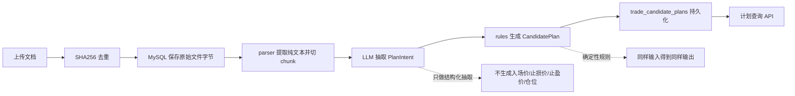
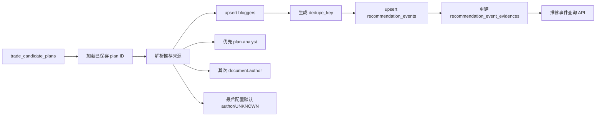
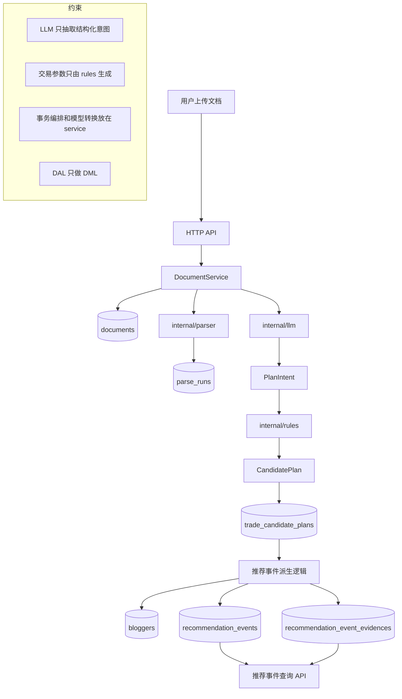
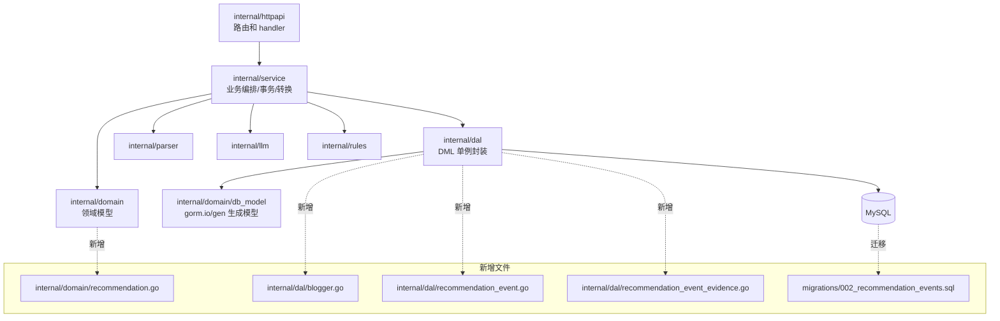
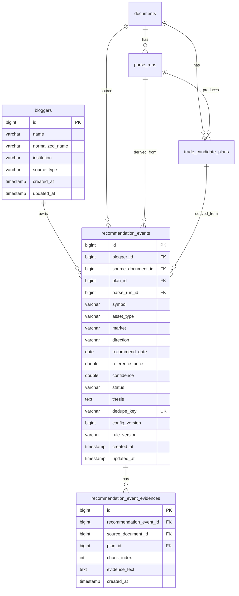
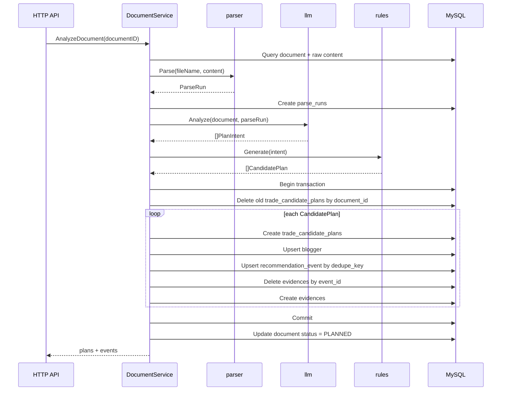
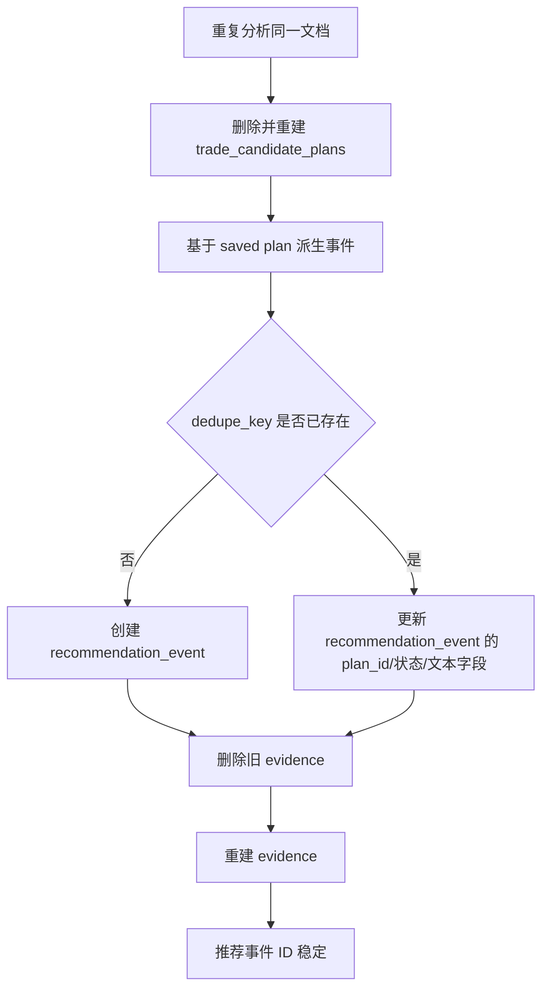
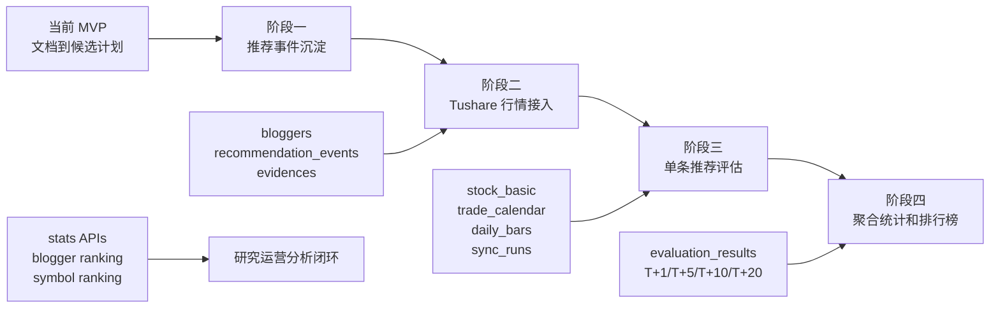

# 阶段一：表结构与推荐事件技术方案

## 1. 结论摘要

阶段一的目标是把当前系统已经生成的 `trade_candidate_plans` 沉淀为长期可跟踪的“推荐事件”。推荐事件只表达事实：谁在什么日期推荐了哪只股票、什么方向、证据是什么。它不计算收益，不接行情，不做排行榜，也不让 AI 直接生成交易参数。

阶段一完成后，系统会具备三类新增能力：

1. 推荐来源归一化：通过 `bloggers` 表统一博主/来源主体。
2. 推荐事件沉淀：通过 `recommendation_events` 表稳定保存推荐事实。
3. 证据可追溯：通过 `recommendation_event_evidences` 表保存来源文本片段。

后续阶段将在推荐事件之上继续演进：

- 阶段二：接入 Tushare，沉淀交易日历、股票基础信息、日线行情。
- 阶段三：基于推荐事件和行情计算 T+1/T+5/T+10/T+20 表现。
- 阶段四：按博主、股票、方向、窗口聚合统计胜率和收益率。

## 2. 从现有能力演进

当前系统已经完成“文档 -> 候选计划”的窄链路：



阶段一只在 `trade_candidate_plans` 后面增加推荐事件沉淀：



完整目标链路如下：



## 3. 阶段一目标边界

### 3.1 本阶段做什么

- 新增三张表：`bloggers`、`recommendation_events`、`recommendation_event_evidences`。
- 从已保存的 `CandidatePlan` 派生推荐事件。
- 用 `dedupe_key` 保证重复分析同一文档不会产生重复主事件。
- 新增推荐事件列表、详情、按文档查询 API。
- 保留证据文本，方便运营校对和后续问题追溯。

### 3.2 本阶段不做什么

- 不接 Tushare。
- 不计算收益率、胜率、最大浮盈、最大回撤。
- 不做手动审批流。
- 不做 worker/scheduler。
- 不恢复 Redis、MinIO 或旧行情 provider chain。
- 不让 LLM 直接输出推荐事件、收益、入场价、止损价、止盈价或仓位。

## 4. 代码架构

阶段一继续沿用当前仓库边界：



职责划分：

| 层 | 职责 | 阶段一新增内容 |
| --- | --- | --- |
| `internal/httpapi` | 参数解析、HTTP 状态码、JSON 响应 | 推荐事件列表/详情/文档下事件查询 |
| `internal/service` | 事务编排、领域模型转换、幂等派生 | `CandidatePlan -> RecommendationEvent` |
| `internal/dal` | 只封装数据库 DML | bloggers/events/evidences 的 CRUD/Upsert |
| `internal/domain` | 业务结构体 | `Blogger`、`RecommendationEvent` |
| `internal/domain/db_model` | GORM 数据库模型 | 由 `gorm.io/gen` 生成 |
| `migrations` | 表结构 | 新增 3 张推荐事件相关表 |

## 5. 数据模型



### 5.1 bloggers

用途：归一化推荐来源，避免“张三”“ 张三 ”、“ZHANG SAN”等可确定等价来源重复统计。

```sql
CREATE TABLE `bloggers` (
  `id` bigint NOT NULL AUTO_INCREMENT,
  `name` varchar(128) COLLATE utf8mb4_general_ci NOT NULL,
  `normalized_name` varchar(128) COLLATE utf8mb4_general_ci NOT NULL,
  `institution` varchar(128) COLLATE utf8mb4_general_ci NOT NULL DEFAULT '',
  `source_type` varchar(32) COLLATE utf8mb4_general_ci NOT NULL DEFAULT 'DOCUMENT',
  `created_at` timestamp NOT NULL DEFAULT CURRENT_TIMESTAMP,
  `updated_at` timestamp NOT NULL DEFAULT CURRENT_TIMESTAMP ON UPDATE CURRENT_TIMESTAMP,
  PRIMARY KEY (`id`),
  UNIQUE KEY `uk_bloggers_normalized_institution` (`normalized_name`, `institution`),
  KEY `idx_bloggers_name` (`name`)
) ENGINE=InnoDB DEFAULT CHARSET=utf8mb4 COLLATE=utf8mb4_general_ci;
```

归一化规则：

```text
trim space -> collapse internal whitespace -> lower case
```

中文不做拼音转换，不做 AI 修正，不依赖远程服务。

### 5.2 recommendation_events

用途：推荐主事件。一条记录代表一次可统计的推荐事实。

```sql
CREATE TABLE `recommendation_events` (
  `id` bigint NOT NULL AUTO_INCREMENT,
  `blogger_id` bigint NOT NULL,
  `source_document_id` bigint NOT NULL,
  `plan_id` bigint NOT NULL,
  `parse_run_id` bigint NOT NULL,
  `symbol` varchar(32) COLLATE utf8mb4_general_ci NOT NULL,
  `asset_type` varchar(32) COLLATE utf8mb4_general_ci NOT NULL DEFAULT '',
  `market` varchar(32) COLLATE utf8mb4_general_ci NOT NULL DEFAULT '',
  `direction` varchar(16) COLLATE utf8mb4_general_ci NOT NULL,
  `recommend_date` date NOT NULL,
  `reference_price` double NOT NULL DEFAULT '0',
  `confidence` double NOT NULL DEFAULT '0',
  `status` varchar(64) COLLATE utf8mb4_general_ci NOT NULL,
  `thesis` text COLLATE utf8mb4_general_ci NOT NULL,
  `dedupe_key` varchar(128) COLLATE utf8mb4_general_ci NOT NULL,
  `config_version` bigint NOT NULL,
  `rule_version` varchar(64) COLLATE utf8mb4_general_ci NOT NULL,
  `created_at` timestamp NOT NULL DEFAULT CURRENT_TIMESTAMP,
  `updated_at` timestamp NOT NULL DEFAULT CURRENT_TIMESTAMP ON UPDATE CURRENT_TIMESTAMP,
  PRIMARY KEY (`id`),
  UNIQUE KEY `uk_recommendation_events_dedupe_key` (`dedupe_key`),
  KEY `idx_recommendation_events_blogger_date` (`blogger_id`, `recommend_date`),
  KEY `idx_recommendation_events_symbol_date` (`symbol`, `recommend_date`),
  KEY `idx_recommendation_events_document` (`source_document_id`, `created_at`),
  KEY `idx_recommendation_events_plan` (`plan_id`),
  CONSTRAINT `fk_recommendation_events_blogger` FOREIGN KEY (`blogger_id`) REFERENCES `bloggers` (`id`),
  CONSTRAINT `fk_recommendation_events_document` FOREIGN KEY (`source_document_id`) REFERENCES `documents` (`id`) ON DELETE CASCADE,
  CONSTRAINT `fk_recommendation_events_plan` FOREIGN KEY (`plan_id`) REFERENCES `trade_candidate_plans` (`id`) ON DELETE CASCADE,
  CONSTRAINT `fk_recommendation_events_parse_run` FOREIGN KEY (`parse_run_id`) REFERENCES `parse_runs` (`id`) ON DELETE CASCADE
) ENGINE=InnoDB DEFAULT CHARSET=utf8mb4 COLLATE=utf8mb4_general_ci;
```

`dedupe_key` 生成口径：

```text
sha256(
  normalized_blogger_name + "|" +
  institution + "|" +
  source_document_id + "|" +
  symbol + "|" +
  direction + "|" +
  recommend_date(YYYY-MM-DD)
)
```

这满足 PRD 的默认去重规则：同一博主、同一股票、同一方向、同一交易日、来自同一文档，只保留一条主事件。

### 5.3 recommendation_event_evidences

用途：保存证据片段。列表接口不加载证据，详情接口按事件 ID 加载。

```sql
CREATE TABLE `recommendation_event_evidences` (
  `id` bigint NOT NULL AUTO_INCREMENT,
  `recommendation_event_id` bigint NOT NULL,
  `source_document_id` bigint NOT NULL,
  `plan_id` bigint NOT NULL,
  `chunk_index` int NOT NULL DEFAULT '0',
  `evidence_text` text COLLATE utf8mb4_general_ci NOT NULL,
  `created_at` timestamp NOT NULL DEFAULT CURRENT_TIMESTAMP,
  PRIMARY KEY (`id`),
  KEY `idx_recommendation_event_evidences_event` (`recommendation_event_id`, `id`),
  KEY `idx_recommendation_event_evidences_document` (`source_document_id`),
  CONSTRAINT `fk_recommendation_event_evidences_event` FOREIGN KEY (`recommendation_event_id`) REFERENCES `recommendation_events` (`id`) ON DELETE CASCADE,
  CONSTRAINT `fk_recommendation_event_evidences_document` FOREIGN KEY (`source_document_id`) REFERENCES `documents` (`id`) ON DELETE CASCADE,
  CONSTRAINT `fk_recommendation_event_evidences_plan` FOREIGN KEY (`plan_id`) REFERENCES `trade_candidate_plans` (`id`) ON DELETE CASCADE
) ENGINE=InnoDB DEFAULT CHARSET=utf8mb4 COLLATE=utf8mb4_general_ci;
```

## 6. 派生链路

推荐事件必须基于“已保存后的 CandidatePlan”，因为事件需要稳定记录 `plan_id`。



关键实现点：

- 原来的 `replacePlansByDocumentID` 建议改为 `replacePlansAndEventsByDocumentID`。
- 候选计划替换和推荐事件 upsert 放在同一个事务里。
- 推荐事件不挂在易变的 `plan_id` 上做长期统计，长期统计主键使用 `recommendation_event_id`。
- `plan_id` 只用于审计：这条推荐事件从哪条候选计划派生。

## 7. 字段映射

| 推荐事件字段 | 来源 |
| --- | --- |
| `blogger_name` | 优先 `CandidatePlan.Analyst`，为空则用 `Document.Author`，仍为空则用配置默认 author |
| `source_document_id` | `CandidatePlan.DocumentID` |
| `plan_id` | 已保存后的 `CandidatePlan.ID` |
| `parse_run_id` | `CandidatePlan.ParseRunID` |
| `symbol` | `CandidatePlan.Symbol` |
| `asset_type` | `CandidatePlan.AssetType` |
| `market` | `CandidatePlan.Market` |
| `direction` | `CandidatePlan.Direction` |
| `recommend_date` | `CandidatePlan.TradeDate` |
| `reference_price` | `CandidatePlan.ReferencePrice` |
| `confidence` | `CandidatePlan.Confidence` |
| `thesis` | `CandidatePlan.Thesis` |
| `evidence` | `CandidatePlan.Evidence` |
| `config_version` | `CandidatePlan.ConfigVersion` |
| `rule_version` | `CandidatePlan.RuleVersion` |

状态映射：

```text
CandidatePlan.Status == READY -> RecommendationEvent.Status = ACTIVE
其他 CandidatePlan.Status -> RecommendationEvent.Status = NEEDS_REVIEW
```

## 8. DAL 设计

### 8.1 internal/dal/blogger.go

```go
var Bloggers = &BloggerDML{}

func (*BloggerDML) Create(ctx context.Context, db *gorm.DB, model *db_model.Blogger) error
func (*BloggerDML) QueryByID(ctx context.Context, db *gorm.DB, id int64) (*db_model.Blogger, error)
func (*BloggerDML) QueryByNormalizedNameAndInstitution(ctx context.Context, db *gorm.DB, normalizedName string, institution string) (*db_model.Blogger, error)
func (*BloggerDML) UpsertByNormalizedNameAndInstitution(ctx context.Context, db *gorm.DB, model *db_model.Blogger) error
```

Upsert 冲突列：`normalized_name, institution`。

冲突时只更新：

- `name`
- `source_type`
- `updated_at`

### 8.2 internal/dal/recommendation_event.go

```go
var RecommendationEvents = &RecommendationEventDML{}

func (*RecommendationEventDML) Create(ctx context.Context, db *gorm.DB, model *db_model.RecommendationEvent) error
func (*RecommendationEventDML) UpsertByDedupeKey(ctx context.Context, db *gorm.DB, model *db_model.RecommendationEvent) error
func (*RecommendationEventDML) QueryByID(ctx context.Context, db *gorm.DB, id int64) (*db_model.RecommendationEvent, error)
func (*RecommendationEventDML) QueryByDocumentID(ctx context.Context, db *gorm.DB, documentID int64) ([]db_model.RecommendationEvent, error)
func (*RecommendationEventDML) QueryLatest(ctx context.Context, db *gorm.DB, limit int) ([]db_model.RecommendationEvent, error)
func (*RecommendationEventDML) QueryByParam(ctx context.Context, db *gorm.DB, param QueryParam) ([]db_model.RecommendationEvent, error)
```

Upsert 冲突列：`dedupe_key`。

冲突时更新：

- `blogger_id`
- `plan_id`
- `parse_run_id`
- `reference_price`
- `confidence`
- `status`
- `thesis`
- `config_version`
- `rule_version`
- `updated_at`

冲突时不要更新：

- `source_document_id`
- `symbol`
- `direction`
- `recommend_date`
- `dedupe_key`

这些字段定义事件身份，不应在冲突时改写。

### 8.3 internal/dal/recommendation_event_evidence.go

```go
var RecommendationEventEvidences = &RecommendationEventEvidenceDML{}

func (*RecommendationEventEvidenceDML) CreateBatch(ctx context.Context, db *gorm.DB, models []db_model.RecommendationEventEvidence) error
func (*RecommendationEventEvidenceDML) DeleteByEventID(ctx context.Context, db *gorm.DB, eventID int64) error
func (*RecommendationEventEvidenceDML) QueryByEventID(ctx context.Context, db *gorm.DB, eventID int64) ([]db_model.RecommendationEventEvidence, error)
```

证据写入策略：

```text
event upsert 成功
-> 查询 event ID
-> DeleteByEventID
-> CreateBatch
```

## 9. HTTP API

阶段一新增三个查询 API：

```text
GET /api/v1/recommendations
GET /api/v1/recommendations/{id}
GET /api/v1/documents/{id}/recommendations
```

列表参数：

| 参数 | 类型 | 默认 | 说明 |
| --- | --- | --- | --- |
| `limit` | int | 100 | 最大建议 500 |
| `symbol` | string | 空 | 股票代码 |
| `direction` | string | 空 | `LONG` / `SHORT` |
| `status` | string | 空 | `ACTIVE` / `NEEDS_REVIEW` |
| `from` | date | 空 | `recommend_date >= from` |
| `to` | date | 空 | `recommend_date <= to` |

列表接口默认不返回 evidence，详情接口返回 evidence。

示例响应：

```json
{
  "id": 1,
  "blogger_id": 1,
  "blogger_name": "张三",
  "source_document_id": 7,
  "plan_id": 12,
  "symbol": "600000.SH",
  "direction": "LONG",
  "recommend_date": "2026-05-16T00:00:00Z",
  "reference_price": 10.5,
  "confidence": 0.82,
  "status": "ACTIVE",
  "thesis": "收入修复，估值处于低位",
  "evidence": []
}
```

## 10. 幂等与一致性

阶段一幂等由三层保证：



实现原则：

- `bloggers.uk_bloggers_normalized_institution` 防止来源重复。
- `recommendation_events.uk_recommendation_events_dedupe_key` 防止主事件重复。
- evidence 先删后插，保证与最新候选计划一致。
- 后续评估结果应挂 `recommendation_event_id`，不要挂 `plan_id`。

## 11. 实施步骤

1. 新增 `migrations/002_recommendation_events.sql`。
2. 本地 MySQL 执行 migration。
3. 执行 `go run generate.go`。
4. 检查生成文件：
   - `internal/domain/db_model/blogger.gen.go`
   - `internal/domain/db_model/recommendation_event.gen.go`
   - `internal/domain/db_model/recommendation_event_evidence.gen.go`
5. 新增 `internal/domain/recommendation.go`。
6. 新增 DAL：
   - `internal/dal/blogger.go`
   - `internal/dal/recommendation_event.go`
   - `internal/dal/recommendation_event_evidence.go`
7. 修改 `internal/service/document.go`：
   - `replacePlansByDocumentID` 改为 `replacePlansAndEventsByDocumentID`
   - 增加 blogger 归一化
   - 增加 dedupe key 生成
   - 增加 plan -> event 转换
8. 修改 `internal/httpapi/server.go`：
   - 注册推荐事件路由
   - 增加列表/详情/按文档查询 handler
9. 增加测试。
10. 执行 `gofmt -w`、`go test ./...`、`go build ./...`。

## 12. 测试方案

### 12.1 单元测试

- `normalizeBloggerName`
  - 去首尾空格。
  - 合并连续空白。
  - 英文大小写归一。
  - 中文保持原文。
- `recommendationEventDedupeKey`
  - 相同输入返回相同 key。
  - 不同方向返回不同 key。
  - 不同文档 ID 返回不同 key。
- `recommendationStatusFromPlan`
  - `READY -> ACTIVE`。
  - `NEEDS_REVIEW -> NEEDS_REVIEW`。

### 12.2 Service 测试

最小场景：

1. 构造 document 和两个 saved plan。
2. 一个 plan 状态为 `READY`，一个为 `NEEDS_REVIEW`。
3. 验证派生事件的 blogger、状态、dedupe key。
4. 重复运行相同输入，验证 dedupe key 不变。

### 12.3 API 测试

- `GET /api/v1/recommendations` 返回数组。
- `GET /api/v1/documents/{id}/recommendations` 返回指定文档事件。
- `GET /api/v1/recommendations/{id}` 返回 evidence。
- 非法 `direction` 返回 400。
- 非法日期返回 400。
- 不存在 ID 建议返回 404。

## 13. 未来演进



### 13.1 阶段二：行情接入

新增模块：

- `internal/marketdata`
- Tushare client
- 股票基础信息同步
- 交易日历同步
- 日线行情同步
- 同步任务记录

新增表建议：

- `market_stocks`
- `market_trade_calendars`
- `market_daily_bars`
- `market_sync_runs`

阶段二只负责“行情数据可信落库”，不计算推荐收益。

### 13.2 阶段三：推荐评估

新增模块：

- `internal/evaluation`

核心输入：

- `recommendation_events`
- `trade_candidate_plans`
- 交易日历
- 日线行情

默认窗口：

- T+1
- T+5
- T+10
- T+20

输出：

- 入场价：T+1 开盘价。
- 退出价：窗口最后一个交易日收盘价。
- 收益率：多头 `(exit - entry) / entry`，空头 `(entry - exit) / entry`。
- 是否盈利。
- 是否命中止盈/止损。
- 最大浮盈。
- 最大回撤。
- 不可评估原因。

### 13.3 阶段四：统计 API

新增模块：

- `internal/stats`

统计维度：

- 博主
- 股票
- 方向
- 时间区间
- 评估窗口

核心指标：

- 推荐次数
- 可评估次数
- 胜率
- 平均收益率
- 中位数收益率
- 累计收益率
- 最大单笔盈利
- 最大单笔亏损
- 止盈命中率
- 止损命中率

## 14. 验收标准

阶段一完成后，应满足：

1. 上传并分析样本文档后，系统保存 `trade_candidate_plans` 的同时生成 `recommendation_events`。
2. `GET /api/v1/recommendations` 可以查到最新推荐事件。
3. `GET /api/v1/documents/{id}/recommendations` 可以查到指定文档派生的推荐事件。
4. `GET /api/v1/recommendations/{id}` 可以返回主事件和证据。
5. 同一文档重复分析，不新增重复 `recommendation_events` 主事件。
6. 候选计划状态为 `READY` 时，推荐事件状态为 `ACTIVE`；否则为 `NEEDS_REVIEW`。
7. `go test ./...` 和 `go build ./...` 通过。

